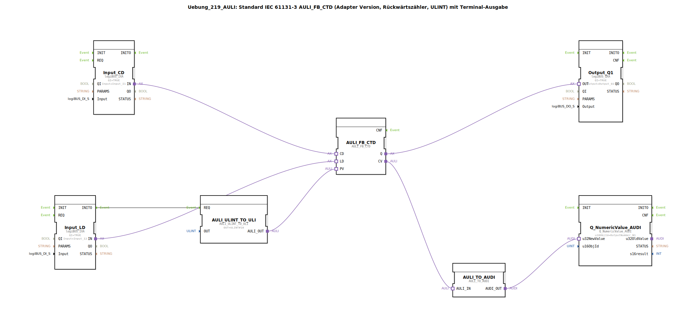

# Uebung_219_AULI: Standard IEC 61131-3 AULI_FB_CTD (Adapter Version, Rückwärtszähler, ULINT) mit Terminal-Ausgabe

* * * * * * * * * *

## Einleitung

Diese Übung implementiert einen **Rückwärtszähler (Count Down)** nach IEC 61131-3 (Typ `CTD`) im **Adapter-Format**. Der Zähler arbeitet mit dem Datentyp **ULINT** (Unsigned Long Integer) und gibt den aktuellen Zählerstand über ein Terminal (z. B. System Display) aus. Zusätzlich wird ein digitaler Ausgang gesetzt, sobald der Zählerstand Null erreicht.

Die gesamte Funktionalität ist in einer SubApplikation (SubApp) gekapselt, die über logiBUS‑Ein‑ und Ausgänge mit der Hardware verbunden ist.

## Verwendete Funktionsbausteine (FBs)

Die SubApp enthält folgende interne Funktionsbausteine:

### FB: AULI_FB_CTD
- **Typ**: `adapter::iec61131::counters::AULI_FB_CTD`
- **Beschreibung**: Kernbaustein – der eigentliche Rückwärtszähler. Er besitzt die für einen CTD typischen Schnittstellen:
    - **Ereigniseingänge**: – (wird automatisch durch die Adapterverbindungen gesteuert)
    - **Dateneingänge**: `CD` (Count-Down-Impuls), `LD` (Laden des Startwerts), `PV` (Preset Value, ULINT)
    - **Datenausgänge**: `Q` (Ausgangssignal = TRUE wenn Zählerstand = 0), `CV` (aktueller Zählerstand, ULINT)
- **Parameter**: keine zusätzlichen Parameter

### FB: AULI_ULINT_TO_ULI
- **Typ**: `adapter::conversion::unidirectional::AULI_ULINT_TO_ULI`
- **Beschreibung**: Konvertiert einen konstanten ULINT‑Wert (10) in das Format `ULI` (benötigt vom CTD‑Baustein).
- **Parameter**: `OUT` = `ULINT#10` (Festwert, der als Preset‑Wert dient)
- **Ereigniseingang**: `REQ` (wird durch `Input_LD.INITO` getriggert)
- **Datenausgang**: `AULI_OUT` (verbunden mit `AULI_FB_CTD.PV`)

### FB: Input_CD
- **Typ**: `logiBUS::io::DI::logiBUS_IXA`
- **Beschreibung**: Digitaler Eingang für das Signal `CD` (Count Down). Liest den physischen Eingang `Input_I1`.
- **Parameter**: `QI` = `TRUE` (Initialisierung), `Input` = `Input_I1`
- **Adapterausgang**: `IN` (verbunden mit `AULI_FB_CTD.CD`)

### FB: Input_LD
- **Typ**: `logiBUS::io::DI::logiBUS_IXA`
- **Beschreibung**: Digitaler Eingang für das Signal `LD` (Load). Liest den physischen Eingang `Input_I2`.
- **Parameter**: `QI` = `TRUE`, `Input` = `Input_I2`
- **Adapterausgang**: `IN` (verbunden mit `AULI_FB_CTD.LD`)
- **Ereignisausgang**: `INITO` (triggert die Umwandlung des Preset-Werts)

### FB: Output_Q1
- **Typ**: `logiBUS::io::DQ::logiBUS_QXA`
- **Beschreibung**: Digitaler Ausgang. Wird aktiv, sobald der Zählerstand Null erreicht (Q‑Signal des CTD).
- **Parameter**: `QI` = `TRUE`, `Output` = `Output_Q1`
- **Adaptereingang**: `OUT` (verbunden mit `AULI_FB_CTD.Q`)

### FB: AULI_TO_AUDI
- **Typ**: `adapter::conversion::unidirectional::AULI_TO_AUDI`
- **Beschreibung**: Konvertiert den aktuellen Zählerstand (`CV`, Typ AULI) in den Typ AUDI, der für die Terminalausgabe benötigt wird.
- **Adaptereingang**: `AULI_IN` (verbunden mit `AULI_FB_CTD.CV`)
- **Adapterausgang**: `AUDI_OUT` (verbunden mit `Q_NumericValue_AUDI.u32NewValue`)

### FB: Q_NumericValue_AUDI
- **Typ**: `isobus::UT::Q::Q_NumericValue_AUDI`
- **Beschreibung**: Baustein zur Anzeige eines numerischen Werts im Terminal. Erhält den aktuellen Zählerstand und zeigt ihn auf dem zugeordneten Ausgabeobjekt an.
- **Parameter**: `u16ObjId` = `OutputNumber_N1` (Terminal‑Ausgabeobjekt)
- **Dateneingang**: `u32NewValue` (verbunden mit `AULI_TO_AUDI.AUDI_OUT`)

## Programmablauf und Verbindungen

1. **Initialisierung**:  
   Beim Start wird durch das Ereignis `Input_LD.INITO` der Baustein `AULI_ULINT_TO_ULI` getriggert. Dieser liefert den festen Preset‑Wert 10 (ULINT) an den Dateneingang `PV` des Zählers.

2. **Zähler laden**:  
   Ein positiver Flanke am digitalen Eingang `Input_I2` (LD) lädt den Zähler mit dem Preset‑Wert. Der aktuelle Zählerstand wird auf 10 gesetzt.

3. **Rückwärts zählen**:  
   Jeder positive Flanke am digitalen Eingang `Input_I1` (CD) verringert den Zählerstand um 1, solange der Stand größer als 0 ist.

4. **Ausgabe des Zählerstandes**:  
   Der aktuelle Zählerstand (`CV`) wird über die Konvertierungskette `AULI_TO_AUDI` → `Q_NumericValue_AUDI` auf das Terminal ausgegeben (Objekt `OutputNumber_N1`).

5. **Signal bei Null**:  
   Sobald der Zählerstand den Wert 0 erreicht, setzt der CTD‑Baustein den Ausgang `Q` auf TRUE. Dies schaltet den digitalen Ausgang `Output_Q1` ein.

**Zusammenfassung der Verbindungen (Adapter‑ und Ereignis‑Connections):**

| Quelle | Ziel | Art |
|--------|------|-----|
| `Input_CD.IN` | `AULI_FB_CTD.CD` | Adapter |
| `Input_LD.IN` | `AULI_FB_CTD.LD` | Adapter |
| `AULI_FB_CTD.Q` | `Output_Q1.OUT` | Adapter |
| `AULI_FB_CTD.CV` | `AULI_TO_AUDI.AULI_IN` | Adapter |
| `AULI_TO_AUDI.AUDI_OUT` | `Q_NumericValue_AUDI.u32NewValue` | Adapter |
| `AULI_ULINT_TO_ULI.AULI_OUT` | `AULI_FB_CTD.PV` | Adapter |
| `Input_LD.INITO` | `AULI_ULINT_TO_ULI.REQ` | Ereignis |

## Zusammenfassung

**Lernziele** dieser Übung:
- Aufbau und Funktionsweise eines IEC 61131-3 Rückwärtszählers (CTD) im Adapter‑Format verstehen.
- Einbindung digitaler Ein‑ und Ausgänge über logiBUS.
- Konvertierung von Datentypen für die Kommunikation zwischen Bausteinen.
- Ausgabe von Prozesswerten auf einem Terminal (isobus‑basiert).

**Schwierigkeitsgrad**: Mittel  

**Vorkenntnisse**: Grundlagen der 4diac‑IDE, Umgang mit logiBUS‑I/O‑Bausteinen, einfache Datenkonvertierung.

**Starten der Übung**:
- Die SubApp kann in ein 4diac‑Projekt eingefügt und auf eine entsprechende Steuerung (mit logiBUS‑Anbindung und Terminal) geladen werden.
- Die Eingänge `Input_I1` (CD) und `Input_I2` (LD) müssen mit Tastern oder einem Signalgenerator verbunden sein.
- Der Ausgang `Output_Q1` und das Terminalobjekt `OutputNumber_N1` zeigen die Ergebnisse an.