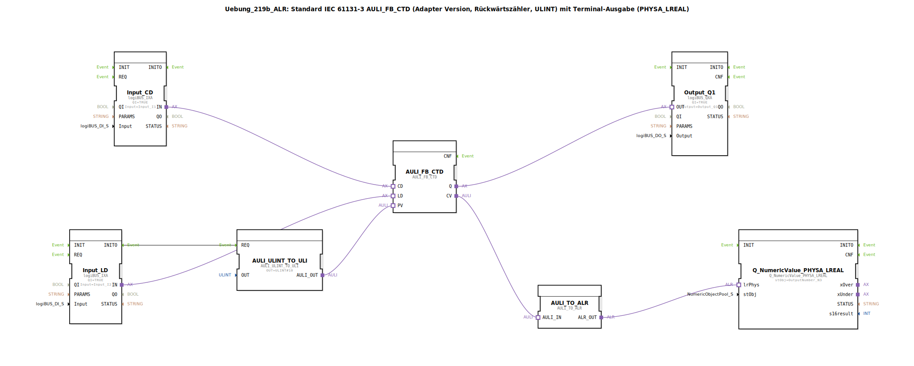

# Uebung_219b_ALR: Standard IEC 61131-3 AULI_FB_CTD (Adapter Version, Rückwärtszähler, ULINT) mit Terminal-Ausgabe (PHYSA_LREAL)

* * * * * * * * * *

## Einleitung

Diese Übung implementiert einen Rückwärtszähler (CTD – Count Down) gemäß IEC 61131-3 als Adapter-Version. Der Zähler verarbeitet ULINT-Werte und gibt das aktuelle Zählergebnis über eine Terminalausgabe (PHYSA_LREAL) aus. Zusätzlich wird ein digitaler Ausgang gesetzt, wenn der Zählwert Null erreicht.

Die Übung demonstriert den Einsatz von:
- Adapter-basierten Funktionsbausteinen für Zähler und Konvertierungen
- physikalischen Ein- und Ausgängen (logiBUS)
- Formatierung und Ausgabe numerischer Werte auf einem Terminal

## Verwendete Funktionsbausteine (FBs)

### AULI_FB_CTD
- **Typ**: `adapter::iec61131::counters::AULI_FB_CTD`
- **Beschreibung**: Rückwärtszähler (Count Down) für ULINT-Datentyp in Adapter-Ausführung. Er besitzt die Ereigniseingänge `CD` (Count Down), `LD` (Load) sowie die Datenausgänge `Q` (Null erreicht) und `CV` (aktueller Zählwert).
- **Parameter**: keine
- **Ereignisse**: nicht direkt verbunden (Ereignisse der Eingänge werden über Adapterverbindungen gesteuert)
- **Daten**: 
  - `PV` (Preset Value) erhält den Startwert über `AULI_ULINT_TO_ULI`
  - `CV` (Current Value) wird auf `AULI_TO_ALR` gegeben

### AULI_ULINT_TO_ULI
- **Typ**: `adapter::conversion::unidirectional::AULI_ULINT_TO_ULI`
- **Beschreibung**: Konvertiert ULINT in ULINT (hier eher als Initialisierung genutzt). Der Parameter `OUT` wird auf `ULINT#10` gesetzt, d.h. der Zähler startet bei 10.
- **Parameter**: 
  - `OUT = ULINT#10`
- **Ereigniseingang**: `REQ` (von `Input_LD.INITO`)
- **Datenausgang**: `AULI_OUT` → `PV` des Zählers

### Input_CD (logiBUS_IXA)
- **Typ**: `logiBUS::io::DI::logiBUS_IXA`
- **Beschreibung**: Digitaler Eingang für das Count-Down-Signal (Tasteneingang `Input_I1`). Aktiv bei TRUE.
- **Parameter**: 
  - `QI = TRUE`
  - `Input = Input_I1`

### Input_LD (logiBUS_IXA)
- **Typ**: `logiBUS::io::DI::logiBUS_IXA`
- **Beschreibung**: Digitaler Eingang für das Load-Signal (Tasteneingang `Input_I2`). Aktiv bei TRUE.
- **Parameter**: 
  - `QI = TRUE`
  - `Input = Input_I2`

### Output_Q1 (logiBUS_QXA)
- **Typ**: `logiBUS::io::DQ::logiBUS_QXA`
- **Beschreibung**: Digitaler Ausgang, der gesetzt wird, wenn der Zählwert Null erreicht (`Q` des Zählers).
- **Parameter**: 
  - `QI = TRUE`
  - `Output = Output_Q1`

### AULI_TO_ALR
- **Typ**: `adapter::conversion::unidirectional::AULI_TO_ALR`
- **Beschreibung**: Konvertiert den aktuellen ULINT-Zählwert in einen LREAL-Wert für die physische Ausgabe (AR).
- **Ereignisse**: keine direkte Ereignisverbindung
- **Daten**: 
  - `AULI_IN` ← `CV` des Zählers
  - `ALR_OUT` → `Q_NumericValue_PHYSA_LREAL.lrPhys`

### Q_NumericValue_PHYSA_LREAL
- **Typ**: `isobus::UT::Q::Q_NumericValue_PHYSA_LREAL`
- **Beschreibung**: Gibt den übergebenen LREAL-Wert als formatierten numerischen String auf einem Terminal aus (Objekt `OutputNumber_N3`).
- **Parameter**: 
  - `stObj = OutputNumber_N3`
- **Daten**: 
  - `lrPhys` ← `ALR_OUT` von `AULI_TO_ALR`

## Programmablauf und Verbindungen

Die folgende Beschreibung erläutert den Daten- und Ereignisfluss:

1. **Initialisierung**  
   Beim Systemstart (oder nach einem Reset) wird das Ereignis `INITO` des Eingangsbausteins `Input_LD` ausgelöst. Dieses Ereignis triggert die Konvertierung `AULI_ULINT_TO_ULI` über deren `REQ`-Eingang. Der Baustein gibt daraufhin den Wert `ULINT#10` als Startwert an den `PV`-Eingang des Zählers `AULI_FB_CTD`.

2. **Load-Vorgang**  
   Wird der Eingang `Input_LD` (Taster I2) betätigt, so lädt der Zähler den Preset-Wert (10) in seinen aktuellen Zählwert `CV`. Dies geschieht über die Adapterverbindung `Input_LD.IN` → `AULI_FB_CTD.LD`.

3. **Count-Down**  
   Jede steigende Flanke am Eingang `Input_CD` (Taster I1) verringert den Zählwert um 1. Die Verbindung `Input_CD.IN` → `AULI_FB_CTD.CD` realisiert dies.

4. **Null-Erkennung**  
   Sobald der Zählwert `CV` den Wert Null erreicht, setzt der Zähler seinen Ausgang `Q` auf TRUE. Dieser wird über die Verbindung `AULI_FB_CTD.Q` → `Output_Q1.OUT` an den physikalischen Ausgang `Output_Q1` weitergeleitet. Ein angeschlossenes Gerät (z.B. Lampe) signalisiert den Null-Zustand.

5. **Terminalausgabe**  
   Der aktuelle Zählwert `CV` wird über die Konvertierungskette `AULI_FB_CTD.CV` → `AULI_TO_ALR.AULI_IN` → `AULI_TO_ALR.ALR_OUT` → `Q_NumericValue_PHYSA_LREAL.lrPhys` auf dem Terminal (Objekt `OutputNumber_N3`) angezeigt. Hierbei wird der ULINT-Wert in LREAL umgewandelt, sodass auch negative Werte (z.B. durch Überlauf) dargestellt werden können (siehe Hinweis-Kommentar in der Grafik).

**Hinweise aus den Kommentaren:**
- Im Bereich der Terminalausgabe sind negative Werte möglich (z.B. wenn der Zähler unter Null gezählt wird).
- Bei hohen Ereignisraten kann ein AX_D_FF (Verzögerungsglied) zwischengeschaltet werden, um die Anzahl der Terminalaktualisierungen zu reduzieren.

## Zusammenfassung

Die Übung `Uebung_219b_ALR` realisiert einen IEC 61131-3 konformen Rückwärtszähler (CTD) in Adapter-Bauweise. Über digitale Eingänge wird der Zähler geladen und dekrementiert. Der aktuelle Zählwert wird auf einem Terminal ausgegeben, und ein digitaler Ausgang signalisiert das Erreichen des Nullwerts. Die Implementierung zeigt die Kombination von Standard-Zählerbausteinen, Konvertierungsadaptern und hardwarenaher Ein-/Ausgabe in der 4diac-IDE.