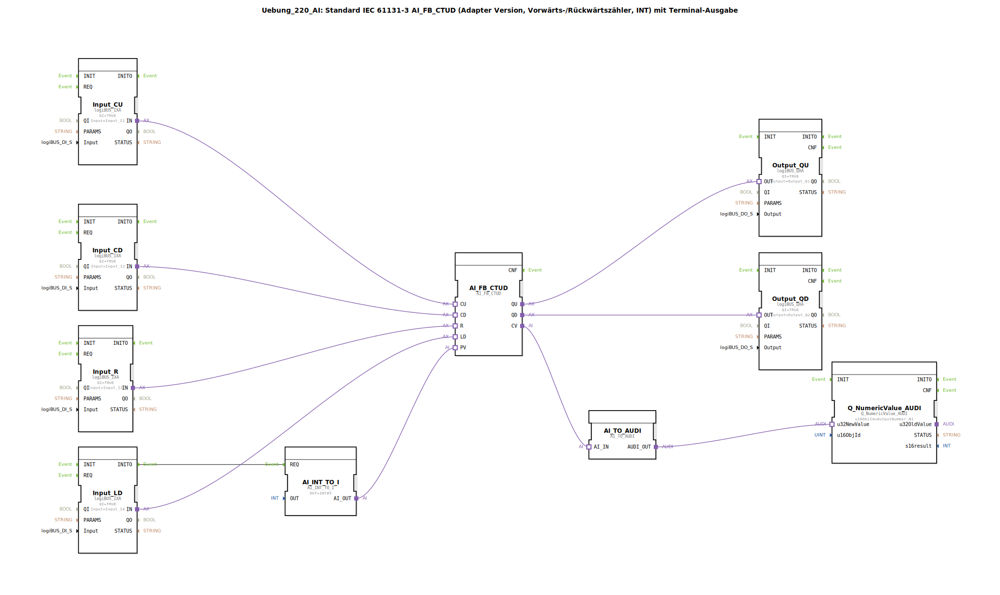

# Uebung_220_AI: Standard IEC 61131-3 AI_FB_CTUD (Adapter Version, Vorwärts-/Rückwärtszähler, INT) mit Terminal-Ausgabe

* * * * * * * * * *

## Einleitung

Diese Übung implementiert einen **Vorwärts-/Rückwärtszähler nach IEC 61131-3 (CTUD)** als Adapter-Version für den Datentyp `INT`. Der aktuelle Zählerstand wird über ein Terminal (Numerikausgabe) ausgegeben. Die Steuerung erfolgt über vier digitale Eingänge (CU, CD, R, LD) und zwei digitale Ausgänge (QU, QD). Ein Konstantwert (INT#5) wird als Voreinstellwert (PV) geladen.

## Verwendete Funktionsbausteine (FBs)

- **AI_FB_CTUD** (`adapter::iec61131::counters::AI_FB_CTUD`)  
  Zentrale Zählerlogik: Ereignisgesteuerter Vorwärts-/Rückwärtszähler (CTUD) mit den Anschlüssen CU, CD, R, LD und PV. Liefert die Ausgänge QU (Überlauf), QD (Unterlauf) und CV (aktueller Zählerwert). Keine Parameter.

- **AI_INT_TO_I** (`adapter::conversion::unidirectional::AI_INT_TO_I`)  
  Konvertiert einen konstanten `INT`-Wert (hier: 5) in ein Adapter-Format für den Voreinstellwert (PV). Parameter: `OUT = INT#5`.

- **Input_CU** (`logiBUS::io::DI::logiBUS_IXA`)  
  Digitaler Eingang für das Signal „Count Up“ (Vorwärtszählen).  
  Parameter: `QI = TRUE`, `Input = Input_I1`.

- **Input_CD** (`logiBUS::io::DI::logiBUS_IXA`)  
  Digitaler Eingang für das Signal „Count Down“ (Rückwärtszählen).  
  Parameter: `QI = TRUE`, `Input = Input_I2`.

- **Input_R** (`logiBUS::io::DI::logiBUS_IXA`)  
  Digitaler Eingang für das Rücksetzsignal (Reset).  
  Parameter: `QI = TRUE`, `Input = Input_I3`.

- **Input_LD** (`logiBUS::io::DI::logiBUS_IXA`)  
  Digitaler Eingang für das Laden des Voreinstellwerts (Load).  
  Parameter: `QI = TRUE`, `Input = Input_I4`.

- **Output_QU** (`logiBUS::io::DQ::logiBUS_QXA`)  
  Digitaler Ausgang, der den Überlauf (QU) des Zählers signalisiert.  
  Parameter: `QI = TRUE`, `Output = Output_Q1`.

- **Output_QD** (`logiBUS::io::DQ::logiBUS_QXA`)  
  Digitaler Ausgang, der den Unterlauf (QD) des Zählers signalisiert.  
  Parameter: `QI = TRUE`, `Output = Output_Q2`.

- **AI_TO_AUDI** (`adapter::conversion::unidirectional::AI_TO_AUDI`)  
  Konvertiert den aktuellen Zählerwert (CV) vom Adapter-Format in ein numerisches Audio-Format (AUDI), das von der Ausgabe-Komponente verarbeitet werden kann.  
  *Hinweis: Laut Kommentar im Quelltext ist dieser Baustein für negative Zahlen nicht geeignet.*

- **Q_NumericValue_AUDI** (`isobus::UT::Q::Q_NumericValue_AUDI`)  
  Terminal-Ausgabebaustein zur Anzeige des Zählerwerts auf einem numerischen Display.  
  Parameter: `u16ObjId = OutputNumber_N1`.

## Programmablauf und Verbindungen

Der Ablauf wird durch Ereignisse gesteuert. Die Verbindungen sind wie folgt realisiert:

1. **Initialisierung & Voreinstellwert laden**  
   Beim Start wird das Ereignis `Input_LD.INITO` an `AI_INT_TO_I.REQ` weitergeleitet. Dadurch wird der konstante Wert `INT#5` über den Adapter `AI_INT_TO_I` an den PV-Eingang des Zählers `AI_FB_CTUD.PV` übergeben.

2. **Zählereingänge**  
   - `Input_CU.IN` → `AI_FB_CTUD.CU` (Vorwärtszählen bei Flanke)  
   - `Input_CD.IN` → `AI_FB_CTUD.CD` (Rückwärtszählen bei Flanke)  
   - `Input_R.IN` → `AI_FB_CTUD.R` (Reset auf 0)  
   - `Input_LD.IN` → `AI_FB_CTUD.LD` (Laden des Wertes von PV)

3. **Zählerausgänge**  
   - `AI_FB_CTUD.QU` → `Output_QU.OUT` (Überlauf)  
   - `AI_FB_CTUD.QD` → `Output_QD.OUT` (Unterlauf)

4. **Ausgabe des Zählerstandes**  
   Der aktuelle Zählerwert `CV` wird über `AI_TO_AUDI` konvertiert und an den Ausgabebaustein `Q_NumericValue_AUDI.u32NewValue` gesendet. Dieser zeigt den Wert auf einer konfigurierten Terminalnummer (`u16ObjId = OutputNumber_N1`) an.

**Hinweise aus dem Quelltext**:  
- Der Baustein `AI_TO_AUDI` unterstützt keine negativen Zahlen – daher können nur Zählwerte ≥ 0 korrekt angezeigt werden.  
- Es wurde angemerkt, dass zur Reduktion der Ereignisrate ggf. flankengetriggerte D-Flipflops (z.B. `AX_D_FF`) zwischengeschaltet werden sollten, was jedoch in dieser Version nicht umgesetzt ist.

## Zusammenfassung

Die Übung demonstriert den Einsatz eines IEC-61131-3-Zählers (CTUD) in einer 4diac-Adapterumgebung. Sie zeigt die Verknüpfung digitaler Ein-/Ausgänge, die Konvertierung von Datenformaten (`INT` ↔ Adapter ↔ AUDI) sowie die Ausgabe eines Zahlenwerts auf einem Terminal. Der Lerneffekt liegt im Verständnis ereignisgesteuerter Zähler, der Datenfluss-Konvertierung und der Fehlerbehandlung bei negativen Werten. Die Übung ist für Fortgeschrittene geeignet und setzt Grundkenntnisse in der 4diac-IDE und in IEC 61131-3 voraus.