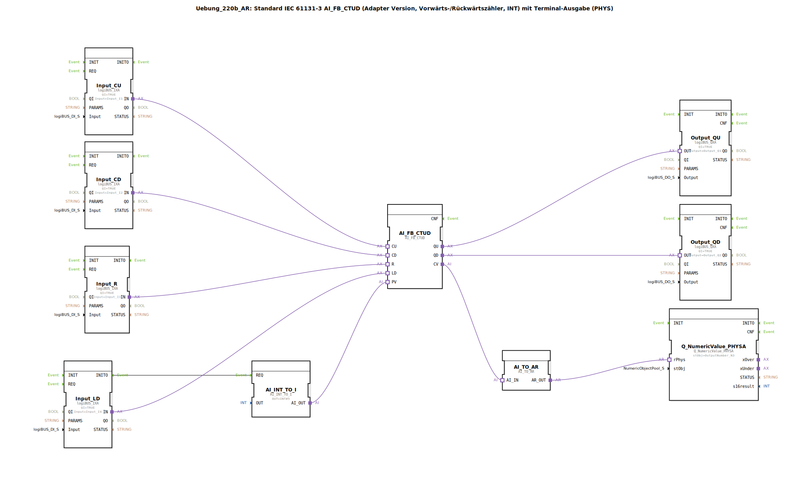

# Uebung_220b_AR: Standard IEC 61131-3 AI_FB_CTUD (Adapter Version, Vorwärts-/Rückwärtszähler, INT) mit Terminal-Ausgabe (PHYS)

*Bild nicht vorhanden*

* * * * * * * * * *
## Einleitung
Diese Übung realisiert einen Vorwärts-/Rückwärtszähler (CTUD) nach IEC 61131-3 in einer Adapter-Version. Der Zählerwert (Integer) wird über einen digitalen Preset-Wert (PV) initialisiert und kann über vier digitale Eingänge gesteuert werden. Der aktuelle Zählerstand wird über einen Analogausgang auf einem Terminal ausgegeben (physikalische Darstellung). Die Übung demonstriert die Verwendung von Adapter-basierten Funktionsbausteinen sowie die Umwandlung und Ausgabe von Zählerdaten.

## Verwendete Funktionsbausteine (FBs)
- **AI_FB_CTUD**  
  - **Typ**: `adapter::iec61131::counters::AI_FB_CTUD`  
  - **Funktion**: Vorwärts-/Rückwärtszähler mit Adapter-Schnittstelle (Eingänge CU, CD, R, LD, PV; Ausgänge QU, QD, CV).  
- **AI_INT_TO_I**  
  - **Typ**: `adapter::conversion::unidirectional::AI_INT_TO_I`  
  - **Parameter**: `OUT = INT#5` (konstanter Preset-Wert)  
  - **Funktion**: Wandelt einen konstanten Integer-Wert in einen Adapter-Ausgang (AI_OUT) um, der als Preset (PV) an den Zähler geht.  
- **Input_CU, Input_CD, Input_R, Input_LD**  
  - **Typ**: jeweils `logiBUS::io::DI::logiBUS_IXA`  
  - **Parameter**: `QI = TRUE` (Aktivierung des Eingangs); `Input` zugeordnet auf logiBUS-Digitaleingänge (Input_I1 bis Input_I4).  
  - **Funktion**: Digital-Eingangsadapter für die Steuerung des Zählers (CU = Vorwärtszählimpuls, CD = Rückwärtszählimpuls, R = Reset, LD = Laden des Presetwerts).  
- **Output_QU, Output_QD**  
  - **Typ**: jeweils `logiBUS::io::DQ::logiBUS_QXA`  
  - **Parameter**: `QI = TRUE`; `Output` zugeordnet auf logiBUS-Digitalausgänge (Output_Q1, Output_Q2).  
  - **Funktion**: Digitalausgangsadapter für die Zählerausgänge QU (Vorwärtszähler erreicht) und QD (Rückwärtszähler erreicht).  
- **AI_TO_AR**  
  - **Typ**: `adapter::conversion::unidirectional::AI_TO_AR`  
  - **Funktion**: Wandelt den Adapter-Ausgang (AI_IN) des Zählerwerts (CV) in einen analogen Adapter-Wert (AR_OUT) um.  
- **Q_NumericValue_PHYSA**  
  - **Typ**: `isobus::UT::Q::Q_NumericValue_PHYSA`  
  - **Parameter**: `stObj = OutputNumber_N3` (vordefiniertes Terminal-Ausgabeobjekt)  
  - **Funktion**: Gibt den analogen Zahlenwert physisch auf dem Terminal aus.

## Programmablauf und Verbindungen
Die Ereignissteuerung erfolgt über einen einzigen Ereignispfad:
- Der Baustein **Input_LD** löst beim Initialisierungsereignis (`INITO`) den Baustein **AI_INT_TO_I** aus (`REQ`), sodass dieser den konstanten Preset-Wert (INT#5) auf seinem Ausgang bereitstellt.

Die logischen Datenverbindungen (Adapterverbindungen) verknüpfen die Komponenten wie folgt:
- **Digitaleingänge zu Zähler:**  
  `Input_CU.IN` → `AI_FB_CTUD.CU` (Vorwärtszählimpuls)  
  `Input_CD.IN` → `AI_FB_CTUD.CD` (Rückwärtszählimpuls)  
  `Input_R.IN` → `AI_FB_CTUD.R` (Reset)  
  `Input_LD.IN` → `AI_FB_CTUD.LD` (Laden des Presetwerts)
- **Zählerausgänge zu Digitalausgängen:**  
  `AI_FB_CTUD.QU` → `Output_QU.OUT` (Vorwärtszählererreicht)  
  `AI_FB_CTUD.QD` → `Output_QD.OUT` (Rückwärtszählererreicht)
- **Zählerwert zu Terminalausgabe:**  
  `AI_FB_CTUD.CV` → `AI_TO_AR.AI_IN` (Aktueller Zählerwert)  
  `AI_TO_AR.AR_OUT` → `Q_NumericValue_PHYSA.rPhys` (Analogwert für Terminalanzeige)
- **Preset-Wert:**  
  `AI_INT_TO_I.AI_OUT` → `AI_FB_CTUD.PV` (Setzt den Preset-Wert auf INT#5)

Ein Kommentar weist darauf hin, dass mit dem Zähler auch negative Werte möglich sind und dass bei Bedarf pro Ausgang ein AX_D_FF (D-Flipflop) eingebaut werden kann, um die Ereignisrate zu reduzieren.  
Der Baustein **AI_FB_CTUD** arbeitet als Zähler: Bei jedem steigenden Flanke an CU wird der Zähler erhöht, bei CD verringert, bei R auf 0 zurückgesetzt und bei LD auf den Wert von PV geladen. Die Ausgänge QU und QD werden aktiv, wenn der Zählerstand einen Schwellwert erreicht (typischerweise >0 für QU, <0 für QD).

## Zusammenfassung
Die Übung **Uebung_220b_AR** zeigt den Einsatz eines standardisierten IEC 61131-3 Zählers (CTUD) in einer Adapter-Architektur. Durch die Verbindung von digitalen Eingängen (Taster/Sensoren), Digitalausgängen und einer Terminalausgabe wird ein vollständiger Zählprozess mit Visualisierung abgebildet. Der Lernende versteht die Funktionsweise von Aufwärts-/Abwärtszählern, die Adapter-Kommunikation in 4diac sowie die Umwandlung von Datenformaten (INT über AI_TO_AR). Zusätzlich wird die Möglichkeit zur Ereignisreduzierung durch Flipflops thematisiert.