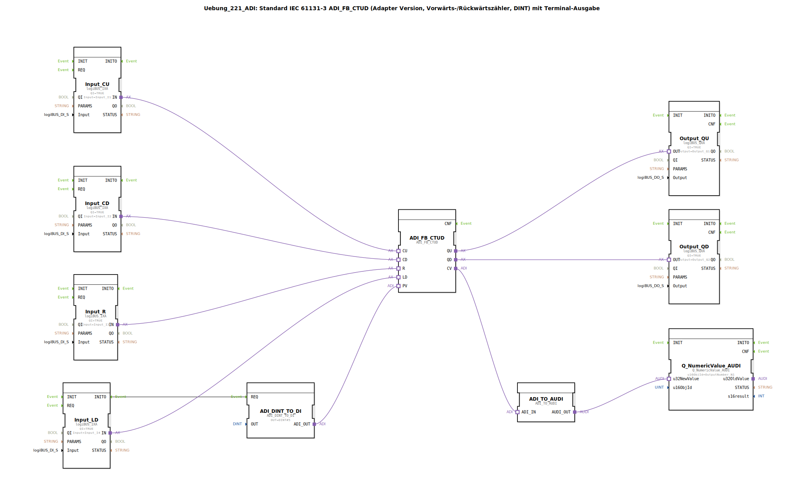

# Uebung_221_ADI: Standard IEC 61131-3 ADI_FB_CTUD (Adapter Version, Vorwärts-/Rückwärtszähler, DINT) mit Terminal-Ausgabe

* * * * * * * * * *

## Einleitung
Diese Übung implementiert einen Vorwärts-/Rückwärtszähler (engl. *Counter Up/Down*, CTUD) nach IEC 61131-3 in einer Adapter-Version (ADI_FB_CTUD). Der Zähler arbeitet mit 32‑Bit‑Ganzzahlen (DINT) und gibt den aktuellen Zählwert über eine Terminalausgabe aus. Die Eingänge werden über logiBUS-Adapter eingelesen, die Ausgänge über logiBUS-Adapter gesteuert. Ein fester Preset-Wert von 5 wird bei der Initialisierung geladen.

## Verwendete Funktionsbausteine (FBs)

- **ADI_FB_CTUD** (Typ: `adapter::iec61131::counters::ADI_FB_CTUD`)  
  Hauptzählerbaustein. Er besitzt die Adapter-Schnittstellen CU (Vorwärtszählen), CD (Rückwärtszählen), R (Reset), LD (Load), PV (Preset Value) sowie die Ausgänge QU (Überlauf), QD (Unterlauf) und CV (aktueller Zählwert).

- **ADI_DINT_TO_DI** (Typ: `adapter::conversion::unidirectional::ADI_DINT_TO_DI`)  
  Wandelt einen konstanten DINT-Wert (hier `DINT#5`) in eine DI-Adapter-Schnittstelle um. Parameter: `OUT = DINT#5`. Der Ausgang `ADI_OUT` wird mit dem PV-Eingang des Zählers verbunden.

- **logiBUS_IXA** (Eingangsadapter) – vier Instanzen:  
  - `Input_CU`: Eingang für Vorwärtszählimpulse (angeschlossen an physischen Eingang `Input_I1`).  
  - `Input_CD`: Eingang für Rückwärtszählimpulse (`Input_I2`).  
  - `Input_R`: Reset-Eingang (`Input_I3`).  
  - `Input_LD`: Load-Eingang (`Input_I4`).  
  Alle haben den Parameter `QI = TRUE`.

- **logiBUS_QXA** (Ausgangsadapter) – zwei Instanzen:  
  - `Output_QU`: Ausgang für Überlaufsignal (physischer Ausgang `Output_Q1`).  
  - `Output_QD`: Ausgang für Unterlaufsignal (`Output_Q2`).  
  Beide mit `QI = TRUE`.

- **ADI_TO_AUDI** (Typ: `adapter::conversion::unidirectional::ADI_TO_AUDI`)  
  Wandelt den ADI-Datenstrom (vom CV des Zählers) in ein AUDI-Signal für die Terminalausgabe um. Hinweis: Diese Wandlung unterstützt keine negativen Zahlen (siehe Kommentar im Netzwerk).

- **Q_NumericValue_AUDI** (Typ: `isobus::UT::Q::Q_NumericValue_AUDI`)  
  Terminalausgabe-Baustein. Parameter: `u16ObjId = OutputNumber_N1`. Zeigt den empfangenen numerischen Wert (Zählwert) auf dem Terminal an.

## Programmablauf und Verbindungen

1. **Initialisierung**: Beim Start wird das INITO-Ereignis von `Input_LD` genutzt, um den Baustein `ADI_DINT_TO_DI` zu triggern. Dieser gibt daraufhin den festen Wert `DINT#5` als ADI-Schnittstelle an den PV-Eingang des Zählers `ADI_FB_CTUD` weiter. Somit wird der Preset-Wert auf 5 gesetzt.

2. **Zählbetrieb**:  
   - Jeder positive Flanke an `Input_CU` (Vorwärtszählimpuls) erhöht den Zählerstand um 1.  
   - Jede positive Flanke an `Input_CD` verringert den Zählerstand um 1.  
   - Bei einem positiven Signal an `Input_R` wird der Zähler auf 0 zurückgesetzt.  
   - Bei einem positiven Signal an `Input_LD` wird der Zähler auf den aktuellen Preset-Wert (hier 5) gesetzt.

3. **Ausgänge**:  
   - Der Ausgang `Output_QU` (Überlauf) wird aktiv, wenn der Zähler den maximalen DINT-Wert erreicht und ein weiterer Vorwärtsimpuls erfolgt.  
   - Der Ausgang `Output_QD` (Unterlauf) wird aktiv, wenn der Zähler den minimalen DINT-Wert erreicht und ein weiterer Rückwärtsimpuls erfolgt.  
   - Der aktuelle Zählwert (CV) wird über `ADI_TO_AUDI` und `Q_NumericValue_AUDI` auf einem Terminal (Objekt-ID `OutputNumber_N1`) ausgegeben.

4. **Datenverbindungen** (Adapter Connections):  
   - Die Adapter-Eingänge `CU`, `CD`, `R`, `LD` des Zählers werden direkt mit den entsprechenden logiBUS-Eingängen verbunden.  
   - Die Adapter-Ausgänge `QU` und `QD` des Zählers werden mit den logiBUS-Ausgängen verbunden.  
   - Der Adapter-Ausgang `CV` (Zählwert) wird an `ADI_TO_AUDI.ADI_IN` angeschlossen.  
   - Der AUDI-Ausgang von `ADI_TO_AUDI` geht an `Q_NumericValue_AUDI.u32NewValue`.  
   - Der feste Preset-Wert von `ADI_DINT_TO_DI` wird an `ADI_FB_CTUD.PV` übertragen.

5. **Hinweise**:  
   - Die verwendete Konvertierung `ADI_TO_AUDI` kann keine negativen Zahlen darstellen (siehe Kommentar im Netzwerk). Sollte der Zähler negative Werte annehmen, ist die Terminalausgabe fehlerhaft.  
   - Bei hochfrequenten Ereignissen kann es sinnvoll sein, je einen AX_D_FF-Baustein (Ereignis-Flipflop) zwischenzuschalten, um die Ereignisrate zu reduzieren (siehe Kommentar).

## Zusammenfassung
Die Übung 221 demonstriert den Einsatz eines IEC‑61131‑3‑konformen Aufwärts-/Abwärtszählers in der Adapter-Version. Der Zähler wird über physische Eingänge gesteuert und gibt seinen aktuellen Wert sowie Überlauf-/Unterlaufsignale auf Ausgänge und ein Terminal aus. Ein fester Preset-Wert wird initial geladen. Die Übung zeigt die Integration von Standard‑FBs mit logiBUS‑E/A und Terminalausgabe sowie die Datenkonvertierung zwischen verschiedenen Adapter-Schnittstellen. Hinweise auf Einschränkungen (keine negativen Zahlen) und Optimierungsmöglichkeiten (Ereignisreduktion) sind vorhanden.