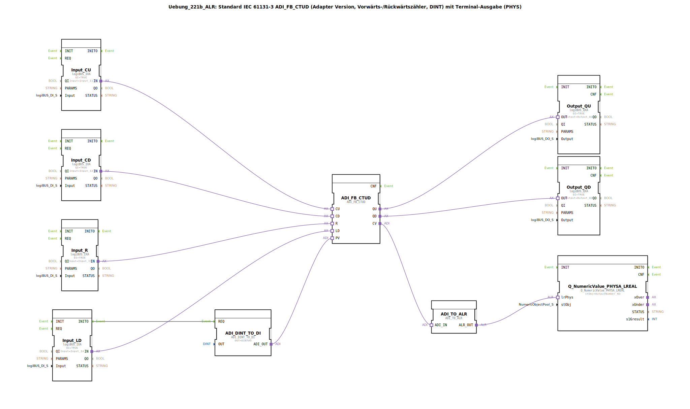

# Uebung_221b_ALR: Standard IEC 61131-3 ADI_FB_CTUD (Adapter Version, Vorwärts-/Rückwärtszähler, DINT) mit Terminal-Ausgabe (PHYS)

* * * * * * * * * *
## Einleitung

Diese Übung implementiert einen Vorwärts-/Rückwärtszähler (Up/Down Counter) nach IEC 61131‑3 (Typ `ADI_FB_CTUD`). Der Zähler wird über digitale Eingänge gesteuert und gibt den aktuellen Zählerstand sowohl über digitale Ausgänge (als Grenzwert‑Signale) als auch über eine Terminal‑Ausgabe (physikalischer Wert) aus. Der Zählbereich arbeitet mit 32‑Bit Ganzzahlen (DINT), wobei auch negative Werte möglich sind.

**Schwierigkeitsgrad**: Fortgeschritten  
**Vorkenntnisse**: Grundlegende Kenntnisse der 4diac‑IDE und des IEC 61131‑3‑Funktionsbausteinsystems, Verständnis von Adapter‑Schnittstellen.  
**Lernziele**:
- Arbeiten mit dem Zähler‑Baustein `ADI_FB_CTUD`
- Konfiguration von digitalen Ein‑/Ausgängen über logiBUS‑Adapter
- Umwandlung von Datentypen (DINT → Digitaleingang, DINT → LREAL) für die Terminalausgabe
- Erzeugung von Impulsen für das Laden des Zählwerts (PV)

## Verwendete Funktionsbausteine (FBs)

Die Übung besteht aus einer flachen Netzwerkstruktur ohne weitere Sub‑Applikationen. Folgende Funktionsbausteine kommen zum Einsatz:

- **`ADI_FB_CTUD`** (Typ: `adapter::iec61131::counters::ADI_FB_CTUD`)  
  Der zentrale Vorwärts-/Rückwärtszähler. Er besitzt die Adapter‑Schnittstelle `CU` (Count Up), `CD` (Count Down), `R` (Reset), `LD` (Load), `PV` (Preset Value) sowie die Ausgänge `QU` (Überlauf), `QD` (Unterlauf) und `CV` (aktueller Zählerwert).

- **`ADI_DINT_TO_DI`** (Typ: `adapter::conversion::unidirectional::ADI_DINT_TO_DI`)  
  Wandelt einen DINT‑Wert in ein digitales Signal (Adapter‑Schnittstelle) um. Der Parameter `OUT` ist auf `DINT#5` gesetzt, d. h. der Preset‑Wert für den Zähler wird auf 5 voreingestellt.

- **`Input_CU`**, **`Input_CD`**, **`Input_R`**, **`Input_LD`** (Typ: `logiBUS::io::DI::logiBUS_IXA`)  
  Digitale Eingangsadapter für die logiBUS‑Hardware. Sie lesen die physischen Eingänge `I1`, `I2`, `I3` und `I4`. Der Parameter `QI` ist auf `TRUE` gesetzt.

- **`Output_QU`**, **`Output_QD`** (Typ: `logiBUS::io::DQ::logiBUS_QXA`)  
  Digitale Ausgangsadapter. `Output_QU` schaltet den physischen Ausgang `Q1`, `Output_QD` den Ausgang `Q2`. Beide haben `QI = TRUE`.

- **`ADI_TO_ALR`** (Typ: `adapter::conversion::unidirectional::ADI_TO_ALR`)  
  Wandelt den Adapter‑Ausgang `CV` (Zählerwert) in den Datentyp `ALR` (Analog‑LREAL‑Darstellung) um.

- **`Q_NumericValue_PHYSA_LREAL`** (Typ: `isobus::UT::Q::Q_NumericValue_PHYSA_LREAL`)  
  Gibt den numerischen Wert (LREAL) auf ein Terminal aus. Der Parameter `stObj` verweist auf das konstante Objekt `OutputNumber_N3` aus der Bibliothek `Uebungen::const::UT::DefaultPool_Numeric`.

### Parameterdetails ausgewählter Bausteine

| Baustein | Parameter | Wert |
|----------|-----------|------|
| `ADI_DINT_TO_DI` | `OUT` | `DINT#5` |
| `Input_CU` | `QI` | `TRUE` |
| | `Input` | `Input_I1` |
| `Input_CD` | `QI` | `TRUE` |
| | `Input` | `Input_I2` |
| `Input_R` | `QI` | `TRUE` |
| | `Input` | `Input_I3` |
| `Input_LD` | `QI` | `TRUE` |
| | `Input` | `Input_I4` |
| `Output_QU` | `QI` | `TRUE` |
| | `Output` | `Output_Q1` |
| `Output_QD` | `QI` | `TRUE` |
| | `Output` | `Output_Q2` |
| `Q_NumericValue_PHYSA_LREAL` | `stObj` | `OutputNumber_N3` |

## Programmablauf und Verbindungen

### Signalfluss

1. **Eingänge**: Die vier digitalen Eingänge (`I1`–`I4`) werden über die logiBUS‑Adapter `Input_CU`, `Input_CD`, `Input_R`, `Input_LD` in die Steuerung eingelesen.
2. **Zählersteuerung**:
   - `CU` (Count Up) von `Input_CU`: jedes Ereignis am Eingang `I1` erhöht den Zähler um 1.
   - `CD` (Count Down) von `Input_CD`: Ereignis an `I2` verringert den Zähler um 1.
   - `R` (Reset) von `Input_R`: Ereignis an `I3` setzt den Zähler auf 0 zurück.
   - `LD` (Load) von `Input_LD`: Ereignis an `I4` lädt den Preset‑Wert (PV) in den Zähler.
3. **Preset‑Wert (PV)**: Der Baustein `ADI_DINT_TO_DI` wird beim INIT‑Ereignis von `Input_LD` aktiviert (Event‑Verbindung `Input_LD.INITO → ADI_DINT_TO_DI.REQ`). Er gibt den konstanten Wert `DINT#5` an den Adapter‑Eingang `PV` des Zählers weiter. Somit wird bei jedem Ladevorgang der Zähler auf 5 gesetzt.
4. **Ausgänge**:
   - `QU` (Count Up Overflow): geht auf `TRUE`, wenn der Zähler seinen maximalen Wert erreicht oder überschreitet → wird auf `Output_Q1` ausgegeben.
   - `QD` (Count Down Overflow): `TRUE` bei Unterschreitung des Minimalwerts → `Output_Q2`.
   - `CV` (Current Value) wird über `ADI_TO_ALR` in ein LREAL‑Signal gewandelt und an `Q_NumericValue_PHYSA_LREAL` übergeben. Dieses gibt den aktuellen Zählerstand als numerischen Wert auf dem Terminal (physikalische Ausgabe) aus.

### Hinweise zum Aufbau

- **Kommentare im Netzwerk**:
  > *„hier sind negative Werte möglich !“* – Der Zähler `ADI_FB_CTUD` arbeitet mit DINT, daher können negative Zählerstände auftreten (z. B. durch mehr Rückwärts‑als Vorwärtsimpulse).
  > *„hier gegebenenfalls je einen AX_D_FF einbauen, damit die Events reduziert werden.“* – Bei schnellen Impulsfolgen könnte es erforderlich sein, Flanken‑Filter (z. B. `AX_D_FF`) zwischen Eingängen und Zähler zu schalten, um die Ereignisrate zu begrenzen und Zählfehler zu vermeiden.
- **Keine eigenen Sub‑Applikationen**: Der gesamte Programmablauf ist in einer Ebene realisiert.
- Die Verbindungen sind als **Adapter‑Connections** ausgeführt, d. h. die Daten‑ und Ereignisübertragung erfolgt über Adapter‑Schnittstellen.
- Die **Ereignisverbindung** `Input_LD.INITO → ADI_DINT_TO_DI.REQ` stellt sicher, dass der Preset‑Wert nur beim Start des Eingangsbausteins (Initialisierung) neu gesendet wird.

### Starten der Übung

1. Die Übung ist als SubAppType (`Uebung_221b_ALR`) in der 4diac‑IDE eingebunden.
2. Voraussetzung ist eine laufende logiBUS‑Hardware mit angeschlossenen Ein‑/Ausgängen (`I1`–`I4`, `Q1`, `Q2`).
3. Das Terminal‑Objekt `OutputNumber_N3` muss im Projekt vorhanden sein (aus der Bibliothek `Uebungen::const::UT::DefaultPool_Numeric`).
4. Nach dem Deployment kann die Steuerung durch Anlegen von Impulsen an den Eingängen getestet werden.

## Zusammenfassung

Die Übung `Uebung_221b_ALR` demonstriert den Einsatz eines industriellen Vorwärts-/Rückwärtszählers (`ADI_FB_CTUD`) in der 4diac‑IDE. Durch die Kombination von logiBUS‑Eingängen, Datenkonvertierung und Terminalausgabe wird ein vollständiger Signalpfad von der Hardware bis zur Visualisierung abgebildet. Der Zähler kann über vier digitale Eingänge gesteuert werden, wobei ein fester Preset‑Wert von 5 verwendet wird. Die Ausgabe des aktuellen Zählerstands als Gleitkommazahl auf das Terminal erleichtert die Überwachung und Fehlersuche. Die Übung vermittelt praxisnahe Kenntnisse über Adapter‑Schnittstellen, Ereignissteuerung und Datentypkonvertierung.