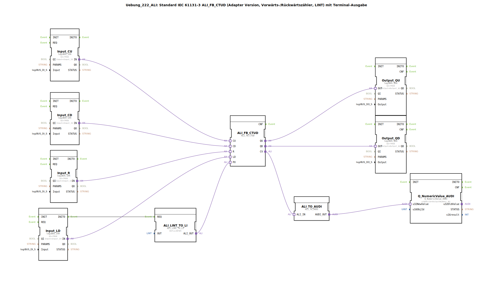

# Uebung_222_ALI: Standard IEC 61131-3 ALI_FB_CTUD (Adapter Version, Vorwärts-/Rückwärtszähler, LINT) mit Terminal-Ausgabe

*Bild nicht vorhanden*

* * * * * * * * * *
## Einleitung

Diese Übung implementiert einen Vorwärts-/Rückwärtszähler nach IEC 61131-3 (CTUD) im Adapter-Format. Der Zähler wird über digitale Eingänge (logiBUS) gesteuert und gibt seinen aktuellen Zählwert über ein Terminal aus. Der Preset-Wert (PV) wird auf LINT#5 gesetzt und beim Setzen des LD-Eingangs geladen. Die Ausgänge QU (Überlauf) und QD (Unterlauf) werden auf digitale Ausgänge geschaltet.

## Verwendete Funktionsbausteine (FBs)

- **ALI_FB_CTUD** (Typ: `adapter::iec61131::counters::ALI_FB_CTUD`):
    - Parameter: keine im XML gesetzt (Standardwerte)
    - Ereigniseingänge: CU, CD, R, LD
    - Daten-Eingänge: PV (von ALI_LINT_TO_LI)
    - Ereignisausgänge: (keine sichtbar)
    - Datenausgänge: QU, QD, CV
- **ALI_LINT_TO_LI** (Typ: `adapter::conversion::unidirectional::ALI_LINT_TO_LI`):
    - Parameter: `OUT` = `LINT#5`
    - Ereigniseingang: REQ (verbunden mit Input_LD.INITO)
    - Datenausgang: ALI_OUT (verbunden mit ALI_FB_CTUD.PV)
- **Input_CU** (Typ: `logiBUS::io::DI::logiBUS_IXA`):
    - Parameter: `QI` = `TRUE`, `Input` = `Input_I1`
    - Adapterausgang: IN
- **Input_CD** (Typ: `logiBUS::io::DI::logiBUS_IXA`):
    - Parameter: `QI` = `TRUE`, `Input` = `Input_I2`
    - Adapterausgang: IN
- **Input_R** (Typ: `logiBUS::io::DI::logiBUS_IXA`):
    - Parameter: `QI` = `TRUE`, `Input` = `Input_I3`
    - Adapterausgang: IN
- **Input_LD** (Typ: `logiBUS::io::DI::logiBUS_IXA`):
    - Parameter: `QI` = `TRUE`, `Input` = `Input_I4`
    - Adapterausgang: IN
- **Output_QU** (Typ: `logiBUS::io::DQ::logiBUS_QXA`):
    - Parameter: `QI` = `TRUE`, `Output` = `Output_Q1`
    - Adaptereingang: OUT
- **Output_QD** (Typ: `logiBUS::io::DQ::logiBUS_QXA`):
    - Parameter: `QI` = `TRUE`, `Output` = `Output_Q2`
    - Adaptereingang: OUT
- **ALI_TO_AUDI** (Typ: `adapter::conversion::unidirectional::ALI_TO_AUDI`):
    - Konvertiert einen `ALI`-Wert in ein `AUDI`-Format (für Terminalausgabe)
    - **Hinweis:** Gemäß Kommentar ist dieser Baustein nicht geeignet, um negative Zahlen darzustellen.
- **Q_NumericValue_AUDI** (Typ: `isobus::UT::Q::Q_NumericValue_AUDI`):
    - Parameter: `u16ObjId` = `OutputNumber_N1`
    - Zeigt den übergebenen numerischen Wert auf einem Terminal an.

## Programmablauf und Verbindungen

Die Hardware-Eingänge (I1–I4) werden über die logiBUS-DI-Bausteine eingelesen. Die Ereignisse und Daten werden wie folgt verbunden:

1. **Takteingänge CU und CD**:
   - `Input_CU.IN` → `ALI_FB_CTUD.CU` (Vorwärtszählen, positive Flanke)
   - `Input_CD.IN` → `ALI_FB_CTUD.CD` (Rückwärtszählen, positive Flanke)

2. **Rücksetzen und Laden**:
   - `Input_R.IN` → `ALI_FB_CTUD.R` (Setzt den Zählerstand auf 0)
   - `Input_LD.IN` → `ALI_FB_CTUD.LD` (Lädt den Preset-Wert PV in den Zähler)
   - Das Ereignis `Input_LD.INITO` löst den `ALI_LINT_TO_LI.REQ` aus, sodass der feste Wert LINT#5 als PV am Ausgang `ALI_OUT` bereitsteht.

3. **Preset-Wert**:
   - `ALI_LINT_TO_LI.ALI_OUT` → `ALI_FB_CTUD.PV`

4. **Ausgänge**:
   - `ALI_FB_CTUD.QU` → `Output_QU.OUT` (wird auf digitalen Ausgang Q1 geschaltet)
   - `ALI_FB_CTUD.QD` → `Output_QD.OUT` (wird auf digitalen Ausgang Q2 geschaltet)

5. **Zählwertausgabe auf Terminal**:
   - `ALI_FB_CTUD.CV` → `ALI_TO_AUDI.ALI_IN`
   - `ALI_TO_AUDI.AUDI_OUT` → `Q_NumericValue_AUDI.u32NewValue`
   - Der aktuelle Zählwert (CV) wird umgewandelt und im Terminal mit der Objekt-ID `OutputNumber_N1` ausgegeben.

**Hinweise aus den Kommentaren**:
- Der Baustein `ALI_TO_AUDI` unterstützt keine negativen Zahlen – der ausgegebene Wert kann daher bei Unterschreiten von 0 nicht korrekt dargestellt werden.
- Zur Reduzierung der Eventanzahl (z. B. bei schnellen Zählimpulsen) könnte man vor den Ausgängen jeweils einen `AX_D_FF` einfügen.

## Zusammenfassung

Die Übung demonstriert den Einsatz des standardisierten CTUD-Zählers (IEC 61131-3) in einer 4diac-Umgebung unter Verwendung des Adapter-Konzepts. Die Anbindung an die reale Hardware (logiBUS) sowie die Ausgabe eines Zählwertes auf ein Terminal werden gezeigt. Der Preset-Wert wird einmalig beim Start durch einen eigenen Konvertierungsbaustein gesetzt. Die Übung macht auch auf Einschränkungen der Konvertierungsbausteine aufmerksam (keine negativen Zahlen) und gibt einen Hinweis zur Optimierung der Eventverarbeitung bei schnellen Signalen.