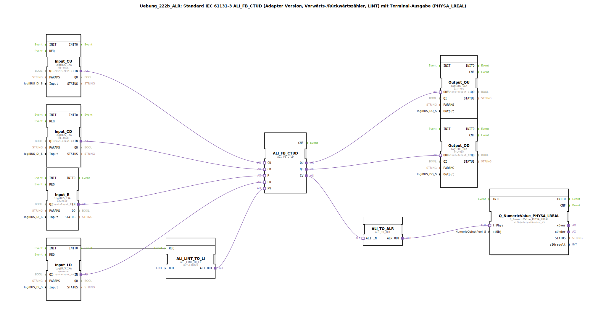

# Uebung_222b_ALR: Standard IEC 61131-3 ALI_FB_CTUD (Adapter Version, Vorwärts-/Rückwärtszähler, LINT) mit Terminal-Ausgabe (PHYSA_LREAL)

* * * * * * * * * *

## Einleitung

Diese Übung implementiert einen Vorwärts-/Rückwärtszähler auf Basis des adaptierten IEC‑61131‑3‑Bausteins `ALI_FB_CTUD` (Typ LINT).  
Die Zählerimpulse, der Reset und der Ladevorgang werden über vier digitale Eingänge (logiBUS) gesteuert.  
Die beiden Zählausgänge `QU` und `QD` werden auf digitale Ausgänge geführt.  
Der aktuelle Zählerstand (`CV`) wird über einen Konverter in einen physikalischen Wert (LREAL) umgewandelt und auf einem Terminal (Ausgabepool) ausgegeben.  
Ein konstanter Startwert (`PV = 5`) wird über einen separaten Konvertierungsbaustein bereitgestellt.

Lernziele:
- Verwendung des adaptierten IEC-Zählers `ALI_FB_CTUD`
- Verbindung von digitalen Ein‑/Ausgängen (logiBUS)
- Konvertierung zwischen LINT und LREAL
- Ausgabe eines physikalischen Werts auf ein Terminal (Pool‑Element)

## Verwendete Funktionsbausteine (FBs)

Die Applikation besteht aus folgenden Bausteinen, die im SubApp‑Netzwerk verbunden sind:

- **ALI_FB_CTUD** (`adapter::iec61131::counters::ALI_FB_CTUD`)  
  Der zentrale Vorwärts‑/Rückwärtszähler (IEC 61131‑3, LINT). Er besitzt die Adapter‑Eingänge `CU`, `CD`, `R`, `LD`, die Ausgänge `QU`, `QD` sowie den Datenausgang `CV`.

- **ALI_LINT_TO_LI** (`adapter::conversion::unidirectional::ALI_LINT_TO_LI`)  
  Wandelt einen konstanten LINT‑Wert in ein LINT‑Signal um.  
  Parameter: `OUT = LINT#5` (Startwert für den Zähler).

- **Input_CU** (`logiBUS::io::DI::logiBUS_IXA`)  
  Digitaler Eingang für den Vorwärtszählimpuls (`CU`), verbunden mit `Input_I1`.  
  Parameter: `QI = TRUE`.

- **Input_CD** (`logiBUS::io::DI::logiBUS_IXA`)  
  Digitaler Eingang für den Rückwärtszählimpuls (`CD`), verbunden mit `Input_I2`.  
  Parameter: `QI = TRUE`.

- **Input_R** (`logiBUS::io::DI::logiBUS_IXA`)  
  Digitaler Eingang für den Reset (`R`), verbunden mit `Input_I3`.  
  Parameter: `QI = TRUE`.

- **Input_LD** (`logiBUS::io::DI::logiBUS_IXA`)  
  Digitaler Eingang für das Laden des Startwerts (`LD`), verbunden mit `Input_I4`.  
  Parameter: `QI = TRUE`.

- **Output_QU** (`logiBUS::io::DQ::logiBUS_QXA`)  
  Digitaler Ausgang für den Zählausgang `QU`, verbunden mit `Output_Q1`.  
  Parameter: `QI = TRUE`.

- **Output_QD** (`logiBUS::io::DQ::logiBUS_QXA`)  
  Digitaler Ausgang für den Zählausgang `QD`, verbunden mit `Output_Q2`.  
  Parameter: `QI = TRUE`.

- **ALI_TO_ALR** (`adapter::conversion::unidirectional::ALI_TO_ALR`)  
  Wandelt den LINT‑Zählerstand (`CV`) in einen LREAL‑Wert (physikalische Größe) um.

- **Q_NumericValue_PHYSA_LREAL** (`isobus::UT::Q::Q_NumericValue_PHYSA_LREAL`)  
  Nimmt den physikalischen Wert auf und gibt ihn auf das konfigurierte Terminalelement (`OutputNumber_N3`) aus.

## Programmablauf und Verbindungen

Die logischen Verbindungen (über Adapter) stellen den Datenfluss her:

1. **Eingänge zum Zähler**  
   - `Input_CU.IN` → `ALI_FB_CTUD.CU`  
   - `Input_CD.IN` → `ALI_FB_CTUD.CD`  
   - `Input_R.IN` → `ALI_FB_CTUD.R`  
   - `Input_LD.IN` → `ALI_FB_CTUD.LD`

2. **Startwert (PV)**  
   - `Input_LD.INITO` (Ereignis) → `ALI_LINT_TO_LI.REQ`  
   - `ALI_LINT_TO_LI.ALI_OUT` → `ALI_FB_CTUD.PV`  
   Der Startwert wird beim Laden (Flanke an `LD`) aktiv gesetzt.

3. **Zählerausgänge**  
   - `ALI_FB_CTUD.QU` → `Output_QU.OUT`  
   - `ALI_FB_CTUD.QD` → `Output_QD.OUT`

4. **Ausgabe des Zählerstands (Terminal)**  
   - `ALI_FB_CTUD.CV` → `ALI_TO_ALR.ALI_IN`  
   - `ALI_TO_ALR.ALR_OUT` → `Q_NumericValue_PHYSA_LREAL.lrPhys`  
   Der Zählerwert (LINT) wird in einen LREAL‑Wert umgewandelt und an die Terminal‑Ausgabe gesendet.

Beachten Sie die Kommentare im Netzwerk:
- *„hier sind negative Werte möglich!“* (der LINT‑Zähler kann unter Null zählen)
- *„hier gegebenenfalls je einen AX_D_FF einbauen, damit die Events reduziert werden.“* (Hinweis zur Ereignisoptimierung an den Ausgängen)

Der Baustein `ALI_LINT_TO_LI` initialisiert den Vorgabewert mit `LINT#5`. Dadurch wird der Zähler beim ersten Ladevorgang auf 5 gesetzt.

## Zusammenfassung

Die Übung 222b demonstriert den Einsatz eines adaptierten IEC‑Zählers in der 4diac‑IDE.  
Über digitale logiBUS‑Eingänge werden Zählimpulse, Reset und Laden gesteuert.  
Der aktuelle Zählerstand wird sowohl auf digitale Ausgänge als auch – nach Konvertierung in eine physikalische Größe – auf ein Terminal ausgegeben.  
Sie lernen die Verbindung von Ein‑/Ausgabebausteinen, die Konvertierung von Ganzzahl‑ in Gleitkommawerte sowie das Setzen eines konstanten Startwerts kennen.  
Hinweise zu negativen Zählerständen und zur Ereignisreduzierung ergänzen die praktische Anwendung.