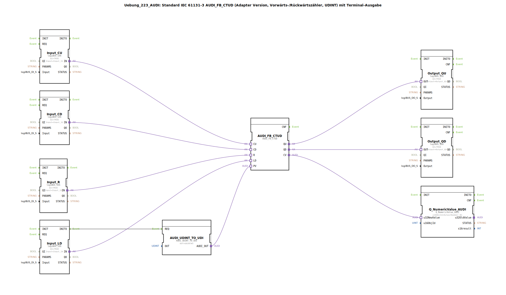

# Uebung_223_AUDI: Standard IEC 61131-3 AUDI_FB_CTUD (Adapter Version, Vorwärts-/Rückwärtszähler, UDINT) mit Terminal-Ausgabe

* * * * * * * * * *

## Einleitung

Diese Übung implementiert einen bidirektionalen Zähler (Vorwärts-/Rückwärtszähler) nach IEC 61131‑3 (Typ CTUD) als Adapter-Version. Der Zählerwert wird als UDINT (unsigned double integer) verarbeitet und über ein Terminalmodul auf einer numerischen Anzeige ausgegeben. Die Steuerung der Zählerfunktionen erfolgt über vier digitale Eingänge (CU, CD, R, LD), die über logiBUS‑Bausteine angebunden sind. Die Ausgänge (QU, QD) werden ebenfalls über logiBUS‑Bausteine auf digitale Ausgänge geführt.

## Verwendete Funktionsbausteine (FBs)

- **AUDI_FB_CTUD**  
  Typ: `adapter::iec61131::counters::AUDI_FB_CTUD`  
  Kernbaustein: IEC‑61131 konformer Vorwärts‑/Rückwärtszähler (CTUD).  
  Ereigniseingänge: CU (Vorwärtszählen), CD (Rückwärtszählen), R (Reset), LD (Laden des Presetwerts).  
  Datenausgänge: QU (Überlauf bei Vorwärtszählung), QD (Überlauf bei Rückwärtszählung), CV (aktueller Zählerwert).  
  Dateneingänge: PV (Presetwert).

- **AUDI_UDINT_TO_UDI**  
  Typ: `adapter::conversion::unidirectional::AUDI_UDINT_TO_UDI`  
  Wandelt einen konstanten UDINT-Wert in einen passenden Adapterausgang (UDI) für den PV‑Eingang des Zählers um.  
  Parameter: OUT = `UDINT#5` (Presetwert wird auf 5 gesetzt).

- **Input_CU, Input_CD, Input_R, Input_LD**  
  Typ: `logiBUS::io::DI::logiBUS_IXA`  
  Digitale Eingangsbausteine (logiBUS‑Adapter).  
  Parameter: QI = TRUE (aktiv), Input = `Input_I1`, `Input_I2`, `Input_I3`, `Input_I4` (pro Baustein je ein physikalischer Eingang).  
  Adapterausgang „IN“ stellt das digitale Signal für CU, CD, R bzw. LD bereit.

- **Output_QU, Output_QD**  
  Typ: `logiBUS::io::DQ::logiBUS_QXA`  
  Digitale Ausgangsbausteine (logiBUS‑Adapter).  
  Parameter: QI = TRUE, Output = `Output_Q1` bzw. `Output_Q2`.  
  Adaptereingang „OUT“ erhält das Signal von QU bzw. QD des Zählers.

- **Q_NumericValue_AUDI**  
  Typ: `isobus::UT::Q::Q_NumericValue_AUDI`  
  Baustein zur Ausgabe eines numerischen Werts auf einem Terminal (z. B. Anzeige).  
  Parameter: u16ObjId = `OutputNumber_N1` (Kennung des Terminalobjekts).  
  Dateneingang: u32NewValue (erhält den aktuellen Zählerwert CV).

## Programmablauf und Verbindungen

1. **Initialisierung**  
   Beim Systemstart (INITO des Eingangsbausteins Input_LD) wird der Baustein `AUDI_UDINT_TO_UDI` über den Ereigniseingang REQ getriggert. Dieser wandelt den konstanten Wert `UDINT#5` in einen Adapterausgang um, der mit dem Presetwert-Eingang PV des Zählers verbunden ist. Somit wird der Zähler beim ersten Laden (LD) auf den Wert 5 gesetzt.

2. **Zählersteuerung**  
   - **CU** (Eingang I1): Bei positiver Flanke zählt der Zähler um 1 aufwärts.  
   - **CD** (Eingang I2): Bei positiver Flanke zählt der Zähler um 1 abwärts.  
   - **R** (Eingang I3): Bei positiver Flanke wird der Zähler auf 0 zurückgesetzt.  
   - **LD** (Eingang I4): Bei positiver Flanke wird der Zähler auf den aktuellen PV-Wert (5) geladen.

3. **Ausgangssignale**  
   - **QU** (Ausgang Q1): Wird HIGH, wenn der Zähler den maximalen Wert (Überlauf) erreicht hat.  
   - **QD** (Ausgang Q2): Wird HIGH, wenn der Zähler den minimalen Wert (Unterlauf) erreicht hat.  
   - Der aktuelle Zählerwert (CV) wird über den Baustein `Q_NumericValue_AUDI` an das Terminal (OutputNumber_N1) übermittelt und dort numerisch angezeigt.

4. **Hinweis zur Entprellung**  
   Ein Kommentar im Netzwerk empfiehlt, zwischen den digitalen Eingängen und dem Zähler ggf. AX_D_FF‑Bausteine (T‑Flipflops) einzufügen, um die Ereignisrate durch Flankenreduzierung zu verringern. Dies ist in dieser Übung nicht realisiert, kann aber bei Bedarf ergänzt werden.

## Zusammenfassung

Die Übung demonstriert die Verwendung eines IEC‑61131 konformen Vorwärts-/Rückwärtszählers (CTUD) als Adapter in einer 4diac‑IDE. Eingangssignale werden über logiBUS‑Bausteine eingelesen, der Zählerwert wird über eine Adapterkonvertierung initialisiert, und die Ausgänge (QU, QD) sowie der aktuelle Zählerstand werden auf digitale Ausgänge bzw. ein Terminal ausgegeben. Die Übung vermittelt Grundlagen der Zählersteuerung, des Umgangs mit Adaptern und der Ein‑/Ausgabe über logiBUS‑Hardware.