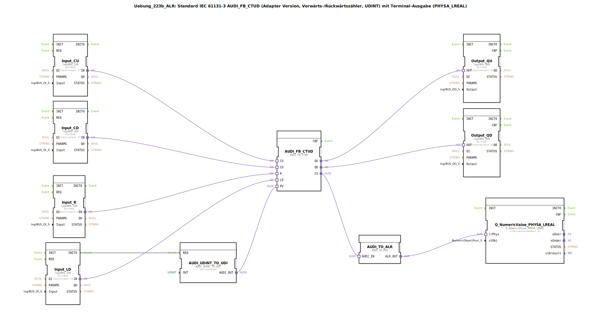

# Uebung_223b_ALR: Standard IEC 61131-3 AUDI_FB_CTUD (Adapter Version, Vorwärts-/Rückwärtszähler, UDINT) mit Terminal-Ausgabe (PHYSA_LREAL)

* * * * * * * * * *

## Einleitung

Diese Übung implementiert einen standardkonformen Auf‑/Abwärtszähler auf Basis des IEC‑61131‑3‑Bausteins **AUDI_FB_CTUD** in der Adapterversion. Der Zähler verarbeitet vier digitale Eingangssignale (Zählen vorwärts, rückwärts, Reset und Laden eines Preset‑Wertes) und gibt den aktuellen Zählerstand sowie die Überlauf‑/Unterlaufsignale aus. Der Preset‑Wert wird über einen Konvertierungsbaustein bereitgestellt, der Zählerstand wird für eine Terminalausgabe in einen physikalischen LREAL‑Wert umgewandelt.

Die Übung demonstriert die Adaptertechnologie der 4diac‑IDE, die Typkonvertierung zwischen verschiedenen Datenformaten und die Anbindung digitaler Ein‑/Ausgänge sowie einer numerischen Ausgabe (z. B. für ein Bedienterminal).

## Verwendete Funktionsbausteine (FBs)

### Hauptbaustein: `AUDI_FB_CTUD`
- **Typ**: `adapter::iec61131::counters::AUDI_FB_CTUD`
- **Beschreibung**: Standard IEC‑61131‑3 Auf‑/Abwärtszähler (Forward/Reverse Counter) mit einem Zählbereich vom Typ `UDINT`.
- **Funktionsweise**:
  - Bei einem positiven Flanke am **CU**‑Eingang wird der Zähler um eins erhöht.
  - Bei einer positiven Flanke am **CD**‑Eingang wird der Zähler um eins verringert.
  - Bei **R** (Reset) wird der Zählerstand auf Null gesetzt.
  - Bei **LD** (Load) wird der am **PV**‑Eingang anliegende Preset‑Wert übernommen.
  - Der aktuelle Zählerwert wird am **CV**‑Ausgang bereitgestellt.
  - Der **QU**‑Ausgang gibt ein Signal, wenn der Zähler den oberen Grenzwert erreicht hat (Überlauf).
  - Der **QD**‑Ausgang gibt ein Signal, wenn der Zähler auf Null steht und weiter rückwärts zählen soll (Unterlauf).

### Konvertierungsbaustein: `AUDI_UDINT_TO_UDI`
- **Typ**: `adapter::conversion::unidirectional::AUDI_UDINT_TO_UDI`
- **Parameter**: `OUT = UDINT#5`
- **Funktionsweise**: Wandelt eine Konstante vom Typ `UDINT` (hier: 5) in den vom Zähler erwarteten `UDI`‑Typ um und stellt den Wert am Ausgang `AUDI_OUT` bereit. Dieser Wert wird als Preset‑Wert an den **PV**‑Eingang des Zählers übergeben.

### Digitaleingänge
- **Input_CU**, **Input_CD**, **Input_R**, **Input_LD**
  - **Typ**: `logiBUS::io::DI::logiBUS_IXA`
  - **Parameter**:
    - `QI = TRUE` (Qualifier, aktiviert den Baustein)
    - `Input` = jeweilige physikalische Eingangsvariable (`Input_I1`, `Input_I2`, `Input_I3`, `Input_I4`)
  - **Funktionsweise**: Diese Adapter‑Bausteine koppeln die digitalen Eingänge der logiBUS‑Hardware an die Adapterschnittstellen. Sie liefern ein Ereignis und einen Datenwert (Adapterschnittstelle) an den Zähler.

### Digitalausgänge
- **Output_QU**, **Output_QD**
  - **Typ**: `logiBUS::io::DQ::logiBUS_QXA`
  - **Parameter**:
    - `QI = TRUE`
    - `Output` = zugeordnete Ausgangsvariable (`Output_Q1`, `Output_Q2`)
  - **Funktionsweise**: Empfangen die Adaptersignale vom Zähler (QU, QD) und geben sie als digitale Ausgangssignale an die Hardware weiter.

### Konvertierungsbaustein: `AUDI_TO_ALR`
- **Typ**: `adapter::conversion::unidirectional::AUDI_TO_ALR`
- **Funktionsweise**: Wandelt den `AUDI`‑Zählerstand (Typ `AUDI`, entspricht einem vorzeichenlosen Integer) in einen `ALR`‑Wert um. Dieser wird anschließend an die Terminalausgabe übergeben.

### Terminalausgabe: `Q_NumericValue_PHYSA_LREAL`
- **Typ**: `isobus::UT::Q::Q_NumericValue_PHYSA_LREAL`
- **Parameter**: `stObj = OutputNumber_N3`
- **Funktionsweise**: Nimmt einen physikalischen Wert vom Typ `LREAL` entgegen und gibt ihn als numerischen Wert auf einem Terminal (z. B. HMI) aus. Der Parameter `stObj` referenziert das entsprechende Ausgabeelement.

## Programmablauf und Verbindungen

Der Zähler wird durch die digitalen Eingänge gesteuert:
- **Vorwärtszählen** über `Input_CU` → `CU`
- **Rückwärtszählen** über `Input_CD` → `CD`
- **Reset** über `Input_R` → `R`
- **Laden des Preset‑Wertes** über `Input_LD` → `LD`

Der Preset‑Wert wird beim erstmaligen Einschalten über die Ereignisverbindung `Input_LD.INITO -> AUDI_UDINT_TO_UDI.REQ` initialisiert. Der Konvertierungsbaustein `AUDI_UDINT_TO_UDI` gibt daraufhin den konstanten Wert 5 (UDINT) über seinen Ausgang `AUDI_OUT` an den **PV**‑Eingang des Zählers weiter.

Der aktuelle Zählerstand wird über die Adapterverbindung `AUDI_FB_CTUD.CV → AUDI_TO_ALR.AUDI_IN` geleitet, dort in den `ALR`‑Typ konvertiert und anschließend an den physikalischen Eingang `lrPhys` des Terminalbausteins übergeben (`AUDI_TO_ALR.ALR_OUT → Q_NumericValue_PHYSA_LREAL.lrPhys`).

Die Überlauf‑ und Unterlauf‑Signale des Zählers (`QU`, `QD`) werden auf die digitalen Ausgänge `Output_QU` und `Output_QD` gelegt, die an den physikalischen Ausgängen `Output_Q1` und `Output_Q2` anliegen.

**Besonderheiten**:
- Negative Zählerstände sind möglich, da der Baustein vorzeichenlos arbeitet, der Zähler jedoch bei Unterlauf unter Null gehen kann.
- Es wird empfohlen, bei häufigen Ereignissen **AX_D_FF**‑Bausteine (Ereignisreduzierer) zwischen den Eingängen und dem Zähler einzufügen, um die Eventlast zu verringern (siehe Kommentar im Netzwerk).

**Lernziele**:
- Verwendung des IEC‑61131‑3‑Auf‑/Abwärtszählers in der Adapterversion
- Verständnis der Adapter‑Schnittstellentechnik in der 4diac‑IDE
- Konvertierung zwischen unterschiedlichen Datentypen (UDINT → UDI, AUDI → ALR → LREAL)
- Einbindung von digitalen Ein‑/Ausgängen und Terminalausgaben
- Beachtung möglicher negativer Zählerwerte und Ereignisoptimierung

## Zusammenfassung

Die Übung 223b realisiert einen vollständigen Auf‑/Abwärtszähler mit festem Preset‑Wert (5). Digitale Eingänge steuern den Zähler, die Zählerausgänge (Überlauf/Unterlauf) werden auf digitale Ausgänge geschaltet, und der aktuelle Zählerstand wird als physikalischer Wert auf einem Terminal ausgegeben. Die Umsetzung nutzt durchgängig die Adaptertechnologie, bei der Ereignis‑ und Datenflüsse über standardisierte Schnittstellen verbunden werden. Durch den Einsatz von Konvertierungsbausteinen wird die Datenkompatibilität zwischen den verschiedenen Teilsystemen sichergestellt. Die Übung bietet eine solide Grundlage für erweiterte Zähleranwendungen in der Automatisierungstechnik.