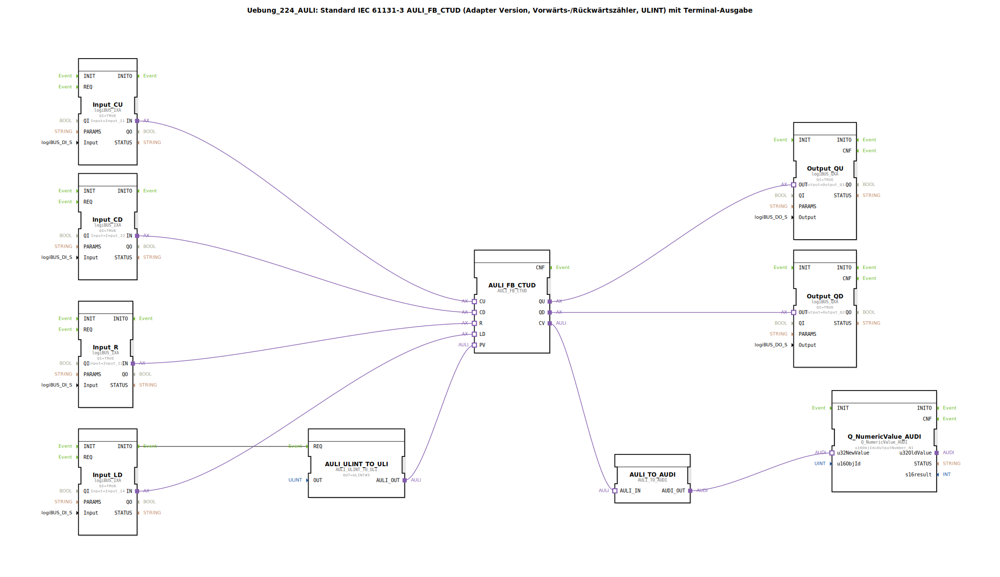

# Uebung_224_AULI: Standard IEC 61131-3 AULI_FB_CTUD (Adapter Version, Vorwärts-/Rückwärtszähler, ULINT) mit Terminal-Ausgabe

* * * * * * * * * *
## Einleitung
Diese Übung realisiert einen Vorwärts-/Rückwärtszähler gemäß IEC 61131-3 (Typ CTUD) im Adapter-Format. Der Zähler verwendet den Datentyp ULINT (Unsigned Long Integer) und gibt den aktuellen Zählerstand sowie die Überlauf-/Unterlauf-Signale an physische Ausgänge aus. Zusätzlich wird der Zählerstand über ein Terminal (isobus) ausgegeben. Der Preset-Wert (PV) wird initial auf 5 gesetzt.

## Verwendete Funktionsbausteine (FBs)

### Sub-Bausteine: `AULI_FB_CTUD`
- **Typ**: `adapter::iec61131::counters::AULI_FB_CTUD`
- **Verwendete interne FBs**: keine (Funktionsbaustein direkt verwendet)
- **Funktionsweise**: IEC 61131-3 CTUD-Zähler mit den Anschlüssen:
  - **CU** (Count Up) – Vorwärtszählen bei positiver Flanke
  - **CD** (Count Down) – Rückwärtszählen bei positiver Flanke
  - **R** (Reset) – Setzt Zählerstand zurück auf 0
  - **LD** (Load) – Lädt den Preset-Wert (PV) in den Zähler
  - **PV** (Preset Value) – Vorgabewert (ULINT, initial auf 5 gesetzt)
  - **QU** (Overflow) – Ausgang wird TRUE, wenn Zählerstand ≥ PV (bei Aufwärtszählen)
  - **QD** (Underflow) – Ausgang wird TRUE, wenn Zählerstand ≤ 0 (bei Abwärtszählen)
  - **CV** (Current Value) – aktueller Zählerstand (ULINT)

### Sub-Bausteine: `AULI_ULINT_TO_ULI`
- **Typ**: `adapter::conversion::unidirectional::AULI_ULINT_TO_ULI`
- **Verwendete interne FBs**: keine
  - **Parameter**: `OUT = ULINT#5`
- **Funktionsweise**: Wandelt einen konstanten ULINT-Wert (5) in ein ULI-Format um, das als Preset-Wert (PV) für den Zähler verwendet wird. Der Baustein wird beim Start der Applikation einmalig ausgelöst (über Eventverbindung `Input_LD.INITO → AULI_ULINT_TO_ULI.REQ`).

### Sub-Bausteine: `AULI_TO_AUDI`
- **Typ**: `adapter::conversion::unidirectional::AULI_TO_AUDI`
- **Verwendete interne FBs**: keine
- **Funktionsweise**: Konvertiert den aktuellen Zählerstand (AULI-Format) in ein AUDI-Format, das für die Terminalausgabe benötigt wird.

### Sub-Bausteine: `Q_NumericValue_AUDI`
- **Typ**: `isobus::UT::Q::Q_NumericValue_AUDI`
- **Verwendete interne FBs**: keine
  - **Parameter**: `u16ObjId = OutputNumber_N1` (Referenz auf Terminalausgabeobjekt)
- **Funktionsweise**: Nimmt den konvertierten Zählerstand (AUDI) entgegen und gibt ihn als numerischen Wert an das konfigurierte Terminal (isobus) aus.

### Weitere verwendete FBs (logiBUS E/A-Anbindung)
- **Input_CU** (`logiBUS::io::DI::logiBUS_IXA`): Liest den digitalen Eingang `Input_I1` (Vorwärtszählen)
- **Input_CD** (`logiBUS::io::DI::logiBUS_IXA`): Liest den digitalen Eingang `Input_I2` (Rückwärtszählen)
- **Input_R** (`logiBUS::io::DI::logiBUS_IXA`): Liest den digitalen Eingang `Input_I3` (Reset)
- **Input_LD** (`logiBUS::io::DI::logiBUS_IXA`): Liest den digitalen Eingang `Input_I4` (Load)
- **Output_QU** (`logiBUS::io::DQ::logiBUS_QXA`): Schaltet den digitalen Ausgang `Output_Q1` (Überlauf)
- **Output_QD** (`logiBUS::io::DQ::logiBUS_QXA`): Schaltet den digitalen Ausgang `Output_Q2` (Unterlauf)

Alle logiBUS-Blöcke sind standardmäßig mit `QI = TRUE` aktiv geschaltet.

## Programmablauf und Verbindungen
1. **Initialisierung**: Beim Systemstart löst der Baustein `Input_LD` über seinen Ereignisausgang `INITO` den Baustein `AULI_ULINT_TO_ULI` aus. Dieser setzt den Preset-Wert des Zählers auf `ULINT#5`.
2. **Zählbetrieb**: Die vier digitalen Eingänge (`Input_I1` bis `Input_I4`) werden über Adapterverbindungen direkt mit den Zählereingängen `CU`, `CD`, `R` und `LD` des `AULI_FB_CTUD` verbunden. Der Zähler reagiert auf positive Flanken an den jeweiligen Eingängen.
3. **Ausgabe der Zählerstände**:
   - Die Überlauf- und Unterlauf-Signale `QU` und `QD` werden über die Adapterausgänge an die physischen Ausgänge `Output_Q1` und `Output_Q2` weitergeleitet.
   - Der aktuelle Zählerstand `CV` wird über die Konvertierungsbausteine `AULI_TO_AUDI` und `Q_NumericValue_AUDI` auf dem Terminal (Objekt `OutputNumber_N1`) dargestellt. Diese Konvertierung und Ausgabe erfolgt ebenfalls zyklisch parallel zum Zählbetrieb.

**Hinweise**:
- Ein Kommentar im Netzwerk schlägt vor, optional AX_D_FF (D-Flipflops) einzubauen, um die Ereignisrate zu reduzieren.
- Der Zähler arbeitet mit dem Datentyp ULINT, daher sind große Zählbereiche möglich.

## Zusammenfassung
Die Übung demonstriert die Verwendung eines standardkonformen IEC 61131-3 CTUD-Zählers in der Adapterversion. Der Zähler wird über vier digitale Eingänge gesteuert, gibt Überlauf/Unterlauf auf Ausgänge aus und zeigt den aktuellen Stand auf einem Terminal an. Der Preset-Wert wird initial fest vorgegeben. Die Realisierung verwendet logiBUS-Ein-/Ausgänge und spezielle Konvertierungsbausteine, um den Zählerstand an das Terminal zu übergeben. Dieses Beispiel eignet sich als Grundlage für Zähleraufgaben in der Automatisierungstechnik.