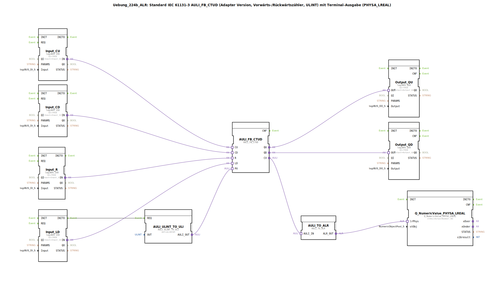

# Uebung_224b_ALR: Standard IEC 61131-3 AULI_FB_CTUD (Adapter Version, Vorwärts-/Rückwärtszähler, ULINT) mit Terminal-Ausgabe (PHYSA_LREAL)

* * * * * * * * * *
## Einleitung

Diese Übung implementiert einen Standard IEC 61131-3 Vorwärts-/Rückwärtszähler (CTUD) als Adapter-Version mit dem Datentyp ULINT. Der aktuelle Zählerstand wird über einen Terminal-Ausgang in Form des physischen Wertes (PHYSA_LREAL) ausgegeben. Die Steuerung erfolgt über vier digitale Eingänge, zwei digitale Ausgänge sowie Startwertvorgabe über einen ULINT-zu-ULI-Konverter.

## Verwendete Funktionsbausteine (FBs)

- **AULI_FB_CTUD**: Adapter-basierter Vorwärts-/Rückwärtszähler (Typ: ULINT)
    - **Parameter**: keine statischen Parameter
    - **Erklärung**: Der eigentliche Zähler. Er besitzt die Ereignis-/Adaptereingänge CU (Vorwärtszählen), CD (Rückwärtszählen), R (Reset), LD (Laden des Startwerts) und die Ausgänge QU (Überlauf?), QD (Unterlauf?), CV (aktueller Zählerstand). Über den Adaptereingang PV wird der Startwert geladen.
- **AULI_ULINT_TO_ULI**: Konvertierung von ULINT- nach ULI-Datentyp
    - **Parameter**: OUT = ULINT#5 (fester Startwert 5)
    - **Funktion**: Stellt den Startwert (PV) für den Zähler bereit.
- **Input_CU**, **Input_CD**, **Input_R**, **Input_LD**: logiBUS Digitaleingänge (Typ: logiBUS_IXA)
    - **Parameter**: QI = TRUE, Input = entsprechender physischer Eingang (Input_I1..I4)
    - **Funktion**: Wandeln die binären Eingangssignale (Taster, Schalter) in Adaptersignale für den Zähler um.
- **Output_QU**, **Output_QD**: logiBUS Digitalausgänge (Typ: logiBUS_QXA)
    - **Parameter**: QI = TRUE, Output = entsprechender physischer Ausgang (Output_Q1, Q2)
    - **Funktion**: Geben die Zählerausgänge QU (z.B. Überlauf) und QD (z.B. Unterlauf) an die Peripherie weiter.
- **AULI_TO_ALR**: Konvertierung von AULI (analoger Wert) nach ALR (LREAL)
    - **Parameter**: keine
    - **Funktion**: Wandelt den aktuellen Zählerstand (CV) vom Typ ULINT in den physischen Wert (LREAL) um.
- **Q_NumericValue_PHYSA_LREAL**: Terminal-Ausgabebaustein (Typ: isobus::UT::Q::Q_NumericValue_PHYSA_LREAL)
    - **Parameter**: stObj = OutputNumber_N3 (Referenz auf ein Terminal-Objekt)
    - **Funktion**: Gibt den konvertierten Wert auf dem Terminal aus.

### Sub-Bausteine: keine

Die Übung verwendet keine weiteren Unterbausteine, alle FBs sind direkt auf der obersten Ebene der SubApp angeordnet.

## Programmablauf und Verbindungen

1. **Initialisierung**: Beim Start (Ereignis INITO von Input_LD) wird der Baustein AULI_ULINT_TO_ULI getriggert, der den festen Startwert ULINT#5 an den PV-Eingang des Zählers weitergibt. Dadurch wird der Zähler auf 5 voreingestellt.
2. **Zählbetrieb**:
    - **Vorwärtszählen**: Impuls an Eingang I1 → Input_CU → Adapter CU → Zähler erhöht CV um 1.
    - **Rückwärtszählen**: Impuls an Eingang I2 → Input_CD → Adapter CD → Zähler verringert CV um 1 (negative Werte möglich!).
    - **Reset**: Impuls an Eingang I3 → Input_R → Adapter R → Zähler wird auf 0 zurückgesetzt.
    - **Laden**: Impuls an Eingang I4 → Input_LD → Adapter LD → Zähler lädt den Wert von PV (aktuell 5) in CV.
3. **Ausgabe**:
    - Bei Überlauf (QU) signalisiert Output_Q1.
    - Bei Unterlauf (QD) signalisiert Output_Q2.
    - Der aktuelle Zählerstand CV wird über die Konverterkette (AULI_TO_ALR → Q_NumericValue_PHYSA_LREAL) auf dem Terminal ausgegeben.
4. **Hinweise**: Im XML sind zwei Kommentare enthalten:
    - „hier sind negative Werte möglich!“ – dies bezieht sich auf den Zähler, der bei Rückwärtszählen unter Null gehen kann.
    - „hier gegebenenfalls je einen AX_D_FF einbauen, damit die Events reduziert werden.“ – ein Hinweis für eine mögliche Erweiterung zur Ereignisreduzierung an den Ausgängen.

## Zusammenfassung

Die Übung 224b ALR demonstriert den Einsatz eines IEC 61131-3 konformen Vorwärts-/Rückwärtszählers (CTUD) in der 4diac-IDE mit Adaptertechnologie. Vier Digitaleingänge steuern den Zähler (Vorwärts, Rückwärts, Reset, Laden), zwei Digitalausgänge geben die Überlauf-/Unterlaufzustände aus, und über einen Terminalbaustein wird der aktuelle Zählerstand als LREAL-Wert visualisiert. Der feste Startwert von 5 wird über einen ULINT-zu-ULI-Konverter bereitgestellt. Die Übung eignet sich für Einsteiger in die IEC 61131-3-Zählerfunktionen und die Adapterkommunikation in 4diac.