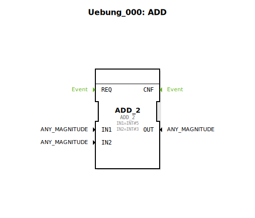

# Uebung_000: ADD

Dieser Artikel beschreibt die logiBUS®-Übung `Uebung_000`. Dies ist das absolute Einstiegsbeispiel für die mathematische Datenverarbeitung.

## 🎧 Podcast

* [3000 Watt Lüge Die TVS Diode entschlüsselt](https://podcasters.spotify.com/pod/show/ms-muc-lama/episodes/3000-Watt-Lge-Die-TVS-Diode-entschlsselt-e3aun8t)
* [Hannes' Turbo-Mais: Wie ein Landwirt mit Hackschnitzel-Kreislauf und Turmtrockner 15.000 Tonnen Körnermais verarbeitet](https://podcasters.spotify.com/pod/show/ms-muc-lama/episodes/Hannes-Turbo-Mais-Wie-ein-Landwirt-mit-Hackschnitzel-Kreislauf-und-Turmtrockner-15-000-Tonnen-Krnermais-verarbeitet-e3a5e0o)

----

## Ziel der Übung

Verwendung eines Standard-Mathematikbausteins (`ADD_2`). Es wird gezeigt, wie konstante Werte an die Eingänge eines Bausteins angelegt werden, um eine einfache Berechnung auszuführen.

-----

## Beschreibung und Komponenten

[cite_start]In `Uebung_000.SUB` wird ein Additions-Baustein zur Berechnung einer Summe genutzt[cite: 1].

### Funktionsbausteine (FBs)

  * **`ADD_2`**: Ein Baustein aus der IEC 61131-Bibliothek (Arithmetik).
  * **Parameter**:
    * `IN1`: Festwert 5 (`INT#5`).
    * `IN2`: Festwert 3 (`INT#3`).

-----

## Funktionsweise

Der Baustein nimmt die beiden Eingangswerte und addiert sie intern. Da in diesem minimalistischen Beispiel keine Ereignisverbindungen definiert sind, handelt es sich um eine rein statische Berechnung des Datenflusses. Das mathematische Ergebnis am Ausgang `OUT` ist 8.

-----

## Lernziel

Diese Übung dient dazu, sich mit der 4diac-Oberfläche vertraut zu machen:
1.  Bausteine aus der Bibliothek ziehen.
2.  Eigenschaften (Parameter) von Bausteinen im Properties-Fenster editieren.
3.  Den Unterschied zwischen variablen Eingängen und Konstanten verstehen.