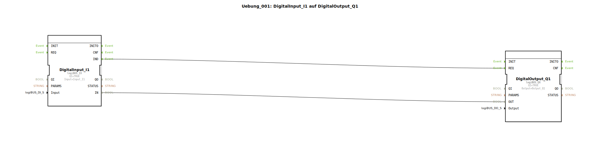
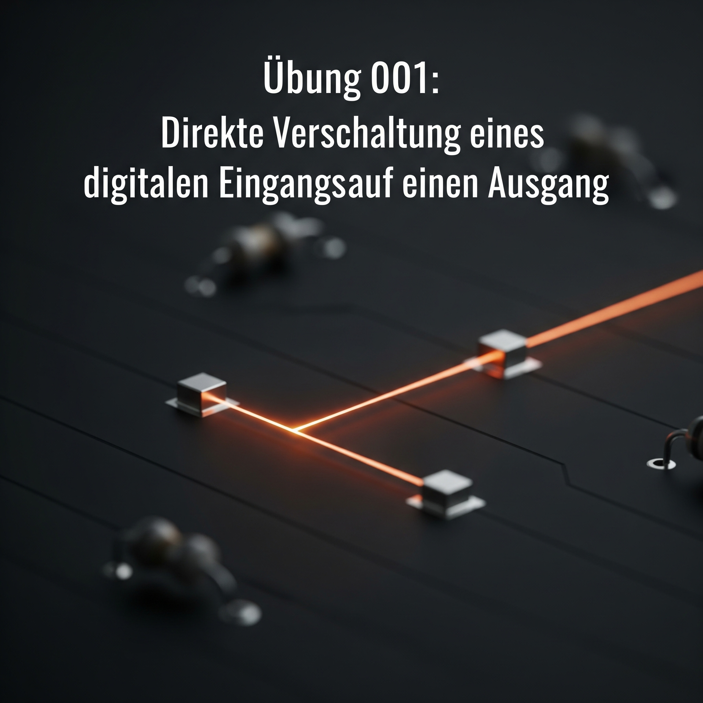
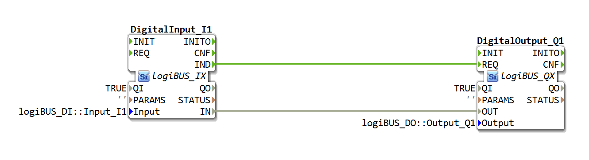

# Uebung_001: DigitalInput_I1 auf DigitalOutput_Q1


[](https://notebooklm.google.com/notebook/a6872e59-1dfc-4132-a118-aff1bc7bc944)

Dieser Artikel beschreibt die grundlegende logiBUS®-Übung `Uebung_001`. Hier wird das fundamentale Prinzip der IEC 61499 demonstriert: Die explizite Trennung von Datenfluss und Ereignisfluss.

## 🎧 Podcast




* [Analyse der Novellierung der Meisterprüfungsverordnung im Land- und Baumaschinenmechatroniker-Handwerk: Ein Detaillierter Vergleich der Verordnungen von 2024 und 2001](https://podcasters.spotify.com/pod/show/ms-muc-lama/episodes/Analyse-der-Novellierung-der-Meisterprfungsverordnung-im-Land--und-Baumaschinenmechatroniker-Handwerk-Ein-Detaillierter-Vergleich-der-Verordnungen-von-2024-und-2001-e37aejv)

----





## Ziel der Übung

Das Ziel dieser Einstiegsübung ist es, ein Signal von einem physischen digitalen Eingang zu einem digitalen Ausgang zu leiten. Dabei lernen die Anwender, dass in der IEC 61499 eine reine Datenverbindung (die "Leitung") nicht ausreicht – es muss auch ein Ereignis (der "Trigger") übertragen werden, damit der Zielbaustein die Daten verarbeitet.

-----

## Beschreibung und Komponenten

[cite_start]Die Übung besteht aus einer Subapplikation (`Uebung_001.SUB`), die einen Eingangsbaustein und einen Ausgangsbaustein über zwei separate Verbindungstypen verknüpft[cite: 1].

### Funktionsbausteine (FBs)

  * **`DigitalInput_I1`**: Eine Instanz des Typs `logiBUS_IX`. [cite_start]Dieser Baustein repräsentiert den physischen Eingang `Input_I1`[cite: 1]. Er stellt sowohl den logischen Zustand (`IN`) als auch ein Benachrichtigungs-Ereignis (`IND`) zur Verfügung.
  * **`DigitalOutput_Q1`**: Eine Instanz des Typs `logiBUS_QX`. [cite_start]Dieser Baustein steuert den physischen Ausgang `Output_Q1`[cite: 1]. Er benötigt einen Datenwert (`OUT`) und einen Auslöse-Befehl (`REQ`).

-----

## Funktionsweise

Die Logik wird durch zwei parallele Verbindungen realisiert. Der Aufbau in `Uebung_001.SUB` verdeutlicht dies:

```xml
<EventConnections>
    <Connection Source="DigitalInput_I1.IND" Destination="DigitalOutput_Q1.REQ"/>
</EventConnections>
<DataConnections>
    <Connection Source="DigitalInput_I1.IN" Destination="DigitalOutput_Q1.OUT"/>
</DataConnections>
```

[cite_start][cite: 1]

Der Prozess läuft wie folgt ab:
1.  Der Baustein `DigitalInput_I1` erkennt eine Änderung am Hardware-Eingang `I1`.
2.  Er aktualisiert seinen Daten-Ausgang `IN` mit dem neuen Wert (TRUE oder FALSE).
3.  Zeitgleich feuert er ein Ereignis am Port `IND` (Indication) ab.
4.  Dieses Ereignis wandert über die **Event Connection** zum Port `REQ` (Request) des Bausteins `DigitalOutput_Q1`.
5.  Erst durch den Empfang des Ereignisses liest `DigitalOutput_Q1` den Wert, der an seinem Port `OUT` über die **Data Connection** anliegt, und schaltet den Hardware-Ausgang entsprechend.

-----

## Anwendungsbeispiel

Ein **Lichtschalter im Haus**:
Der Schalter an der Wand ist der Eingang `I1`, die Glühbirne an der Decke ist der Ausgang `Q1`. Das Kabel überträgt den Strom (Daten), aber erst das Umlegen des Schalters (Ereignis) sorgt dafür, dass die Information "An" oder "Aus" verarbeitet und umgesetzt wird.