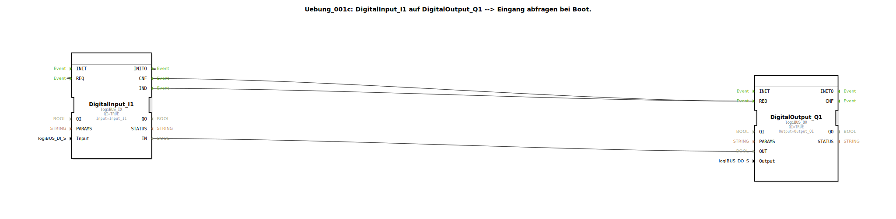

# Uebung_001c: DigitalInput_I1 auf DigitalOutput_Q1 --&gt; Eingang abfragen bei Boot.


[](https://notebooklm.google.com/notebook/a6872e59-1dfc-4132-a118-aff1bc7bc944)

Dieser Artikel beschreibt die logiBUS®-Übung `Uebung_001c`. Hier wird demonstriert, wie ein digitaler Eingang unmittelbar nach dem Systemstart (Boot-Vorgang) abgefragt wird, um den initialen Zustand an einen digitalen Ausgang zu übertragen, unter Verwendung von Standard-Ereignis- und Datenverbindungen.

----


## Ziel der Übung

Das Hauptziel dieser Übung ist das Verständnis des Initialisierungsvorgangs in der IEC 61499. Es soll sichergestellt werden, dass der Ausgang bereits beim Hochfahren der Steuerung den korrekten Ist-Zustand des Hardware-Eingangs übernimmt, auch wenn zu diesem Zeitpunkt noch keine Zustandsänderung (Flanke) stattgefunden hat.

-----

## Beschreibung und Komponenten

[cite_start]Die Übung nutzt die Subapplikation `Uebung_001c.SUB`, um eine Verbindung zwischen einem digitalen Eingang und einem Ausgang herzustellen, ergänzt um eine Selbst-Triggerung für den Systemstart[cite: 1].

### Funktionsbausteine (FBs)




  * **`DigitalInput_I1`**: Eine Instanz des Typs `logiBUS_IX`. [cite_start]Dieser Baustein liefert das Ereignis `IND` bei Änderungen und reagiert auf den Befehl `REQ`, um den aktuellen Wert manuell auszulesen[cite: 1].
  * **`DigitalOutput_Q1`**: Eine Instanz des Typs `logiBUS_QX`. [cite_start]Dieser Baustein setzt den Hardware-Ausgang `Output_Q1` bei jedem eintreffenden `REQ`-Ereignis[cite: 1].

-----

## Funktionsweise

Die Logik kombiniert die normale Signalweiterleitung mit einer Initialisierungsschleife. Der Aufbau in `Uebung_001c.SUB` ist wie folgt definiert:

```xml
<EventConnections>
    <Connection Source="DigitalInput_I1.IND" Destination="DigitalOutput_Q1.REQ"/>
    <Connection Source="DigitalInput_I1.INITO" Destination="DigitalInput_I1.REQ"/>
    <Connection Source="DigitalInput_I1.CNF" Destination="DigitalOutput_Q1.REQ"/>
</EventConnections>
<DataConnections>
    <Connection Source="DigitalInput_I1.IN" Destination="DigitalOutput_Q1.OUT"/>
</DataConnections>
```

[cite_start][cite: 1]

Der Ablauf gliedert sich in zwei Phasen:

1.  **Initialisierungsphase (Boot)**:
    *   Beim Systemstart wird der Baustein `DigitalInput_I1` initialisiert und sendet ein `INITO`-Ereignis.
    *   Dieses Ereignis wird auf den eigenen `REQ`-Eingang zurückgeführt.
    *   Dadurch liest der Baustein sofort den physischen Zustand ein und quittiert dies mit einem `CNF`-Ereignis.
    *   Das `CNF`-Ereignis triggert schließlich `DigitalOutput_Q1.REQ`, wodurch der Ausgang bereits beim Start den korrekten Wert erhält.

2.  **Betriebsphase (Laufzeit)**:
    *   Jede spätere Änderung am Eingang triggert über `IND -> REQ` direkt den Ausgang, wie in Übung 001.

-----

## Anwendungsbeispiel

Ein **Zustands-Display**:
Stellen Sie sich vor, der Ausgang `Q1` steuert eine Kontrollleuchte, die anzeigt, ob ein Sicherheitsschalter (`I1`) geschlossen ist. Wenn die Anlage nach einem Stromausfall neu startet, muss die Lampe sofort korrekt leuchten – nicht erst, wenn jemand den Sicherheitsschalter erneut betätigt. Die Boot-Abfrage garantiert diese sofortige Korrektheit der Anzeige.