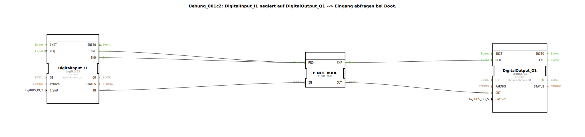

# Uebung_001c2: DigitalInput_I1 negiert auf DigitalOutput_Q1 --&gt; Eingang abfragen bei Boot.

* * * * * * * * * *

## Einleitung

Diese Übung realisiert eine einfache Signalverarbeitung: Der digitale Eingang `I1` wird negiert und auf den digitalen Ausgang `Q1` ausgegeben. Der Eingang wird beim Booten des Systems einmal abgefragt. Ein spezieller Kommentar im Netzwerk weist darauf hin, dass das Verhalten beim Start vom Vorhandensein einer bestimmten Ereignisverbindung (`INITO → REQ`) abhängt.

## Verwendete Funktionsbausteine (FBs)

### `DigitalInput_I1`
- **Typ**: `logiBUS::io::DI::logiBUS_IX`
- **Parameter**:
  - `QI = TRUE`
  - `Input = Input_I1`
- **Ereignisschnittstelle**:
  - Eingang: `REQ` (Anforderung zum Lesen des Eingangs)
  - Ausgang: `IND` (Bestätigung: Eingang gelesen), `INITO` (Initialisierungsbestätigung)
- **Datenschnittstelle**:
  - Ausgang: `IN` (aktueller digitaler Wert des Eingangs)
- **Funktionsweise**:
  Der Baustein liest den digitalen Wert des konfigurierten Eingangs (hier `Input_I1`) aus. Gesteuert wird das Lesen über das Ereignis `REQ`. Nach erfolgreichem Lesen wird am Ausgang `IND` ein Ereignis ausgegeben und der gelesene Wert über `IN` bereitgestellt.

### `F_NOT_BOOL`
- **Typ**: `iec61131::bitwiseOperators::F_NOT_BOOL`
- **Parameter**: Keine.
- **Ereignisschnittstelle**:
  - Eingang: `REQ` (Anforderung zur Negation)
  - Ausgang: `CNF` (Bestätigung: Negation ausgeführt)
- **Datenschnittstelle**:
  - Eingang: `IN` (BOOL-Wert, der negiert werden soll)
  - Ausgang: `OUT` (negierten BOOL-Wert)
- **Funktionsweise**:
  Der Baustein führt eine logische Negation auf den anliegenden BOOL-Wert durch. Bei einem Ereignis an `REQ` wird der Wert an `IN` negiert und das Ergebnis an `OUT` ausgegeben. Anschließend wird `CNF` ausgelöst.

### `DigitalOutput_Q1`
- **Typ**: `logiBUS::io::DQ::logiBUS_QX`
- **Parameter**:
  - `QI = TRUE`
  - `Output = Output_Q1`
- **Ereignisschnittstelle**:
  - Eingang: `REQ` (Anforderung zum Setzen des Ausgangs)
  - Ausgang: `CNF` (Bestätigung: Ausgang gesetzt)
- **Datenschnittstelle**:
  - Eingang: `OUT` (Wert, der auf den Ausgang geschrieben werden soll)
- **Funktionsweise**:
  Der Baustein setzt den digitalen Ausgang `Output_Q1` auf den über `OUT` erhaltenen Wert. Bei einem Ereignis an `REQ` wird der Wert übernommen und der Ausgang physisch aktualisiert. Nach Abschluss wird `CNF` ausgelöst.

## Programmablauf und Verbindungen

Die drei Bausteine sind wie folgt miteinander verbunden:

1. **Eingangslesen und Negation auslösen**  
   Der Ereignisausgang `IND` von `DigitalInput_I1` ist direkt mit dem Ereigniseingang `REQ` von `F_NOT_BOOL` verbunden. Dadurch wird nach jedem erfolgreichen Einlesen des digitalen Eingangs sofort die Negation des gelesenen Wertes angestoßen. Gleichzeitig wird der Datenwert `IN` von `DigitalInput_I1` auf den Dateneingang `IN` von `F_NOT_BOOL` übertragen.

2. **Negation und Ausgang setzen**  
   Der Ereignisausgang `CNF` von `F_NOT_BOOL` ist mit dem Ereigniseingang `REQ` von `DigitalOutput_Q1` verbunden. Sobald die Negation abgeschlossen ist, wird der negierte Wert (vom Ausgang `OUT` von `F_NOT_BOOL`) auf den Dateneingang `OUT` von `DigitalOutput_Q1` gelegt und der Ausgang aktualisiert.

3. **Besonderheit beim Booten**  
   Ein wichtiger Aspekt ist die Initialisierung. Der Ereignisausgang `INITO` von `DigitalInput_I1` ist mit dem Ereigniseingang `REQ` von `DigitalInput_I1` (also dem Baustein selbst) zurückverbunden. Diese Verbindung sorgt dafür, dass der Eingang unmittelbar nach dem Booten einmal gelesen wird. Ohne diese Rückkopplung würde der Ausgang `Q1` beim Start den Wert `FALSE` behalten, weil kein erstes Ereignis ausgelöst wird. **Mit der Verbindung** wird der Eingang sofort abgefragt, negiert und der Ausgang auf den tatsächlichen (negierten) Wert gesetzt – dieser kann dann `TRUE` sein.

   Der Kommentar im Netzwerk fasst dies zusammen:  
   > „ohne die Linie INITO -> REQ ist der Ausgang Q1 beim Start FALSE. mit der Linie ist er TRUE."

## Zusammenfassung

Die Übung demonstriert die grundlegende Verwendung von digitalen Ein- und Ausgangsbausteinen in Kombination mit einer logischen Negation. Der Fokus liegt auf dem Verständnis der ereignisgesteuerten Ablaufsteuerung (Ereigniskette) sowie auf dem Initialisierungsverhalten beim Systemstart. Durch die Rückkopplung des `INITO`-Ereignisses wird sichergestellt, dass der Ausgang bereits beim Booten einen korrekten (negierten) Wert erhält. Dies ist ein typisches Beispiel für die Anwendung von Initialisierungsereignissen in der 4diac-IDE.