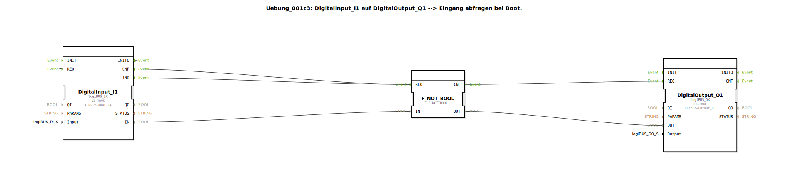

# Uebung_001c3: DigitalInput_I1 auf DigitalOutput_Q1 --&gt; Eingang abfragen bei Boot.

* * * * * * * * * *

## Einleitung

Diese Übung demonstriert das Auslesen eines digitalen Eingangs (Input I1) und die direkte Ausgabe auf einen digitalen Ausgang (Output Q1) beim Hochfahren der Steuerung.  
Besonderheit ist die Nutzung einer Negation des Eingangssignals sowie einer speziellen Ereignisverbindung, die den Ausgang beim Booten auf TRUE setzt.

## Verwendete Funktionsbausteine (FBs)

- **DigitalInput_I1** (Typ: `logiBUS::io::DI::logiBUS_IX`)  
  - Parameter: `QI = TRUE`, `Input = Input_I1`  
  - Stellt den physikalischen digitalen Eingang I1 bereit. Die Datenbereitstellung erfolgt über den Ereignisausgang `IND` (bei neuer gültiger Eingangsinformation) und `INITO` (Initialisierung beim Start).  
- **F_NOT_BOOL** (Typ: `iec61131::bitwiseOperators::F_NOT_BOOL`)  
  - Parameter: keine  
  - Führt eine logische Negation (NOT) des Booleschen Eingangssignals durch.  
- **DigitalOutput_Q1** (Typ: `logiBUS::io::DQ::logiBUS_QX`)  
  - Parameter: `QI = TRUE`, `Output = Output_Q1`  
  - Steuert den physikalischen digitalen Ausgang Q1. Der Ausgangswert wird nur bei einem REQ-Ereignis übernommen.

## Programmablauf und Verbindungen

Der Ablauf wird durch die Ereignis- und Datenverbindungen im SubApp-Netzwerk definiert:

1. **Initialisierung**  
   - Beim Booten sendet `DigitalInput_I1` das Ereignis `INITO` an seinen eigenen `REQ`-Eingang. Dies bewirkt ein einmaliges Einlesen des Eingangs direkt nach dem Start.

2. **Eingangslesen und Negation**  
   - Jedes Mal, wenn ein neuer Wert am Eingang anliegt, sendet `DigitalInput_I1` das Ereignis `IND`.  
   - Das Ereignis `IND` (sowie `CNF`) ist mit dem `REQ`-Eingang von `F_NOT_BOOL` verbunden.  
   - Gleichzeitig wird der Datenwert `IN` (vom Eingang) auf den `IN`-Eingang von `F_NOT_BOOL` übertragen. **Wichtig:** Diese Datenverbindung ist mit der Eigenschaft `Negated = true` versehen, was eine Negation auf Verbindungsebene bewirkt. Dadurch wird der Eingangswert bereits vor der NOT-Operation invertiert.

3. **Ausgabe**  
   - Nach der Berechnung sendet `F_NOT_BOOL` das Ereignis `CNF` an den `REQ`-Eingang von `DigitalOutput_Q1`.  
   - Der negierte Datenwert `OUT` von `F_NOT_BOOL` wird auf den Dateneingang `OUT` des Ausgangsbausteins gelegt.  
   - Durch die erste Initialisierung (`INITO -> REQ`) ist der Ausgang nach dem Boot sofort aktiv (TRUE) – ohne diese Verbindung wäre er FALSE.

**Besonderheiten:**  
- Die Kombination aus Negation auf der Datenverbindung und dem NOT-Baustein führt zu einer doppelten Negation, wodurch der Eingangswert unverändert am Ausgang anliegt.  
- Die Verbindung `INITO -> REQ` stellt sicher, dass der Ausgang beim Start einen definierten Zustand (TRUE) annimmt, auch wenn noch kein gültiger Eingangswert vorliegt.

## Zusammenfassung

Die Übung zeigt die grundlegende Verknüpfung eines digitalen Eingangs mit einem Ausgang unter 4diac.  
Durch die Verwendung von Negation und Initialisierungsereignissen wird das Verhalten beim Hochfahren gesteuert. Der Lernende versteht, wie Ereignis- und Datenflüsse in einer IEC 61499-Anwendung aufgebaut werden und wie man mit Negation auf Verbindungsebene arbeitet.