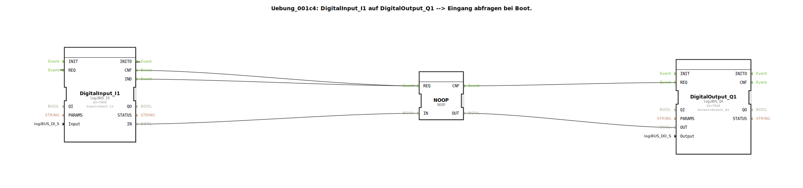

# Uebung_001c4: DigitalInput_I1 auf DigitalOutput_Q1 --&gt; Eingang abfragen bei Boot.

* * * * * * * * * *

## Einleitung

Diese Übung demonstriert die grundlegende Verwendung eines digitalen Eingangs und eines digitalen Ausgangs auf einem logiBUS-System. Der Eingang **Input_I1** wird beim Systemstart (Boot) abgefragt und sein Zustand direkt auf den Ausgang **Output_Q1** übertragen. Die Übung zeigt, wie durch die Initialisierungs-Eventverbindung (INITO → REQ) sichergestellt wird, dass der Ausgang bereits beim Hochfahren den korrekten Wert annimmt. Zudem wird der **NOOP**-Baustein als einfacher Durchschleif-Baustein eingesetzt, um die Event- und Datenpfade zu verbinden.

## Verwendete Funktionsbausteine (FBs)

In dieser Übung werden drei vordefinierte Funktionsbausteine direkt im Netzwerk der SubApp eingesetzt. Es gibt keine weiteren Sub-Bausteine.

- **DigitalInput_I1** (Typ: `logiBUS::io::DI::logiBUS_IX`)
    - **Parameter**:
        - `QI` = `TRUE` (Freigabe des Bausteins)
        - `Input` = `Input_I1` (physikalischer Eingangskanal)
    - **Funktionsweise**: Dieser Baustein liest den Zustand des digitalen Eingangs `Input_I1` ein. Er verfügt über die Ereignisausgänge `IND` (Indikation bei Datenwechsel), `INITO` (Initialisierungsbestätigung) und `CNF` (Bestätigung nach einer Leseanforderung). Der gelesene Wert wird am Datenausgang `IN` bereitgestellt.

- **DigitalOutput_Q1** (Typ: `logiBUS::io::DQ::logiBUS_QX`)
    - **Parameter**:
        - `QI` = `TRUE` (Freigabe des Bausteins)
        - `Output` = `Output_Q1` (physikalischer Ausgangskanal)
    - **Funktionsweise**: Dieser Baustein setzt den digitalen Ausgang `Output_Q1` auf den Wert, der am Dateneingang `OUT` anliegt, sobald er über den Ereigniseingang `REQ` getriggert wird. Der Ausgang wird bei jedem REQ-Ereignis aktualisiert.

- **NOOP** (Typ: `iec61131::bitwiseOperators::NOOP`)
    - **Parameter**: keine
    - **Funktionsweise**: Der NOOP-Baustein ist ein „No Operation“-Baustein, der die an seinem Eingang anliegenden Daten unverändert an den Ausgang weiterleitet. Er dient hier als reiner Durchschleif-Baustein für sowohl Ereignisse als auch Daten. Er kann auch als Gegenstück zu einem `E_TRIG`-Baustein verwendet werden, wenn eine reine Weitergabe ohne Triggerflankenerkennung gewünscht ist.

## Programmablauf und Verbindungen

Der Ablauf der Übung ist wie folgt:

1. **Initialisierung**: Beim Start des Systems sendet der Baustein `DigitalInput_I1` nach erfolgreicher Initialisierung ein Ereignis an seinem Ausgang `INITO`. Dieses Ereignis wird auf seinen eigenen Ereigniseingang `REQ` zurückgeführt (Selbsttriggerung). Dadurch wird eine erste Leseanforderung des Eingangs ausgelöst, bevor das eigentliche zyklische Verhalten beginnt. Ohne diese Verbindung wäre der Ausgang `Q1` beim Start **FALSE**, mit der Verbindung ist er **TRUE** (sofern der Eingang eingeschaltet ist).

2. **Zyklisches Lesen**: Nach der Leseanforderung bestätigt `DigitalInput_I1` den Vorgang mit einem `CNF`-Ereignis. Gleichzeitig liefert es bei jeder Änderung des Eingangssignals ein `IND`-Ereignis. Beide Ereignisse (`CNF` und `IND`) werden zum Ereigniseingang `REQ` des **NOOP**-Bausteins weitergeleitet.

3. **Durchschleifen von Daten**: Der gelesene Eingangswert (Datenausgang `IN` des DigitalInput_I1) wird auf den Dateneingang `IN` des NOOP-Bausteins geführt. Der NOOP leitet diesen Wert unverändert an seinen Datenausgang `OUT` weiter.

4. **Ausgang setzen**: Sobald NOOP ein Ereignis an seinem `REQ`-Eingang erhält (von `DigitalInput_I1`), sendet er ein Bestätigungsereignis an seinem Ausgang `CNF`. Dieses `CNF`-Ereignis triggert den Ereigniseingang `REQ` des **DigitalOutput_Q1**-Bausteins. Gleichzeitig liegt der durchgeschleifte Datenwert von NOOP am Dateneingang `OUT` des Ausgangsbausteins an. Daraufhin setzt `DigitalOutput_Q1` den physikalischen Ausgang `Output_Q1` auf den entsprechenden Wert.

### Visualisierung der Verbindungen

Die folgende Tabelle zeigt die wesentlichen Verbindungen im Netzwerk:

| Von | Nach | Typ |
|-----|------|-----|
| `DigitalInput_I1.INITO` | `DigitalInput_I1.REQ` | Ereignis |
| `DigitalInput_I1.IND` | `NOOP.REQ` | Ereignis |
| `DigitalInput_I1.CNF` | `NOOP.REQ` | Ereignis |
| `NOOP.CNF` | `DigitalOutput_Q1.REQ` | Ereignis |
| `DigitalInput_I1.IN` | `NOOP.IN` | Daten |
| `NOOP.OUT` | `DigitalOutput_Q1.OUT` | Daten |

### Lernziele

- Verständnis der Initialisierungssequenz (INITO) und deren Auswirkung auf Ausgangswerte beim Start.
- Umgang mit logiBUS-Eingangs- und Ausgangsbausteinen in 4diac.
- Einsatz des NOOP-Bausteins als reiner Durchschleif-Baustein zur Verbindung von Ereignis- und Datenpfaden.
- Grundlegendes Verständnis von Event-gesteuerten Abläufen in IEC 61499.

## Zusammenfassung

Die Übung **Uebung_001c4** zeigt einen einfachen Anwendungsfall: Ein digitaler Eingang wird direkt auf einen digitalen Ausgang abgebildet. Durch die clever genutzte Selbsttriggerung der Initialisierung wird sichergestellt, dass der Ausgang bereits beim Booten den korrekten Zustand annimmt. Der NOOP-Baustein fungiert als universeller Verbindungsbaustein, der sowohl Ereignisse als auch Daten unverändert weiterleitet. Die Übung eignet sich für Einsteiger, die die Grundlagen der Ereignis- und Datenverknüpfung in 4diac kennenlernen möchten.