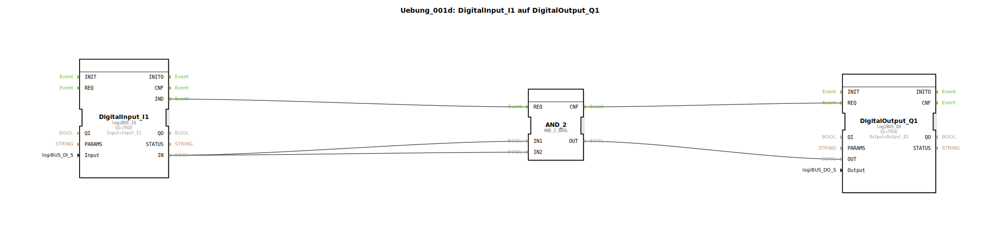

# Uebung_001d: DigitalInput_I1 auf DigitalOutput_Q1

* * * * * * * * * *
## Einleitung
Diese Übung demonstriert die grundlegende Verknüpfung eines digitalen Eingangs (Input_I1) mit einem digitalen Ausgang (Output_Q1) unter Verwendung einer logischen UND-Verknüpfung. Ziel ist es, das Signal des Eingangs direkt auf den Ausgang zu schalten – hierbei wird das UND-Gatter genutzt, um die Funktionsweise von Ereignis- und Datenflüssen innerhalb der 4diac-IDE kennenzulernen.

## Verwendete Funktionsbausteine (FBs)

- **DigitalInput_I1** (Typ: `logiBUS::io::DI::logiBUS_IX`)
    - Parameter:
        - `QI` = `TRUE`
        - `Input` = `Input_I1`
    - Ereignisausgang: `IND` (zeigt an, dass ein neuer Eingangswert vorliegt)
    - Datenausgang: `IN` (aktueller digitaler Wert)

- **AND_2** (Typ: `iec61131::bitwiseOperators::AND_2_BOOL`)
    - Parameter: keine
    - Ereigniseingang: `REQ` (startet die Berechnung)
    - Ereignisausgang: `CNF` (bestätigt die Ausführung)
    - Dateneingänge: `IN1`, `IN2` (zwei boolesche Eingänge)
    - Datenausgang: `OUT` (Ergebnis der UND-Verknüpfung)

- **DigitalOutput_Q1** (Typ: `logiBUS::io::DQ::logiBUS_QX`)
    - Parameter:
        - `QI` = `TRUE`
        - `Output` = `Output_Q1`
    - Ereigniseingang: `REQ` (übernimmt den Ausgangswert)
    - Dateneingang: `OUT` (Wert, der auf den physikalischen Ausgang gesetzt wird)

## Programmablauf und Verbindungen

1. Der **DigitalInput_I1** erfasst den Wert des physikalischen Eingangs `Input_I1`. Bei einer Änderung wird das Ereignis `IND` ausgelöst.
2. Dieses Ereignis wird über die Ereignisverbindung an den **AND_2**‑Baustein gesendet (an dessen Ereigniseingang `REQ`).
3. Gleichzeitig wird der Datenwert `IN` des Eingangsbausteins über zwei parallele **Datenverbindungen** an die Dateneingänge `IN1` und `IN2` des AND_2‑Bausteins weitergegeben.
4. Der **AND_2**‑Baustein berechnet die logische UND-Verknüpfung der beiden identischen Signale:  
   `OUT = IN1 AND IN2 = IN (da beide Eingänge gleich sind)`.
5. Nach der Berechnung wird das Ereignis `CNF` ausgelöst, das an den **DigitalOutput_Q1**‑Baustein (Ereigniseingang `REQ`) weitergeleitet wird.
6. Der Datenwert `OUT` des AND_2‑Bausteins wird an den Dateneingang `OUT` des Ausgangsbausteins übergeben. Dadurch wird der physikalische Ausgang `Output_Q1` auf den gleichen Wert wie der Eingang `Input_I1` gesetzt.

**Ergebnis:** Das Signal des digitalen Eingangs wird unverändert auf den digitalen Ausgang durchgeschaltet – die UND-Verknüpfung zweier gleicher Signale ändert den Wert nicht.

## Zusammenfassung
Die Übung führt in die Grundlagen der Ereignis- und Datenverbindungen in der 4diac-IDE ein. Obwohl die UND-Verknüpfung in diesem Fall funktional überflüssig ist, wird das Zusammenspiel zwischen Sensor (Eingang), Logik (UND-Gatter) und Aktor (Ausgang) veranschaulicht. Sie lernen, wie Sie einfache Steuerungsaufgaben durch Verschaltung von Funktionsbausteinen abbilden können.