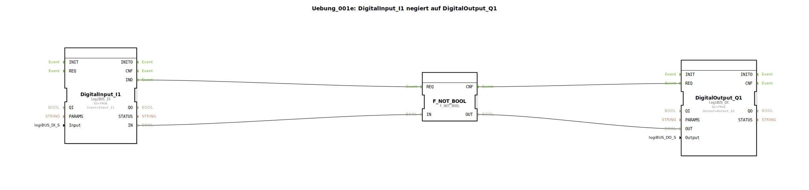

# Uebung_001e: DigitalInput_I1 negiert auf DigitalOutput_Q1

*Hinweis: Diese Übung verfügt über kein separates Bild.*

---

## Einleitung

Diese Übung demonstriert die grundlegende Negation eines digitalen Eingangssignals. Der digitale Eingang **Input_I1** (Pin I1) wird ausgelesen, logisch negiert und auf den digitalen Ausgang **Output_Q1** (Pin Q1) ausgegeben. Dadurch wird bei aktivem Eingang der Ausgang deaktiviert und umgekehrt.

Die Übung eignet sich für Einsteiger in die industrielle Automatisierung mit IEC 61499 und dient dem Verständnis von:
- Ein- und Ausgabe-Funktionsbausteinen der logiBUS-Bibliothek
- Logischer Negation mittels IEC 61131-Bitoperatoren
- Ereignisgesteuerter Datenverarbeitung

**Schwierigkeitsgrad:** Einfach  
**Benötigte Vorkenntnisse:** Grundlegende Kenntnisse der 4diac-IDE und des IEC 61499-Modells

---

## Verwendete Funktionsbausteine (FBs)

### **DigitalInput_I1** (`logiBUS::io::DI::logiBUS_IX`)
- **Typ:** `logiBUS::io::DI::logiBUS_IX`  
- **Parameter:**
  - `QI` = `TRUE` (Qualifier – immer aktiv)
  - `Input` = `Input_I1` (physikalischer Pin I1)
- **Ereignisausgang:** `IND` – wird ausgelöst, sobald der Eingangswert aktualisiert wird
- **Datenausgang:** `IN` – der aktuelle digitale Zustand (BOOL) des Pins
- **Funktionsweise:** Liest den digitalen Zustand des Eingangs I1 und stellt ihn am Ausgang `IN` zur Verfügung. Ein eingehendes Ereignis (z. B. über das Netzwerk) aktiviert die Auslese.

### **F_NOT_BOOL** (`iec61131::bitwiseOperators::F_NOT_BOOL`)
- **Typ:** `iec61131::bitwiseOperators::F_NOT_BOOL`
- **Parameter:** Keine
- **Ereigniseingang:** `REQ` – startet die Negation  
- **Ereignisausgang:** `CNF` – bestätigt die fertige Negation  
- **Dateneingang:** `IN` (BOOL) – zu negierender Wert  
- **Datenausgang:** `OUT` (BOOL) – negierter Wert  
- **Funktionsweise:** Führt eine logische NOT-Operation auf den booleschen Eingangswert aus. Bei `IN = TRUE` wird `OUT = FALSE` und umgekehrt.

### **DigitalOutput_Q1** (`logiBUS::io::DQ::logiBUS_QX`)
- **Typ:** `logiBUS::io::DQ::logiBUS_QX`
- **Parameter:**
  - `QI` = `TRUE` (Qualifier – immer aktiv)
  - `Output` = `Output_Q1` (physikalischer Pin Q1)
- **Ereigniseingang:** `REQ` – löst das Setzen des Ausgangs aus
- **Dateneingang:** `OUT` (BOOL) – gewünschter Zustand des Ausgangs
- **Funktionsweise:** Setzt den digitalen Ausgang Q1 auf den am Eingang `OUT` anliegenden Wert, sobald ein Ereignis am `REQ`-Eingang eintrifft.

---

## Programmablauf und Verbindungen

Der Ablauf ist strikt ereignisgesteuert:

1. **Eingangsereignis:** Der Funktionsbaustein `DigitalInput_I1` erzeugt ein Ereignis an seinem Ausgang `IND`, sobald der Eingang I1 einen neuen Wert liefert (z. B. durch eine zyklische Abfrage oder externe Änderung).

2. **Negation starten:** Dieses `IND`-Ereignis wird über eine **Eventverbindung** an den Ereigniseingang `REQ` von `F_NOT_BOOL` weitergeleitet. Gleichzeitig wird der aktuelle Datenwert von `DigitalInput_I1.IN` über eine **Datenverbindung** an den Eingang `F_NOT_BOOL.IN` übergeben.

3. **Negation ausführen:** `F_NOT_BOOL` berechnet den negierten Wert und gibt ihn an seinem Ausgang `OUT` aus. Sobald die Berechnung abgeschlossen ist, wird ein Ereignis am Ausgang `CNF` erzeugt.

4. **Ausgang setzen:** Das `CNF`-Ereignis wird über eine weitere **Eventverbindung** an den Ereigniseingang `REQ` von `DigitalOutput_Q1` gesendet. Parallel dazu wird der negierte Datenwert von `F_NOT_BOOL.OUT` über eine **Datenverbindung** an den Dateneingang `DigitalOutput_Q1.OUT` angelegt. Dadurch wird der Ausgang Q1 mit dem negierten Wert aktualisiert.

**Zusammenfassung der Verbindungen:**

- Event: `DigitalInput_I1.IND` → `F_NOT_BOOL.REQ` → `F_NOT_BOOL.CNF` → `DigitalOutput_Q1.REQ`
- Data: `DigitalInput_I1.IN` → `F_NOT_BOOL.IN` → `F_NOT_BOOL.OUT` → `DigitalOutput_Q1.OUT`

Die Übung kann in 4diac durch Starten der Applikation (z. B. mit einem Simulationslauf) ausgeführt werden. Beobachten Sie das Verhalten: Der Ausgang Q1 ist genau dann aktiv, wenn der Eingang I1 nicht aktiv ist (und umgekehrt).

---

## Zusammenfassung

Die Übung **Uebung_001e** realisiert eine einfache Negation eines digitalen Eingangs mithilfe einer Kaskade von drei Funktionsbausteinen. Sie vermittelt die Grundprinzipien der ereignisgesteuerten Datenverarbeitung nach IEC 61499 sowie den Umgang mit logiBUS-Ein-/Ausgabe-Bausteinen und IEC 61131-Bitoperatoren. Nach erfolgreicher Durchführung verstehen Sie, wie Eingangsdaten in Echtzeit verarbeitet und auf Ausgänge geschrieben werden. Dies bildet die Basis für komplexere Automatisierungsanwendungen.