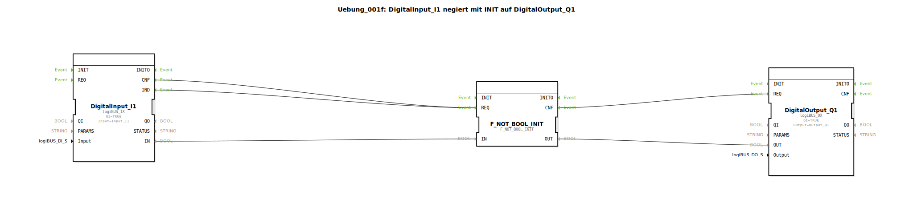

# Uebung_001f: DigitalInput_I1 negiert mit INIT auf DigitalOutput_Q1

* * * * * * * * * *
## Einleitung

Diese Übung demonstriert die Negation eines digitalen Eingangssignals mithilfe des Funktionsbausteins `F_NOT_BOOL_INIT`. Der digitale Eingang `Input_I1` wird gelesen, invertiert und auf den digitalen Ausgang `Output_Q1` geschrieben. Dabei wird deutlich, dass der Negationsbaustein bereits beim Systemstart (BOOT) einen definierten Wert ausgibt, auch wenn der Eingang zu diesem Zeitpunkt noch nicht gelesen wird.

**Lernziel:** Verständnis der Verknüpfung von Ein-/Ausgangsbausteinen mit Logik-FBs sowie der Initialisierung von Negationsbausteinen.

## Verwendete Funktionsbausteine (FBs)

Die Übung besteht aus drei direkt im Netzwerk platzierten Funktionsbausteinen. Es werden keine Sub-Bausteine verwendet.

- **DigitalInput_I1**  
  - **Typ:** `logiBUS::io::DI::logiBUS_IX`  
  - **Parameter:** `QI = TRUE`, `Input = Input_I1`  
  - **Funktion:** Liest den digitalen Eingang `Input_I1` und stellt den Wert am Datenausgang `IN` sowie die Ereignisse `IND` (bei steigender Flanke) und `CNF` (bei fallender Flanke) bereit.

- **F_NOT_BOOL_INIT**  
  - **Typ:** `iec61131::bitwiseOperators::F_NOT_BOOL_INIT`  
  - **Parameter:** keine weiteren  
  - **Funktion:** Negiert den anliegenden booleschen Wert am Dateneingang `IN` und gibt das Ergebnis am Datenausgang `OUT` aus. Der Baustein verfügt über einen eingebauten INIT-Mechanismus, der beim Start des Systems einen definierten Ausgangswert liefert.

- **DigitalOutput_Q1**  
  - **Typ:** `logiBUS::io::DQ::logiBUS_QX`  
  - **Parameter:** `QI = TRUE`, `Output = Output_Q1`  
  - **Funktion:** Schreibt den am Dateneingang `OUT` anliegenden booleschen Wert auf den Ausgang `Output_Q1`, sobald das Ereignis `REQ` empfangen wird.

## Programmablauf und Verbindungen

Das Netzwerk der Übung arbeitet ereignisgesteuert:

1. **Ereignisverbindungen:**  
   - Die Ausgangsereignisse `IND` und `CNF` des DigitalInput_I1 werden beide auf den Ereigniseingang `REQ` des F_NOT_BOOL_INIT geführt.  
   - Das Bestätigungsereignis `CNF` des F_NOT_BOOL_INIT wird auf den Ereigniseingang `REQ` des DigitalOutput_Q1 geschaltet.

2. **Datenverbindungen:**  
   - Der Datenausgang `IN` von DigitalInput_I1 ist mit dem Dateneingang `IN` von F_NOT_BOOL_INIT verbunden.  
   - Der Datenausgang `OUT` von F_NOT_BOOL_INIT ist mit dem Dateneingang `OUT` von DigitalOutput_Q1 verbunden.

**Ablauf:**  
- Sobald sich der Zustand des digitalen Eingangs `Input_I1` ändert (steigende oder fallende Flanke), erzeugt DigitalInput_I1 das entsprechende Ereignis.  
- Dieses Ereignis triggert den Negationsbaustein, der den aktuellen Eingangswert invertiert und nach Abschluss der Berechnung das Ereignis `CNF` ausgibt.  
- Dadurch wird der Ausgangsbaustein getriggert, den negierten Wert auf `Output_Q1` zu schreiben.  

Hinweis: Da der Negationsbaustein `F_NOT_BOOL_INIT` einen INIT-Mechanismus besitzt, wird bereits beim Hochfahren des Systems (ohne vorherige Eingangsänderung) ein initialer negierter Wert am Ausgang anliegen – auch wenn der Eingang zu diesem Zeitpunkt noch nicht gelesen wurde. Dies ist durch den Kommentar im Netzwerk verdeutlicht.

**Schwierigkeitsgrad:** Einfach  
**Vorkenntnisse:** Grundlegende Kenntnisse der Ereignis- und Datenflussmodellierung in 4diac sowie der Ein-/Ausgangskonfiguration über logiBUS.

## Zusammenfassung

Die Übung `Uebung_001f` realisiert eine einfache Negation eines digitalen Eingangssignals auf einen digitalen Ausgang. Sie zeigt die grundlegende Verbindung von Hardware-nahen Funktionsbausteinen mit einem logischen Negationsbaustein und verdeutlicht das initiale Verhalten des Negations-FBs beim Systemstart. Die Implementierung erfolgt ausschließlich über direkte FB-Verkettung ohne Sub-Bausteine und ist als Einstiegsübung für die ereignisgesteuerte Logik mit 4diac geeignet.