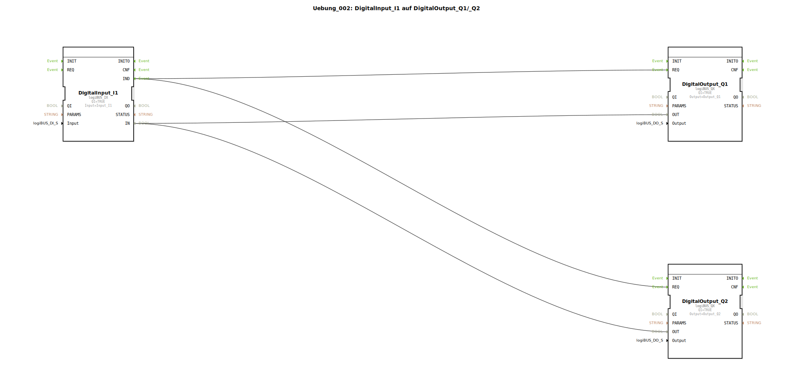

# Uebung_002: DigitalInput_I1 auf DigitalOutput_Q1/_Q2


[](https://notebooklm.google.com/notebook/a6872e59-1dfc-4132-a118-aff1bc7bc944)

Dieser Artikel beschreibt die logiBUS®-Übung `Uebung_002`, bei der ein einzelnes digitales Eingangssignal auf zwei verschiedene digitale Ausgänge verteilt wird. Hierbei wird das Konzept des "Fan-Out" (Vervielfachung) von Verbindungen demonstriert.

----


## Ziel der Übung

Das Hauptziel dieser Übung ist es, zu zeigen, wie Ereignis- und Datenverbindungen in der IEC 61499 verzweigt werden können. Ein einzelner Quell-Port kann mehrere Ziel-Ports bedienen. Dies ist eine fundamentale Methode, um parallele Aktionen in einer Steuerung auszulösen.

-----

## Beschreibung und Komponenten

[cite_start]In der Subapplikation `Uebung_002.SUB` wird ein digitaler Eingang eingelesen und direkt an zwei digitale Ausgänge weitergereicht[cite: 1].

### Funktionsbausteine (FBs)




  * **`DigitalInput_I1`**: Eine Instanz des Typs `logiBUS_IX`. [cite_start]Dieser Baustein liest den Hardware-Eingang `Input_I1`[cite: 1].
  * **`DigitalOutput_Q1` & `DigitalOutput_Q2`**: Instanzen des Typs `logiBUS_QX`. [cite_start]Diese repräsentieren die physischen Ausgänge `Output_Q1` und `Output_Q2`[cite: 1].

-----

## Funktionsweise

Die Signalverteilung wird durch das Ziehen von jeweils zwei Verbindungen von der Quelle zu den Zielen erreicht. Der Aufbau in `Uebung_002.SUB` ist wie folgt definiert:

```xml
<EventConnections>
    <Connection Source="DigitalInput_I1.IND" Destination="DigitalOutput_Q1.REQ"/>
    <Connection Source="DigitalInput_I1.IND" Destination="DigitalOutput_Q2.REQ"/>
</EventConnections>
<DataConnections>
    <Connection Source="DigitalInput_I1.IN" Destination="DigitalOutput_Q1.OUT"/>
    <Connection Source="DigitalInput_I1.IN" Destination="DigitalOutput_Q2.OUT"/>
</DataConnections>
```

[cite_start][cite: 1]

Der Signalweg verläuft dabei in folgenden Schritten:
1.  Der Baustein `DigitalInput_I1` detektiert eine Änderung am physischen Eingang.
2.  Ein Ereignis wird am Port `IND` ausgelöst und an **beide** Zielbausteine (`Q1` und `Q2`) gesendet.
3.  Zeitgleich steht der aktuelle Signalzustand am Port `IN` für beide Bausteine zur Verfügung.
4.  Beide Ausgangsbausteine empfangen das Ereignis zeitgleich und schalten ihre jeweiligen Hardware-Ausgänge auf den gelieferten Wert.

Im Ergebnis schalten beide Ausgänge synchron zum Zustand des Eingangs `I1`.

-----

## Anwendungsbeispiel

Ein typisches Anwendungsbeispiel ist die **parallele Statusanzeige**:
Ein Sensor an einer Maschine (`I1`) soll nicht nur die interne Logik steuern, sondern gleichzeitig eine lokale Kontrollleuchte (`Q1`) und eine Signallampe an einem entfernten Bedienpult (`Q2`) aktivieren. Durch die Verzweigung der Signale wird sichergestellt, dass beide Anzeigen immer den identischen Zustand des Sensors widerspiegeln.