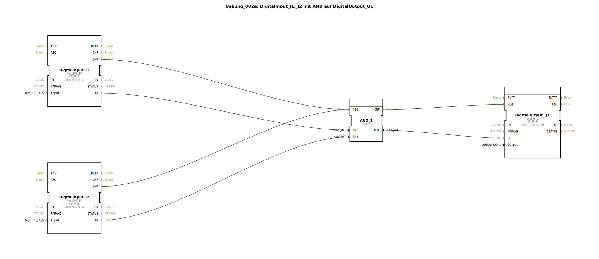

# Uebung_002a: DigitalInput_I1/_I2 mit AND auf DigitalOutput_Q1


[](https://notebooklm.google.com/notebook/a6872e59-1dfc-4132-a118-aff1bc7bc944)

Dieser Artikel beschreibt die logiBUS®-Übung `Uebung_002a`. In dieser Übung wird eine klassische UND-Verknüpfung (AND) realisiert, bei der ein digitaler Ausgang nur dann aktiviert wird, wenn zwei digitale Eingänge gleichzeitig den Zustand "Wahr" (HIGH) führen.

----


## Ziel der Übung

Das Hauptziel dieser Übung ist die Implementierung einer grundlegenden logischen Entscheidungsstruktur. Es wird gezeigt, wie Signale von mehreren Sensoren (Eingängen) kombiniert werden können, um eine Aktion an einem Aktor (Ausgang) auszulösen. Dies ist ein fundamentaler Baustein jeder Steuerungsprogrammierung.

-----

## Beschreibung und Komponenten

[cite_start]Die Subapplikation `Uebung_002a.SUB` verknüpft zwei digitale Eingänge über einen Logik-Baustein mit einem digitalen Ausgang[cite: 1].

### Funktionsbausteine (FBs)




  * **`DigitalInput_I1` & `DigitalInput_I2`**: Instanzen des Typs `logiBUS_IX`. [cite_start]Diese repräsentieren die beiden Hardware-Eingänge, die überwacht werden[cite: 1].
  * **`AND_2`**: Eine Instanz des Typs `AND_2` (aus der IEC 61131-Bibliothek). [cite_start]Dieser Baustein führt die logische UND-Operation aus. Er besitzt zwei Dateneingänge (`IN1`, `IN2`) und einen Datenausgang (`OUT`)[cite: 1]. Zur Steuerung benötigt er ein Ereignis am Port `REQ` und quittiert die Berechnung am Port `CNF`.
  * **`DigitalOutput_Q1`**: Eine Instanz des Typs `logiBUS_QX`. [cite_start]Dieser Baustein steuert den Hardware-Ausgang `Output_Q1` basierend auf dem Ergebnis der Logik[cite: 1].

-----

## Funktionsweise

Die Logik wird durch die Verschaltung von Ereignis- und Datenverbindungen festgelegt. Der Aufbau in `Uebung_002a.SUB` ist wie folgt definiert:

```xml
<EventConnections>
    <Connection Source="DigitalInput_I1.IND" Destination="AND_2.REQ"/>
    <Connection Source="DigitalInput_I2.IND" Destination="AND_2.REQ"/>
    <Connection Source="AND_2.CNF" Destination="DigitalOutput_Q1.REQ"/>
</EventConnections>
<DataConnections>
    <Connection Source="DigitalInput_I1.IN" Destination="AND_2.IN1"/>
    <Connection Source="DigitalInput_I2.IN" Destination="AND_2.IN2"/>
    <Connection Source="AND_2.OUT" Destination="DigitalOutput_Q1.OUT"/>
</DataConnections>
```

[cite_start][cite: 1]

Der Prozess folgt dieser Logik:
1.  Ändert sich einer der beiden Eingänge (`I1` oder `I2`), sendet der jeweilige Baustein ein `IND`-Ereignis an den `REQ`-Port des `AND_2`-Bausteins.
2.  Der `AND_2`-Baustein liest daraufhin beide Daten-Eingänge (`IN1` und `IN2`) und berechnet das Ergebnis (`IN1 AND IN2`).
3.  Nach Abschluss der Berechnung feuert der Logik-Baustein ein `CNF`-Ereignis (Confirmation) ab.
4.  Dieses `CNF`-Ereignis erreicht den `REQ`-Port von `DigitalOutput_Q1`, welcher daraufhin das Ergebnis übernimmt und den physischen Ausgang schaltet.

-----

## Anwendungsbeispiel

Ein klassisches Anwendungsbeispiel ist die **Sicherheits-Freigabe**:
Ein Motor (`Q1`) soll nur starten, wenn sowohl die Schutztür geschlossen ist (`I1`) als auch der Bediener den Start-Taster drückt (`I2`). Nur wenn beide Bedingungen gleichzeitig erfüllt sind (`TRUE`), liefert das UND-Gatter ein Signal zum Einschalten des Motors.