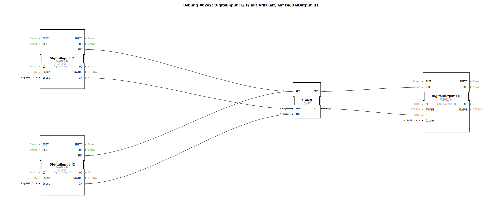

# Uebung_002a2: DigitalInput_I1/_I2 mit AND (alt) auf DigitalOutput_Q1


[](https://notebooklm.google.com/notebook/041f4df4-b729-484d-b786-b6dcdf151961)

Dieser Artikel beschreibt die logiBUS®-Übung `Uebung_002a2`. Diese Übung ist funktional identisch mit `Uebung_002a`, demonstriert jedoch die Verwendung des generischen Funktionsbausteins `F_AND` anstelle des typspezifischen `AND_2`.

----


## Ziel der Übung

Das Ziel ist es, die Verwendung von generischen Funktionsbausteinen (F-FBs) in der IEC 61499 zu verstehen. Es wird gezeigt, dass unterschiedliche Bausteintypen dieselbe logische Operation (UND) ausführen können, wobei das ereignisbasierte Ausführungsmodell identisch bleibt.

-----

## Beschreibung und Komponenten

[cite_start]In der Subapplikation `Uebung_002a2.SUB` werden zwei digitale Eingänge über ein generisches UND-Gatter verknüpft[cite: 1].

### Funktionsbausteine (FBs)




  * **`DigitalInput_I1` & `DigitalInput_I2`**: Standard-Eingangsbausteine vom Typ `logiBUS_IX`[cite: 1].
  * **`F_AND`**: Ein generischer Funktionsbaustein vom Typ `F_AND`. [cite_start]Er berechnet das logische UND seiner Eingänge `IN1` und `IN2`, sobald er ein Ereignis am Eingang `REQ` empfängt, und gibt das Ergebnis am Ausgang `OUT` sowie ein Bestätigungs-Ereignis am Port `CNF` aus[cite: 1].
  * **`DigitalOutput_Q1`**: Standard-Ausgangsbaustein vom Typ `logiBUS_QX`[cite: 1].

-----

## Funktionsweise

Der Aufbau in `Uebung_002a2.SUB` folgt dem bewährten Muster der Ereigniskette:

```xml
<EventConnections>
    <Connection Source="DigitalInput_I1.IND" Destination="F_AND.REQ"/>
    <Connection Source="DigitalInput_I2.IND" Destination="F_AND.REQ"/>
    <Connection Source="F_AND.CNF" Destination="DigitalOutput_Q1.REQ"/>
</EventConnections>
<DataConnections>
    <Connection Source="DigitalInput_I1.IN" Destination="F_AND.IN1"/>
    <Connection Source="DigitalInput_I2.IN" Destination="F_AND.IN2"/>
    <Connection Source="F_AND.OUT" Destination="DigitalOutput_Q1.OUT"/>
</DataConnections>
```

[cite_start][cite: 1]

Der funktionale Ablauf:
1.  Jede Änderung an den Tastern `I1` oder `I2` löst ein `IND`-Event aus.
2.  Beide Events sind mit dem `REQ`-Port von `F_AND` verbunden. Das bedeutet: Egal welcher Taster betätigt wird, die Logik wird neu berechnet.
3.  `F_AND` ermittelt das Ergebnis.
4.  Über das `CNF`-Event wird der Baustein `DigitalOutput_Q1` angewiesen, den Hardware-Ausgang `Q1` zu aktualisieren.

Der Ausgang ist nur dann aktiv, wenn beide Eingänge gleichzeitig den Wert `TRUE` führen.

-----

## Anwendungsbeispiel

**Zustimmungs-Schaltung**:
Ein Bediener muss an einem Steuerpult eine Taste drücken (`I1`) und gleichzeitig muss ein zweiter Sensor (`I2`) die Anwesenheit eines Werkstücks bestätigen, damit der Roboterarm (`Q1`) das Werkstück greifen darf.