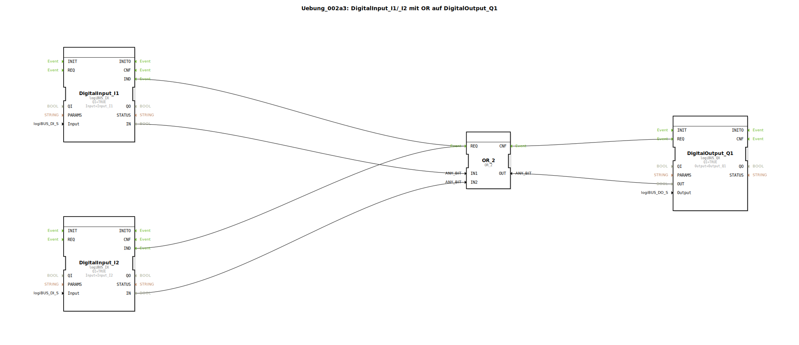

# Uebung_002a3: DigitalInput_I1/_I2 mit OR auf DigitalOutput_Q1


[](https://notebooklm.google.com/notebook/a6872e59-1dfc-4132-a118-aff1bc7bc944)

Dieser Artikel beschreibt die logiBUS®-Übung `Uebung_002a3`. In dieser Übung wird eine logische ODER-Verknüpfung (OR) implementiert, bei der ein digitaler Ausgang aktiviert wird, sobald mindestens einer von zwei digitalen Eingängen den Zustand "Wahr" (HIGH) einnimmt.

----


## Ziel der Übung

Das Hauptziel dieser Übung ist es, die Funktionsweise einer ODER-Verknüpfung in der Automatisierungstechnik zu demonstrieren. Sie zeigt, wie alternative Bedingungen (Eingänge) genutzt werden können, um dieselbe Aktion (Ausgang) auszulösen. Dies ist eine Standardanforderung für Systeme, die von mehreren Stellen aus bedienbar sein müssen.

-----

## Beschreibung und Komponenten

[cite_start]Die Subapplikation `Uebung_002a3.SUB` führt zwei digitale Eingangssignale über einen ODER-Logik-Baustein zusammen[cite: 1].

### Funktionsbausteine (FBs)




  * **`DigitalInput_I1` & `DigitalInput_I2`**: Instanzen des Typs `logiBUS_IX`. [cite_start]Diese Bausteine erfassen die Zustände der physischen Eingänge `Input_I1` und `Input_I2`[cite: 1].
  * **`OR_2`**: Eine Instanz des Typs `OR_2` (aus der IEC 61131-Bibliothek). [cite_start]Dieser Baustein führt die logische ODER-Operation aus. Er besitzt zwei Dateneingänge (`IN1`, `IN2`) und einen Datenausgang (`OUT`)[cite: 1]. Wie der AND-Baustein reagiert er auf ein Ereignis am Port `REQ` und quittiert dies mit `CNF`.
  * **`DigitalOutput_Q1`**: Eine Instanz des Typs `logiBUS_QX`. [cite_start]Dieser Baustein setzt den physischen Ausgang `Output_Q1` basierend auf dem Ergebnis der ODER-Verknüpfung[cite: 1].

-----

## Funktionsweise

Die Logik wird durch die Verschaltung von Ereignis- und Datenverbindungen definiert. Der Aufbau in `Uebung_002a3.SUB` ist wie folgt:

```xml
<EventConnections>
    <Connection Source="DigitalInput_I1.IND" Destination="OR_2.REQ"/>
    <Connection Source="DigitalInput_I2.IND" Destination="OR_2.REQ"/>
    <Connection Source="OR_2.CNF" Destination="DigitalOutput_Q1.REQ"/>
</EventConnections>
<DataConnections>
    <Connection Source="DigitalInput_I1.IN" Destination="OR_2.IN1"/>
    <Connection Source="DigitalInput_I2.IN" Destination="OR_2.IN2"/>
    <Connection Source="OR_2.OUT" Destination="DigitalOutput_Q1.OUT"/>
</DataConnections>
```

[cite_start][cite: 1]

Der Prozess folgt dieser Logik:
1.  Jede Änderung an den Tastern `I1` oder `I2` löst ein `IND`-Event aus.
2.  Beide Events sind mit dem `REQ`-Port von `OR_2` verbunden. Das bedeutet: Egal welcher Taster betätigt wird, die Logik wird neu berechnet.
3.  `OR_2` prüft die Zustände: Wenn mindestens ein Eingang den Wert `TRUE` führt, wird der Ausgang `OUT` ebenfalls `TRUE`.
4.  Über das `CNF`-Event wird der Baustein `DigitalOutput_Q1` angewiesen, den Hardware-Ausgang `Q1` zu aktualisieren.

-----

## Anwendungsbeispiel

Ein typisches Anwendungsbeispiel ist die **Flurbeleuchtung mit zwei Schaltern**:
In einem langen Flur gibt es an beiden Enden einen Schalter (`I1` und `I2`). Die Lampe (`Q1`) soll leuchten, wenn Schalter 1 betätigt wird ODER wenn Schalter 2 betätigt wird. Diese "Entweder-Oder"-Logik wird durch den `OR_2`-Baustein abgebildet, sodass man die Beleuchtung von beiden Stellen aus unabhängig voneinander einschalten kann.