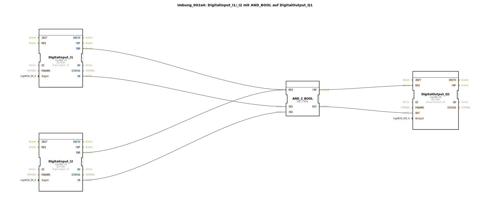

# Uebung_002a4: DigitalInput_I1/_I2 mit AND_BOOL auf DigitalOutput_Q1


[](https://notebooklm.google.com/notebook/041f4df4-b729-484d-b786-b6dcdf151961)

Dieser Artikel beschreibt die logiBUS®-Übung `Uebung_002a4`. In dieser Übung wird eine logische UND-Verknüpfung (AND) realisiert, wobei ein digitaler Ausgang nur dann aktiviert wird, wenn zwei digitale Eingänge gleichzeitig den Zustand "Wahr" (HIGH) führen.

----


## Ziel der Übung

Das Hauptziel dieser Übung ist die Implementierung einer logischen Entscheidungsstruktur unter Verwendung des spezialisierten Typs `AND_2_BOOL`. Es wird gezeigt, wie Ereignis- und Datenflüsse kombiniert werden, um eine Hardware-Ausgabe basierend auf mehreren Eingangsbedingungen zu steuern.

-----

## Beschreibung und Komponenten

[cite_start]Die Subapplikation `Uebung_002a4.SUB` verknüpft zwei digitale Eingänge über einen Logik-Baustein mit einem digitalen Ausgang[cite: 1].

### Funktionsbausteine (FBs)




  * **`DigitalInput_I1` & `DigitalInput_I2`**: Instanzen des Typs `logiBUS_IX`. [cite_start]Diese repräsentieren die beiden Hardware-Eingänge, die überwacht werden[cite: 1].
  * **`AND_2_BOOL`**: Eine Instanz des Typs `AND_2_BOOL` (aus der IEC 61131-Bibliothek). [cite_start]Dieser Baustein führt die logische UND-Operation speziell für boolesche Werte aus. Er besitzt zwei Dateneingänge (`IN1`, `IN2`) und einen Datenausgang (`OUT`)[cite: 1]. Wie alle Standard-Logikbausteine reagiert er auf ein Ereignis am Port `REQ` und signalisiert die Fertigstellung am Port `CNF`.
  * **`DigitalOutput_Q1`**: Eine Instanz des Typs `logiBUS_QX`. [cite_start]Dieser Baustein steuert den Hardware-Ausgang `Output_Q1`[cite: 1].

-----

## Funktionsweise

Die Logik wird durch die Verschaltung der Ereignis- und Datenpfade in der Subapplikation festgelegt. Der Aufbau in `Uebung_002a4.SUB` ist wie folgt definiert:

```xml
<EventConnections>
    <Connection Source="DigitalInput_I1.IND" Destination="AND_2_BOOL.REQ"/>
    <Connection Source="DigitalInput_I2.IND" Destination="AND_2_BOOL.REQ"/>
    <Connection Source="AND_2_BOOL.CNF" Destination="DigitalOutput_Q1.REQ"/>
</EventConnections>
<DataConnections>
    <Connection Source="DigitalInput_I1.IN" Destination="AND_2_BOOL.IN1"/>
    <Connection Source="DigitalInput_I2.IN" Destination="AND_2_BOOL.IN2"/>
    <Connection Source="AND_2_BOOL.OUT" Destination="DigitalOutput_Q1.OUT"/>
</DataConnections>
```

[cite_start][cite: 1]

Der funktionale Ablauf:
1.  Jeder Tastendruck an `I1` oder `I2` löst ein `IND`-Ereignis aus.
2.  Das Ereignis triggert den `REQ`-Eingang des `AND_2_BOOL`-Bausteins.
3.  Der Baustein liest die aktuellen Zustände beider Eingänge und verknüpft sie logisch (UND).
4.  Nach der Berechnung sendet der Baustein ein `CNF`-Ereignis an `DigitalOutput_Q1`.
5.  Der Ausgangsbaustein aktualisiert daraufhin den physischen Ausgang `Q1` mit dem berechneten Ergebnis.

-----

## Anwendungsbeispiel

Ein klassisches Anwendungsbeispiel ist eine **Zweihandbedienung zur Sicherheit**:
Damit eine Maschine (`Q1`) startet, muss der Bediener zwei räumlich getrennte Taster (`I1` und `I2`) gleichzeitig drücken. Dies stellt sicher, dass beide Hände des Bedieners außerhalb des Gefahrenbereichs sind. Nur wenn beide Signale `TRUE` sind, wird der Ausgang aktiviert.