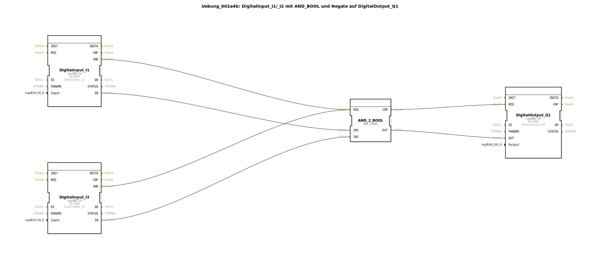

# Uebung_002a4b: DigitalInput_I1/_I2 mit AND_BOOL und Negate auf DigitalOutput_Q1

* * * * * * * * * *

## Einleitung

Diese Übung demonstriert die grundlegende Verknüpfung von digitalen Eingängen mit einem **AND**-Funktionsbaustein, sowie die Negation eines Eingangssignals. Das Ergebnis wird auf einen digitalen Ausgang geschaltet.

Ziel ist es, die Konfiguration und Verschaltung von Ein‑/Ausgangsbausteinen der **logiBUS**-Familie mit einem **IEC 61131**-Standardbaustein zu verstehen.

## Verwendete Funktionsbausteine (FBs)

Die Übung besteht aus folgenden direkt im Netzwerk verwendeten Funktionsbausteinen (es gibt keine Sub‑Bausteine):

| Baustein | Typ | Parameter |
|----------|-----|-----------|
| **DigitalInput_I1** | `logiBUS::io::DI::logiBUS_IX` | `QI = TRUE`, `Input = Input_I1` |
| **DigitalInput_I2** | `logiBUS::io::DI::logiBUS_IX` | `QI = TRUE`, `Input = Input_I2` |
| **AND_2_BOOL** | `iec61131::bitwiseOperators::AND_2_BOOL` | (keine Parameter) |
| **DigitalOutput_Q1** | `logiBUS::io::DQ::logiBUS_QX` | `QI = TRUE`, `Output = Output_Q1` |

### Kurzbeschreibung der verwendeten Bausteine

- **logiBUS_IX**: Liest einen digitalen Eingang der logiBUS‑Hardware. Der Parameter `Input` legt den physikalischen Anschluss fest (z. B. I1, I2). Über den Ereignisausgang `IND` wird ein neuer Wert signalisiert.
- **AND_2_BOOL**: Führt eine UND‑Verknüpfung auf zwei booleschen Signalen aus (Typ `iec61131::bitwiseOperators::AND_2_BOOL`). Der Ausgang `OUT` ist `TRUE` genau dann, wenn beide Eingänge `TRUE` sind.
- **logiBUS_QX**: Setzt einen digitalen Ausgang der logiBUS‑Hardware. Der Parameter `Output` bestimmt den Ausgangskanal (z. B. Q1). Der Ausgang wird über das Ereignis `REQ` gesteuert.

## Programmablauf und Verbindungen

Die Logik der Übung ist wie folgt aufgebaut:

1. Die digitalen Eingänge **I1** und **I2** werden über die Bausteine `DigitalInput_I1` und `DigitalInput_I2` gelesen.
2. Das Signal von **I2** wird **negiert** (invertiert). Dies geschieht über eine **Negate Connection** (Attribut `Negated = "true"`) auf der Datenverbindung zwischen `DigitalInput_I2.IN` und `AND_2_BOOL.IN2`.  
   *(Die Negation ist nur bei booleschen Datentypen möglich.)*
3. Der Baustein `AND_2_BOOL` verknüpft das Signal von **I1** (an `IN1`) mit dem negierten Signal von **I2** (an `IN2`) mittels einer UND‑Operation.
4. Das Ergebnis (`AND_2_BOOL.OUT`) wird an den Dateneingang `OUT` des Ausgangsbausteins `DigitalOutput_Q1` übergeben.
5. Die Ereignissteuerung:
   - Jeder der beiden Eingangsbausteine löst bei einem neuen Wert das Ereignis `IND` aus.
   - Beide `IND`‑Ereignisse sind mit dem `REQ`‑Eingang des **AND_2_BOOL** verbunden, sodass die UND‑Verknüpfung bei jedem Eingangswechsel neu berechnet wird.
   - Der Ausgangsbaustein `DigitalOutput_Q1` erhält über sein `REQ`‑Ereignis vom `CNF`‑Ausgang des **AND_2_BOOL** den Befehl, den Ausgang zu aktualisieren.

**Zusammenfassung der Logik:**  
`Q1 = I1 AND (NOT I2)`

**Lernziele:**
- Konfiguration von logiBUS‑Ein‑/Ausgangsbausteinen.
- Verwendung des IEC‑61131‑Bausteins `AND_2_BOOL`.
- Anwendung einer Datennegation (Not‑Verbindung) in 4diac.
- Verständnis der Ereignissteuerung mit `IND` und `REQ`.

**Schwierigkeitsgrad:** Einfach  
**Benötigte Vorkenntnisse:** Grundlagen der IEC‑61499‑Ereignissteuerung, einfache boolesche Logik.

## Zusammenfassung

Die Übung **Uebung_002a4b** realisiert eine einfache UND‑Verknüpfung mit negiertem zweiten Eingang. Sie vermittelt die Grundlagen der Verschaltung von Hardware‑Bausteinen (logiBUS) mit Logikbausteinen und die Anwendung von Negationsattributen auf Datenverbindungen. Das Verhalten ist deterministisch: Der Ausgang **Q1** ist genau dann aktiv, wenn Eingang **I1** aktiv und Eingang **I2** inaktiv ist.