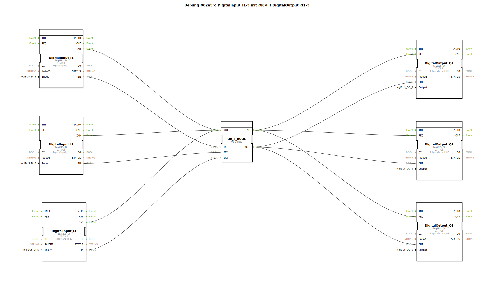

# Uebung_002a5b: DigitalInput_I1-3 mit OR auf DigitalOutput_Q1-3


[](https://notebooklm.google.com/notebook/a6872e59-1dfc-4132-a118-aff1bc7bc944)

Dieser Artikel beschreibt die logiBUS®-Übung `Uebung_002a5b`. In dieser Übung werden zwei Konzepte kombiniert: Eine logische ODER-Verknüpfung (OR) mit drei Eingängen und die gleichzeitige Verteilung (Fan-Out) des Ergebnisses auf drei digitale Ausgänge.

----


## Ziel der Übung

Das Ziel ist es, eine komplexe E/A-Struktur abzubilden. Es wird gezeigt, wie Informationen von mehreren Sensoren gesammelt, logisch bewertet und das Ergebnis an eine Gruppe von Aktoren verteilt wird. Dabei wird die Skalierbarkeit von Ereignisverbindungen sowohl auf der Eingangsseite (Fan-In) als auch auf der Ausgangsseite (Fan-Out) verdeutlicht.

-----

## Beschreibung und Komponenten

[cite_start]In der Subapplikation `Uebung_002a5b.SUB` werden drei Eingangsbausteine über ein ODER-Gatter mit drei Ausgangsbausteinen verknüpft[cite: 1].

### Funktionsbausteine (FBs)




  * **`DigitalInput_I1` bis `I3`**: Drei Instanzen des Typs `logiBUS_IX`. [cite_start]Sie überwachen die Hardware-Eingänge `Input_I1`, `Input_I2` und `Input_I3`[cite: 1].
  * **`OR_3_BOOL`**: Eine Instanz des Typs `OR_3_BOOL` (aus der IEC 61131-Bibliothek). [cite_start]Dieser Baustein führt eine ODER-Operation für drei boolesche Eingänge aus[cite: 1]. Er reagiert auf `REQ` und quittiert mit `CNF`.
  * **`DigitalOutput_Q1` bis `Q3`**: Drei Instanzen des Typs `logiBUS_QX`. [cite_start]Sie steuern die physischen Ausgänge `Output_Q1`, `Output_Q2` und `Output_Q3`[cite: 1].

-----

## Funktionsweise

Die Schaltung nutzt ein zentrales Logik-Element als Knotenpunkt für alle Signale. Der Aufbau in `Uebung_002a5b.SUB` ist wie folgt definiert:

```xml
<EventConnections>
    <Connection Source="DigitalInput_I1.IND" Destination="OR_3_BOOL.REQ"/>
    <Connection Source="DigitalInput_I2.IND" Destination="OR_3_BOOL.REQ"/>
    <Connection Source="DigitalInput_I3.IND" Destination="OR_3_BOOL.REQ"/>
    <Connection Source="OR_3_BOOL.CNF" Destination="DigitalOutput_Q1.REQ"/>
    <Connection Source="OR_3_BOOL.CNF" Destination="DigitalOutput_Q2.REQ"/>
    <Connection Source="OR_3_BOOL.CNF" Destination="DigitalOutput_Q3.REQ"/>
</EventConnections>
<DataConnections>
    <Connection Source="DigitalInput_I1.IN" Destination="OR_3_BOOL.IN1"/>
    <Connection Source="DigitalInput_I2.IN" Destination="OR_3_BOOL.IN2"/>
    <Connection Source="DigitalInput_I3.IN" Destination="OR_3_BOOL.IN3"/>
    <Connection Source="OR_3_BOOL.OUT" Destination="DigitalOutput_Q1.OUT"/>
    <Connection Source="OR_3_BOOL.OUT" Destination="DigitalOutput_Q2.OUT"/>
    <Connection Source="OR_3_BOOL.OUT" Destination="DigitalOutput_Q3.OUT"/>
</DataConnections>
```

[cite_start][cite: 1]

Der funktionale Ablauf:
1.  **Eingangs-Trigger**: Jede Änderung an einem der drei Taster (`I1`, `I2`, `I3`) löst eine Neuberechnung der Logik aus.
2.  **Berechnung**: Der Baustein `OR_3_BOOL` setzt sein Ergebnis auf `TRUE`, wenn mindestens ein Eingang aktiv ist.
3.  **Massen-Update**: Das resultierende Signal wird zeitgleich an alle drei Lampen (`Q1`, `Q2`, `Q3`) gesendet. Sobald die Logik fertig ist (`CNF`), werden alle drei Hardware-Ausgänge synchron aktualisiert.

-----

## Anwendungsbeispiel

**Zentrale Warnanlage**:
In einer Werkshalle gibt es drei Not-Halt-Taster (`I1`, `I2`, `I3`). Sobald einer dieser Taster gedrückt wird, müssen an drei verschiedenen Stellen der Halle Warnlampen (`Q1`, `Q2`, `Q3`) aufleuchten. Die ODER-Logik sammelt die Alarme ein, und der Fan-Out sorgt für die weitreichende Signalisierung.