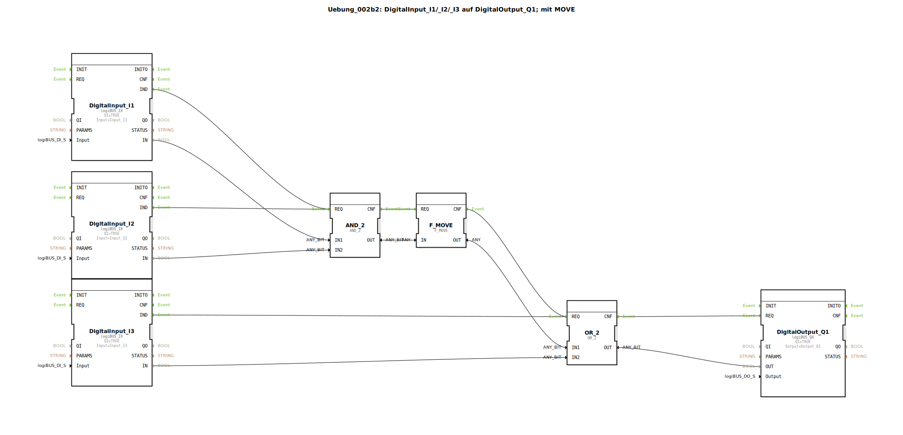

# Uebung_002b2: DigitalInput_I1/_I2/_I3 auf DigitalOutput_Q1; mit MOVE


[](https://notebooklm.google.com/notebook/041f4df4-b729-484d-b786-b6dcdf151961)

Dieser Artikel beschreibt die logiBUS®-Übung `Uebung_002b2`. In dieser Übung wird eine kombinatorische Logikschaltung implementiert, die zwei Grundoperationen (UND und ODER) miteinander verknüpft, wobei ein `F_MOVE`-Baustein zur expliziten Datenweiterleitung genutzt wird.

----


## Ziel der Übung

Das Hauptziel dieser Übung ist die hierarchische Verknüpfung von Logikbausteinen. Es wird gezeigt, wie Teilergebnisse einer Operation als Eingangsgröße für eine weitere Operation dienen können. Zusätzlich wird der Baustein `F_MOVE` eingeführt, der dazu dient, Datenwerte explizit in einem eigenen Ereignisschritt weiterzureichen.

-----

## Beschreibung und Komponenten

[cite_start]Die Subapplikation `Uebung_002b2.SUB` realisiert die logische Funktion `Q1 = (I1 AND I2) OR I3` unter Verwendung von Standard-Logikbausteinen[cite: 1].

### Funktionsbausteine (FBs)




  * **`DigitalInput_I1` bis `I3`**: Drei Instanzen des Typs `logiBUS_IX`. [cite_start]Sie liefern die Eingangssignale für die Logikkette[cite: 1].
  * **`AND_2`**: Eine Instanz des Typs `AND_2`. [cite_start]Verknüpft die Eingänge `I1` und `I2`[cite: 1].
  * **`F_MOVE`**: Ein Datentransfer-Baustein. [cite_start]Er nimmt den Wert am Eingang `IN` entgegen und gibt ihn beim Ereignis `REQ` unverändert am Ausgang `OUT` wieder aus[cite: 1]. Er dient hier als Puffer zwischen den Logikstufen.
  * **`OR_2`**: Eine Instanz des Typs `OR_2`. [cite_start]Verknüpft das (gepufferte) Ergebnis des UND-Bausteins mit dem dritten Eingang `I3`[cite: 1].
  * **`DigitalOutput_Q1`**: Gibt das Endergebnis der Logik an den Hardware-Ausgang aus.

-----

## Funktionsweise

Die hierarchische Struktur der Logik wird durch die Verschaltung der Ereigniskette in `Uebung_002b2.SUB` deutlich:

```xml
<EventConnections>
    <Connection Source="DigitalInput_I1.IND" Destination="AND_2.REQ"/>
    <Connection Source="DigitalInput_I2.IND" Destination="AND_2.REQ"/>
    <Connection Source="AND_2.CNF" Destination="F_MOVE.REQ"/>
    <Connection Source="F_MOVE.CNF" Destination="OR_2.REQ"/>
    <Connection Source="DigitalInput_I3.IND" Destination="OR_2.REQ"/>
    <Connection Source="OR_2.CNF" Destination="DigitalOutput_Q1.REQ"/>
</EventConnections>
<DataConnections>
    <Connection Source="DigitalInput_I1.IN" Destination="AND_2.IN1"/>
    <Connection Source="DigitalInput_I2.IN" Destination="AND_2.IN2"/>
    <Connection Source="AND_2.OUT" Destination="F_MOVE.IN"/>
    <Connection Source="F_MOVE.OUT" Destination="OR_2.IN1"/>
    <Connection Source="DigitalInput_I3.IN" Destination="OR_2.IN2"/>
    <Connection Source="OR_2.OUT" Destination="DigitalOutput_Q1.OUT"/>
</DataConnections>
```

[cite_start][cite: 1]

Der funktionale Ablauf:
1.  Ändert sich `I1` oder `I2`, berechnet `AND_2` das Teilergebnis.
2.  Das Fertigstellungs-Event (`CNF`) von `AND_2` triggert den `F_MOVE`.
3.  `F_MOVE` schiebt das Teilergebnis weiter zum ODER-Baustein und triggert diesen wiederum an (`CNF -> REQ`).
4.  Der ODER-Baustein verarbeitet das gepufferte Ergebnis zusammen mit dem Signal von `I3`.
5.  Der Ausgang `Q1` wird aktiviert, wenn entweder beide ersten Eingänge aktiv sind ODER wenn der dritte Eingang aktiv ist.

-----

## Anwendungsbeispiel

**Anlagenfreigabe mit Überbrückung**:
Ein Motor (`Q1`) soll normalerweise nur laufen, wenn zwei Sensoren (`I1` und `I2`) gleichzeitig grünes Licht geben (z.B. Druck ok UND Temperatur ok). Für Wartungszwecke soll der Motor jedoch auch dann gestartet werden können, wenn ein manueller Taster (`I3`) gedrückt wird, der die Automatiklogik überbrückt.