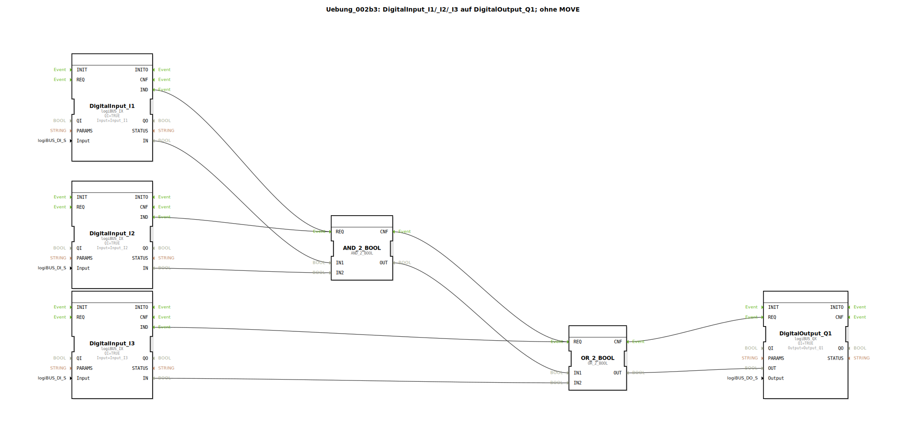

# Uebung_002b3: DigitalInput_I1/_I2/_I3 auf DigitalOutput_Q1; ohne MOVE

* * * * * * * * * *

## Einleitung
Diese Übung demonstriert die Verarbeitung digitaler Eingangssignale und deren logische Verknüpfung zur Steuerung eines digitalen Ausgangs. Die Schaltung kombiniert UND- und ODER-Verknüpfungen, um eine spezifische Logik zwischen drei Eingängen und einem Ausgang zu realisieren.

## Verwendete Funktionsbausteine (FBs)

### DigitalInput_I1, DigitalInput_I2, DigitalInput_I3
- **Typ**: logiBUS_IX
- **Parameter**: 
  - QI = TRUE
  - Input = logiBUS_DI::Input_I1 (bzw. I2, I3)
- **Funktionsweise**: Lesen der digitalen Eingangssignale von den entsprechenden Hardware-Eingängen

### AND_2_BOOL
- **Typ**: AND_2_BOOL
- **Funktionsweise**: Führt eine logische UND-Verknüpfung zwischen zwei booleschen Eingängen durch

### OR_2_BOOL
- **Typ**: OR_2_BOOL
- **Funktionsweise**: Führt eine logische ODER-Verknüpfung zwischen zwei booleschen Eingängen durch

### DigitalOutput_Q1
- **Typ**: logiBUS_QX
- **Parameter**:
  - QI = TRUE
  - Output = logiBUS_DO::Output_Q1
- **Funktionsweise**: Schreibt das Ergebnis der logischen Verknüpfung auf den digitalen Ausgang Q1

## Programmablauf und Verbindungen

**Ereignisverbindungen:**
- DigitalInput_I1.IND → AND_2_BOOL.REQ
- DigitalInput_I2.IND → AND_2_BOOL.REQ
- DigitalInput_I3.IND → OR_2_BOOL.REQ
- AND_2_BOOL.CNF → OR_2_BOOL.REQ
- OR_2_BOOL.CNF → DigitalOutput_Q1.REQ

**Datenverbindungen:**
- DigitalInput_I1.IN → AND_2_BOOL.IN1
- DigitalInput_I2.IN → AND_2_BOOL.IN2
- DigitalInput_I3.IN → OR_2_BOOL.IN2
- AND_2_BOOL.OUT → OR_2_BOOL.IN1
- OR_2_BOOL.OUT → DigitalOutput_Q1.OUT

**Logische Funktion:**
Q1 = (I1 UND I2) ODER I3

**Lernziele:**
- Verständnis der logischen Verknüpfungen UND und ODER
- Umgang mit digitalen Ein- und Ausgängen in 4diac
- Aufbau von kombinatorischen Schaltungen
- Ereignisgesteuerte Datenverarbeitung

**Schwierigkeitsgrad**: Einfach  
**Benötigte Vorkenntnisse**: Grundlagen der Digitaltechnik, Basiswissen 4diac-IDE

**Start der Übung**: Die Übung wird in der 4diac-IDE geladen und auf ein kompatibles Steuerungssystem deployt. Die digitalen Eingänge I1, I2 und I3 können getestet werden, um die Funktionalität der Schaltung zu überprüfen.

## Zusammenfassung
Diese Übung zeigt eine grundlegende kombinatorische Logikschaltung, die digitale Eingangssignale verarbeitet und über logische Verknüpfungen einen Ausgang steuert. Die Implementierung demonstriert die prinzipielle Arbeitsweise ereignisgesteuerter Systeme in der IEC 61499 mit direkter Anbindung an Hardware-Ein- und Ausgänge.