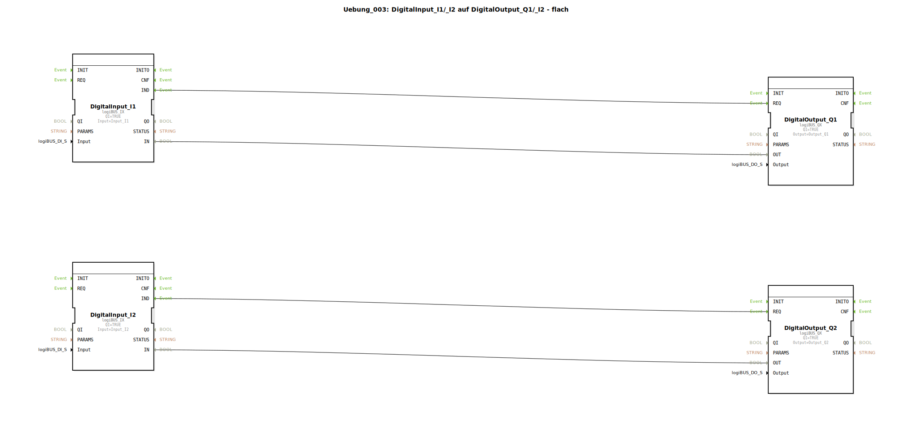

# Uebung_003: DigitalInput_I1/_I2 auf DigitalOutput_Q1/_I2 - flach


[](https://notebooklm.google.com/notebook/a6872e59-1dfc-4132-a118-aff1bc7bc944)

Dieser Artikel beschreibt die logiBUS®-Übung `Uebung_003`. In dieser Übung werden zwei voneinander unabhängige Signalpfade realisiert, wobei jeder digitale Eingang direkt einen zugeordneten digitalen Ausgang steuert.

----


## Ziel der Übung

Das Hauptziel dieser Übung ist es, die parallele Verarbeitung von Signalen in der IEC 61499 zu demonstrieren. Da Funktionsbausteine in 4diac ereignisbasiert arbeiten, können mehrere Steuerungsaufgaben völlig unabhängig voneinander in einem Netzwerk existieren, ohne sich gegenseitig in der Ausführung zu blockieren.

-----

## Beschreibung und Komponenten

[cite_start]Die Subapplikation `Uebung_003.SUB` definiert zwei separate Signalwege ("Kanäle"), die parallel verarbeitet werden[cite: 1].

### Funktionsbausteine (FBs)

Es werden zwei Paare von Ein- und Ausgangsbausteinen verwendet:




  * **`DigitalInput_I1` & `DigitalOutput_Q1`**: Das erste Paar (Kanal 1). [cite_start]Verbindet Hardware-Eingang `I1` mit Hardware-Ausgang `Q1`[cite: 1].
  * **`DigitalInput_I2` & `DigitalOutput_Q2`**: Das zweite Paar (Kanal 2). [cite_start]Verbindet Hardware-Eingang `I2` mit Hardware-Ausgang `Q2`[cite: 1].

-----

## Funktionsweise

Die Unabhängigkeit der beiden Kanäle wird durch die getrennten Ereignis- und Datenverbindungen in der Subapplikation `Uebung_003.SUB` sichergestellt:

```xml
<EventConnections>
    <Connection Source="DigitalInput_I1.IND" Destination="DigitalOutput_Q1.REQ"/>
    <Connection Source="DigitalInput_I2.IND" Destination="DigitalOutput_Q2.REQ"/>
</EventConnections>
<DataConnections>
    <Connection Source="DigitalInput_I1.IN" Destination="DigitalOutput_Q1.OUT"/>
    <Connection Source="DigitalInput_I2.IN" Destination="DigitalOutput_Q2.OUT"/>
</DataConnections>
```

[cite_start][cite: 1]

Der funktionale Ablauf:
1.  Ändert sich der Zustand von `I1`, feuert der erste Baustein ein `IND`-Event, welches `Q1` zur Aktualisierung auffordert.
2.  Ändert sich der Zustand von `I2`, feuert der zweite Baustein ein `IND`-Event, welches `Q2` zur Aktualisierung auffordert.

Beide Prozesse laufen asynchron ab. Eine schnelle Schaltfolge auf Kanal 1 beeinflusst die Reaktionszeit von Kanal 2 in keiner Weise.

-----

## Anwendungsbeispiel

**Unabhängige Aggregate**:
In einer landwirtschaftlichen Maschine werden zwei unabhängige Elektromotoren gesteuert. Schalter 1 (`I1`) schaltet den Motor für die Förderschnecke (`Q1`) ein, und Schalter 2 (`I2`) schaltet das Gebläse (`Q2`) ein. Obwohl beide Logiken im selben Steuerungsprogramm definiert sind, operieren sie als getrennte "Software-Schaltkreise".