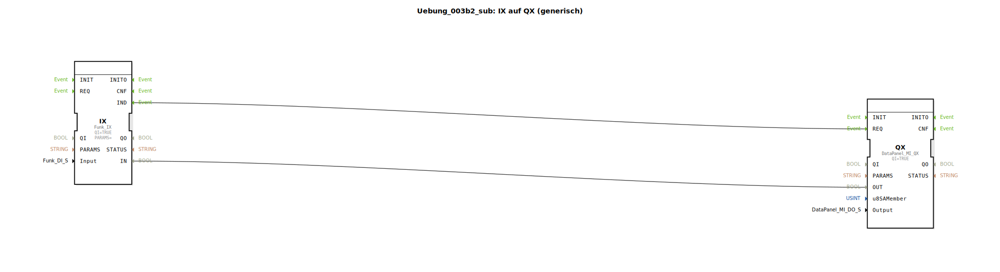

# Uebung_003b2_sub: IX auf QX (generisch)

Dieser Artikel beschreibt den Sub-App-Typ `Uebung_003b2_sub`. Dieser Baustein dient als universeller Koppler zwischen einer Funkfernbedienung und einem CAN-Bus Ausgangsmodul (DataPanel).

----

## Ziel der Übung

Abstraktion von Funk-Signalen. Der Baustein ermöglicht es, Funktasten so einfach zu handhaben wie direkt verdrahtete Eingänge und diese auf ein dezentrales Ausgangsmodul zu mappen.

-----

## Beschreibung und Komponenten

[cite_start]Der Typ `Uebung_003b2_sub` bündelt den Funk-Empfang und die CAN-Ausgabe[cite: 1].

### Interne Funktionsbausteine (FBs)

  * **`IX`**: Typ `Funk_IX`. Empfängt die Signale der über `Input` gewählten Funktaste.
  * **`QX`**: Typ `DataPanel_MI_QX`. Sendet CAN-Nachrichten an das gewählte DataPanel (`u8SAMember`) und schaltet dort den physischen Port (`Output`).

-----

## Schnittstellen

[cite_start]Der Baustein bietet drei Konfigurationsmöglichkeiten[cite: 1]:
*   **`Input`**: Name der Funktaste (z.B. `Key_01`).
*   **`u8SAMember`**: CAN-Bus Adresse des Zielmoduls.
*   **`Output`**: Nummer des Ausgangs am Modul (z.B. `DigitalOutput_1A`).

Durch die Verwendung dieses Typs kann eine komplexe Funkfernsteuerung durch einfaches "Eintragen" der IDs in der Hauptanwendung konfiguriert werden.

## 🛠️ Zugehörige Übungen

* [Uebung_003b2](Uebung_003b2.md)

