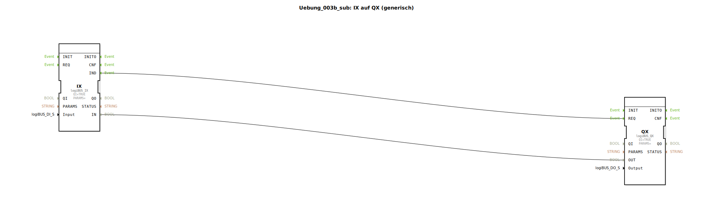

# Uebung_003b_sub: IX auf QX (generisch)

## Übersicht

[cite_start]Dieser Sub-App-Typ ist identisch mit `Uebung_003a_sub` und dient der Demonstration der Mehrfachverwendung desselben logischen Musters für verschiedene Übungsszenarien[cite: 1]. Er kapselt die direkte Verbindung zwischen Hardware-Eingang und Hardware-Ausgang.

## 🛠️ Zugehörige Übungen

* [Uebung_003b](Uebung_003b.md)

