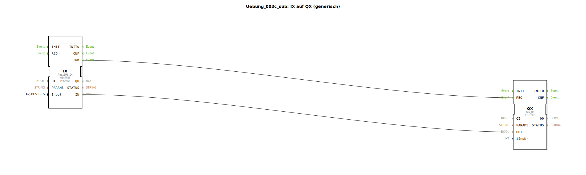

# Uebung_003c_sub: IX auf QX (generisch)

Dieser Artikel beschreibt den Sub-App-Typ `Uebung_003c_sub`. Dieser Baustein dient als Brücke zwischen lokaler Hardware und dem ISOBUS-Hilfseingangssystem (Auxiliary).

----

## Ziel der Übung

Kapselung der ISOBUS-Kommunikation. Der Baustein verbirgt die Details des ISOBUS-Protokolls und stellt eine einfache Schnittstelle zur Zuordnung von physischen Tastern zu logischen AUX-Nummern bereit.

-----

## Beschreibung und Komponenten

[cite_start]Der Typ `Uebung_003c_sub` enthält einen lokalen Eingangs-Baustein und einen ISOBUS-Ausgangs-Baustein[cite: 1].

### Interne Funktionsbausteine (FBs)

  * **`IX`**: Typ `logiBUS_IX`. Liest den lokalen Hardware-Pin (`Input`) ein.
  * **`QX`**: Typ `Aux_QX`. Sendet den Zustand als ISOBUS-Nachricht für die gewählte Funktionsnummer (`iInpNr`).

-----

## Schnittstellen

[cite_start]Der Baustein wird über zwei Parameter konfiguriert[cite: 1]:
*   **`Input`**: Der physische Taster an der Steuerung.
*   **`iInpNr`**: Die fortlaufende Nummer (Index) im ISOBUS-Auxiliary-Pool.

Jede Änderung am lokalen Taster führt sofort zu einer entsprechenden Status-Meldung im ISOBUS-Netzwerk, wodurch der Taster für andere Geräte (z.B. Task Controller) sichtbar wird.

## 🛠️ Zugehörige Übungen

* [Uebung_003c](Uebung_003c.md)

