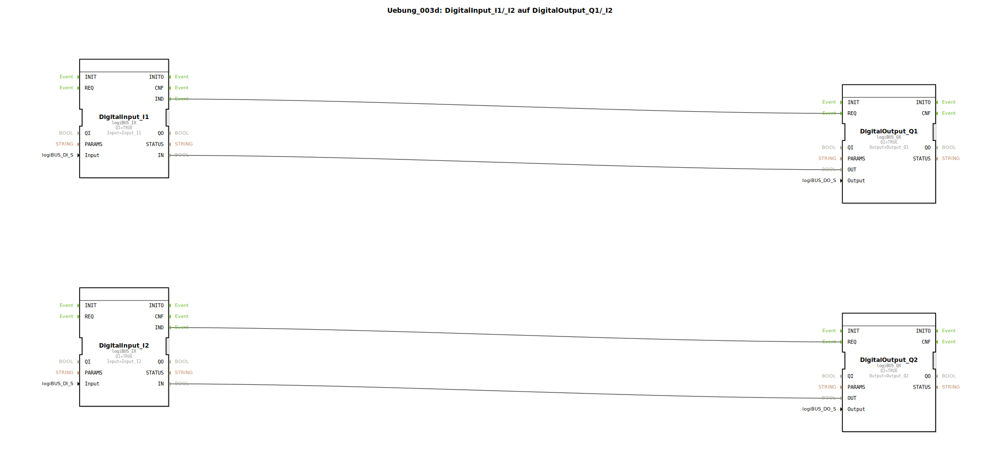

# Uebung_003d: DigitalInput_I1/_I2 auf DigitalOutput_Q1/_I2

Dieser Artikel beschreibt die logiBUS®-Übung `Uebung_003d`. Diese Übung ist strukturell identisch mit `Uebung_003` und dient der Festigung des Verständnisses für parallele Signalpfade in der IEC 61499.

----

## Ziel der Übung

Das Ziel ist die Wiederholung der direkten I/O-Verknüpfung mittels Ereignis- und Datenverbindungen. Es wird sichergestellt, dass das Konzept der asynchronen und unabhängigen Datenflüsse verstanden wurde.

-----

## Beschreibung und Komponenten

[cite_start]Die Subapplikation `Uebung_003d.SUB` verbindet zwei Eingangsbausteine direkt mit zwei Ausgangsbausteinen[cite: 1].

### Funktionsbausteine (FBs)

  * **`DigitalInput_I1`** ➡️ **`DigitalOutput_Q1`**
  * **`DigitalInput_I2`** ➡️ **`DigitalOutput_Q2`**

Die Bausteintypen sind `logiBUS_IX` (Eingang) und `logiBUS_QX` (Ausgang).

-----

## Funktionsweise

Die Signale werden 1:1 und latenzarm von den Eingängen auf die Ausgänge durchgeschleift. Jede Änderung am Eingang `I1` löst sofort eine Aktualisierung von `Q1` aus, ohne dass die Logik für `I2`/`Q2` davon beeinflusst wird.

-----

## Anwendungsbeispiel

Diese Übung eignet sich hervorragend als **Verdrahtungstest-Programm**:
Wenn eine neue Hardware-Konfiguration aufgebaut wurde, lädt man dieses "transparente" Programm hoch, um zu prüfen, ob alle Taster und Lampen physikalisch korrekt angeschlossen und adressiert sind. Ein Druck auf den Taster muss die zugehörige Lampe unmittelbar zum Leuchten bringen.