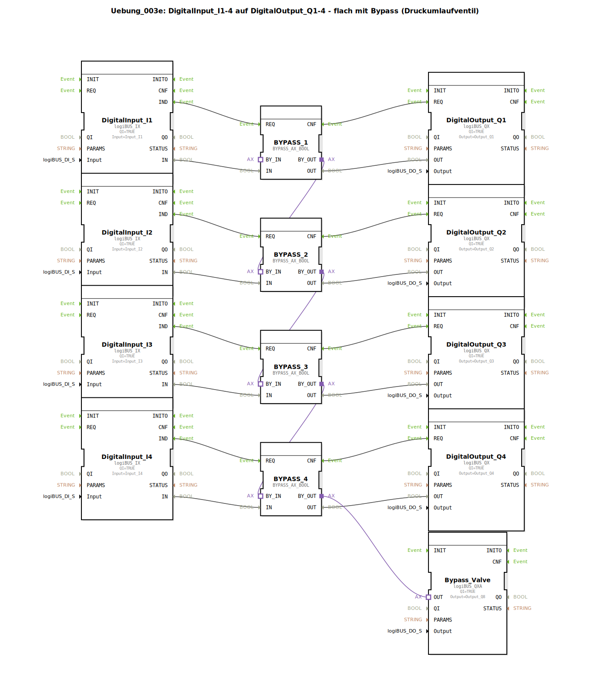

# Uebung_003e: DigitalInput_I1-4 auf DigitalOutput_Q1-4 - flach mit Bypass (Druckumlaufventil)

* * * * * * * * * *
## Einleitung

In dieser Übung werden vier digitale Eingangssignale (I1–I4) direkt auf vier digitale Ausgänge (Q1–Q4) durchgeschaltet. Dazwischen liegt jeweils ein Bypass-Baustein, der eine zusätzliche Funktionalität bietet: Die Bypass-Blöcke sind kaskadenartig miteinander verbunden und führen über ein gemeinsames Bypass-Ventil (Ausgang Q8). Die Schaltung realisiert eine einfache Durchschleifung mit der Möglichkeit, den Signalfluss durch ein Druckumlaufventil zu beeinflussen.

## Verwendete Funktionsbausteine (FBs)

Die Übung besteht aus folgenden FB-Instanzen:

- **DigitalInput_I1** bis **DigitalInput_I4**  
  Typ: `logiBUS::io::DI::logiBUS_IX`  
  Parameter: QI = TRUE, Input = zugehöriger physikalischer Eingang (Input_I1 usw.)

- **DigitalOutput_Q1** bis **DigitalOutput_Q4**  
  Typ: `logiBUS::io::DQ::logiBUS_QX`  
  Parameter: QI = TRUE, Output = zugehöriger physikalischer Ausgang (Output_Q1 usw.)

- **BYPASS_1** bis **BYPASS_4**  
  Typ: `logiBUS::signalprocessing::bypass::BYPASS_AX_BOOL`  
  Keine Parameter gesetzt.

- **Bypass_Valve**  
  Typ: `logiBUS::io::DQ::logiBUS_QXA`  
  Parameter: QI = TRUE, Output = Output_Q8 (Bypass-Ventil)

**Ereignisverbindungen:**  
- `DigitalInput_I1.IND` → `BYPASS_1.REQ`  
- `BYPASS_1.CNF` → `DigitalOutput_Q1.REQ`  
- (Analog für I2–I4)

**Datenverbindungen:**  
- `DigitalInput_I1.IN` → `BYPASS_1.IN`  
- `BYPASS_1.OUT` → `DigitalOutput_Q1.OUT`  
- (Analog für I2–I4)

**Adapterverbindungen (Bypass-Kette):**  
- `BYPASS_1.BY_OUT` → `BYPASS_2.BY_IN`  
- `BYPASS_2.BY_OUT` → `BYPASS_3.BY_IN`  
- `BYPASS_3.BY_OUT` → `BYPASS_4.BY_IN`  
- `BYPASS_4.BY_OUT` → `Bypass_Valve.OUT`

## Programmablauf und Verbindungen

1. **Signalweg**: Jeder Digitaleingang (I1–I4) erzeugt bei einer Änderung ein Ereignis `IND`. Dieses triggert den zugehörigen Bypass-Baustein (`BYPASS_x`). Der Bypass-Baustein gibt das Signal unverändert (oder mit Bypass-Funktion) an den Ausgang weiter und signalisiert mit `CNF` den entsprechenden Digitalausgang (`DigitalOutput_Qx`), der das physikalische Ausgangssignal setzt.

2. **Bypass-Kette**: Die Adapteranschlüsse `BY_OUT` und `BY_IN` der vier Bypass-Blöcke sind in Reihe geschaltet. Dadurch wird ein gemeinsames Bypass-Signal (z. B. ein Freigabe- oder Sperrsignal) durch die gesamte Kette geleitet. Das letzte Glied der Kette (`BYPASS_4.BY_OUT`) ist mit dem Bypass-Ventil (`Bypass_Valve`) verbunden, das auf den Ausgang `Output_Q8` wirkt.

3. **Funktion des Bypass**: Durch das Bypass-Signal kann der gesamte Datenfluss der vier Kanäle zentral beeinflusst werden – beispielsweise ein- oder ausgeschaltet. In der Konfiguration als Druckumlaufventil dient dies zur Steuerung eines hydraulischen oder pneumatischen Kreislaufs.

## Zusammenfassung

Die Übung zeigt die grundlegende Verkettung von digitalen Ein- und Ausgängen mit Zwischenschaltung von Bypass-Bausteinen. Die Besonderheit liegt in der kaskadierten Adapterverbindung, die es erlaubt, ein gemeinsames Steuersignal über mehrere Kanäle zu führen. Dieses Konzept eignet sich für Anwendungen, bei denen eine zentrale Abschaltung oder Umlenkung der Signale erforderlich ist, beispielsweise in Sicherheitsschaltungen oder Druckregelungen.