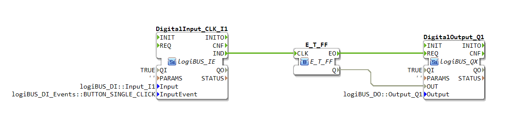
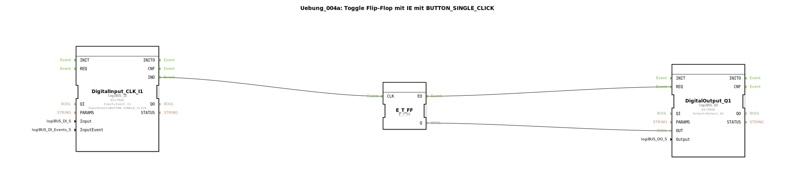

# Uebung_004a: Toggle Flip-Flop mit IE mit BUTTON_SINGLE_CLICK


[](https://notebooklm.google.com/notebook/a6872e59-1dfc-4132-a118-aff1bc7bc944)

Dieser Artikel beschreibt die logiBUS®-Übung `Uebung_004a`. In dieser Übung verlassen wir die reine Datenweiterleitung und nutzen Ereignisse (Events), um eine Speicherfunktion zu realisieren: Einen klassischen Stromstoßschalter.

----



## Ziel der Übung

Das Ziel ist es, den Unterschied zwischen zustandsorientierter (Pegel) und ereignisorientierter (Flanke) Programmierung zu verstehen. Während ein einfacher Taster nur solange "Ein" ist, wie er gedrückt wird, soll hier jeder Tastendruck den Zustand des Ausgangs wechseln (Umschalten: Aus ➡️ Ein ➡️ Aus ➡️ ...).

-----

## Beschreibung und Komponenten

[cite_start]Die Subapplikation `Uebung_004a.SUB` verwendet einen speziellen Eingangsbaustein, der Klick-Ereignisse generiert, und ein Toggle-Flip-Flop[cite: 1].

### Funktionsbausteine (FBs)




  * **`DigitalInput_CLK_I1`**: Typ `logiBUS_IE` (Input Event). [cite_start]Im Gegensatz zum Standard-Eingang liefert dieser Baustein kein kontinuierliches Signal, sondern feuert ein einzelnes Ereignis (`IND`), wenn eine bestimmte Bedingung erfüllt ist. Hier ist er auf `BUTTON_SINGLE_CLICK` konfiguriert[cite: 1].
  * **`E_T_FF`**: Typ `E_T_FF` (Standard-IEC-Event-Baustein). [cite_start]Dieser Baustein hat einen Takteingang (`CLK`). Bei jedem empfangenen Ereignis wechselt er seinen internen Zustand und gibt diesen über den Daten-Ausgang `Q` sowie ein Bestätigungs-Event `EO` aus[cite: 1].
  * **`DigitalOutput_Q1`**: Typ `logiBUS_QX`. [cite_start]Schaltet den physischen Ausgang `Q1` basierend auf dem Zustand des Flip-Flops[cite: 1].

-----

## Funktionsweise

Die Logik basiert auf der Umwandlung eines flüchtigen Tastendrucks in einen dauerhaften Speicherzustand:

```xml
<EventConnections>
    <Connection Source="DigitalInput_CLK_I1.IND" Destination="E_T_FF.CLK"/>
    <Connection Source="E_T_FF.EO" Destination="DigitalOutput_Q1.REQ"/>
</EventConnections>
<DataConnections>
    <Connection Source="E_T_FF.Q" Destination="DigitalOutput_Q1.OUT"/>
</DataConnections>
```

[cite_start][cite: 1]

1.  Der Benutzer drückt den Taster an `I1` kurz ("Klick").
2.  Der `DigitalInput_CLK_I1` erkennt das Muster "Einzelklick" und sendet ein `IND`-Ereignis.
3.  Das Ereignis erreicht den `CLK`-Eingang des `E_T_FF`.
4.  Das Flip-Flop kippt seinen Zustand (z.B. von FALSE auf TRUE).
5.  Das neue Signal steht am Daten-Ausgang `Q` bereit und das Flip-Flop sendet ein Ereignis an `EO`.
6.  `DigitalOutput_Q1` empfängt dieses Ereignis, liest den Wert von `Q` und schaltet die Lampe ein.
7.  Beim nächsten Klick wiederholt sich der Vorgang, das Flip-Flop kippt zurück auf FALSE, die Lampe geht aus.

-----

## Anwendungsbeispiel

Die klassische **Flurbeleuchtung**: Ein Tasterdruck schaltet das Licht ein, der nächste schaltet es wieder aus. Dies ist mit einem rein elektrischen Taster (der zurückfedert) nicht ohne Speicherelement (Software-Flip-Flop) möglich.