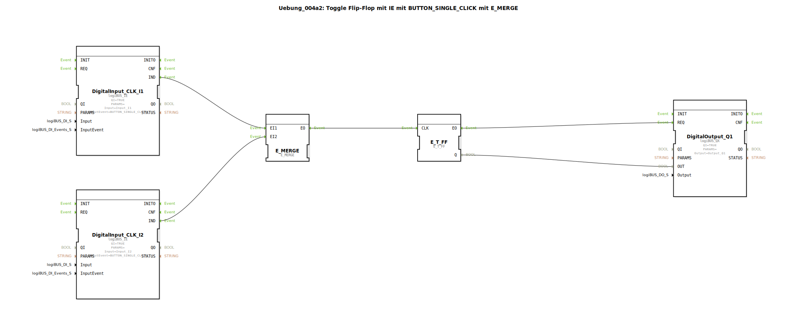

# Uebung_004a2: Toggle Flip-Flop mit IE mit BUTTON_SINGLE_CLICK mit E_MERGE


[](https://notebooklm.google.com/notebook/a6872e59-1dfc-4132-a118-aff1bc7bc944)

Dieser Artikel beschreibt die logiBUS®-Übung `Uebung_004a2`. Hier wird die Stromstoßschaltung erweitert, sodass sie von zwei verschiedenen Tastern aus bedient werden kann. Dazu werden die Ereignisse der beiden Taster logisch zusammengeführt.

----


## Ziel der Übung

Das Ziel ist es zu lernen, wie man asynchrone Ereignisströme vereint. Wenn zwei verschiedene Ereignisquellen (Taster) denselben Prozess (Licht umschalten) auslösen sollen, müssen ihre Signale "gemerged" (zusammengeführt) werden, bevor sie den Flip-Flop-Baustein erreichen.

-----

## Beschreibung und Komponenten

[cite_start]Die Subapplikation `Uebung_004a2.SUB` nutzt einen `E_MERGE` Baustein, um zwei Eingangs-Events auf einen gemeinsamen Takteingang zu leiten[cite: 1].

### Funktionsbausteine (FBs)




  * **`DigitalInput_CLK_I1` & `I2`**: Zwei `logiBUS_IE` Bausteine, konfiguriert auf `BUTTON_SINGLE_CLICK`. [cite_start]Sie erzeugen Ereignisse bei Betätigung von Taster 1 oder 2[cite: 1].
  * **`E_MERGE`**: Ein Standard-Ereignis-Baustein. [cite_start]Er besitzt zwei Ereigniseingänge (`EI1`, `EI2`) und einen Ereignisausgang (`EO`). Jedes eintreffende Event wird sofort an den Ausgang weitergereicht[cite: 1].
  * **`E_T_FF`**: Das Toggle-Flip-Flop zum Speichern des Zustands.
  * **`DigitalOutput_Q1`**: Der Hardware-Ausgang für die Lampe.

-----

## Funktionsweise

Die Verschaltung sorgt für ein logisches ODER der Auslöser:

```xml
<EventConnections>
    <Connection Source="DigitalInput_CLK_I1.IND" Destination="E_MERGE.EI1"/>
    <Connection Source="DigitalInput_CLK_I2.IND" Destination="E_MERGE.EI2"/>
    <Connection Source="E_MERGE.EO" Destination="E_T_FF.CLK"/>
</EventConnections>
```

[cite_start][cite: 1]

1.  Drückt man Taster 1, sendet `I1` ein Event an `E_MERGE.EI1`. `E_MERGE` leitet es an `EO` weiter -> `E_T_FF` toggelt.
2.  Drückt man Taster 2, sendet `I2` ein Event an `E_MERGE.EI2`. `E_MERGE` leitet es an `EO` weiter -> `E_T_FF` toggelt.

Das Licht wechselt also bei jedem Klick, egal an welcher Stelle gedrückt wurde.

-----

## Anwendungsbeispiel

**Wechselschaltung im Flur**: Man kann das Licht an einem Ende des Flurs einschalten und am anderen Ende wieder ausschalten. Jeder Tastendruck bewirkt lediglich eine Zustandsänderung ("Toggle"), unabhängig davon, wie der aktuelle Zustand ist.