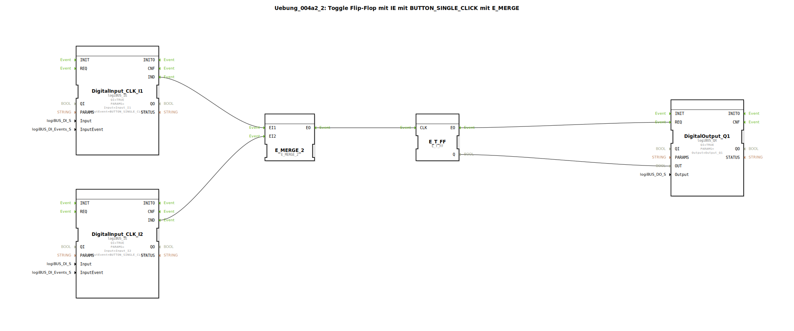

Hier ist die Dokumentation für die Übung `Uebung_004a2_2`, basierend auf den bereitgestellten Daten.

# Uebung_004a2_2: Toggle Flip-Flop mit IE mit BUTTON_SINGLE_CLICK mit E_MERGE

* * * * * * * * * *

## Einleitung
Diese Übung implementiert eine Schaltung, bei der ein Ausgang (Q1) durch zwei verschiedene Eingänge (I1 und I2) umgeschaltet (getoggelt) werden kann. Dabei wird spezifisch auf das "Single Click" Ereignis der Taster reagiert. Die Logik nutzt ein Event-Toggle-Flip-Flop (`E_T_FF`) in Kombination mit einem Event-Merge-Baustein (`E_MERGE_2`), um die Signale der beiden Taster zusammenzuführen.

Dies entspricht einer klassischen Wechselschaltung oder Stromstoßschaltung in der Gebäudeautomation, realisiert durch Event-Logik in IEC 61499.

## Verwendete Funktionsbausteine (FBs)

In dieser SubApp werden verschiedene Funktionsbausteine verschaltet, um die gewünschte Logik zu realisieren.

### Sub-Bausteine:

#### DigitalInput_CLK_I1 & DigitalInput_CLK_I2
- **Typ**: `logiBUS::io::DI::logiBUS_IE`
- **Beschreibung**: Diese Bausteine dienen als Schnittstelle zu den physischen Eingängen. Sie sind so konfiguriert, dass sie Ereignisse (Events) generieren.
- **Konfiguration**:
    - **Parameter**: `Input` = `Input_I1` (bzw. `Input_I2`)
    - **Parameter**: `InputEvent` = `BUTTON_SINGLE_CLICK`
- **Funktionsweise**: Der Baustein überwacht den physischen Eingang. Wenn ein einfacher Tastendruck (Single Click) erkannt wird, wird das `IND` Ereignis ausgelöst.

#### E_MERGE_2
- **Typ**: `iec61499::events::E_MERGE_2`
- **Beschreibung**: Ein Baustein zum Zusammenführen von Ereignisflüssen.
- **Ereigniseingänge**: `EI1`, `EI2`
- **Ereignisausgang**: `EO`
- **Funktionsweise**: Dieser Baustein fungiert als ODER-Glied für Events. Egal, ob ein Ereignis am Eingang `EI1` oder am Eingang `EI2` eintrifft, es wird sofort an den Ausgang `EO` weitergeleitet.

#### E_T_FF
- **Typ**: `iec61499::events::E_T_FF`
- **Beschreibung**: Ein eventgesteuertes Toggle-Flip-Flop.
- **Ereigniseingang**: `CLK`
- **Datenausgang**: `Q`
- **Ereignisausgang**: `EO`
- **Funktionsweise**: Bei jedem Eintreffen eines Events am `CLK`-Eingang wechselt der boolesche Zustand des Ausgangs `Q` (von FALSE auf TRUE oder umgekehrt). Nach dem Zustandswechsel wird ein Event am `EO` Ausgang gefeuert.

#### DigitalOutput_Q1
- **Typ**: `logiBUS::io::DQ::logiBUS_QX`
- **Beschreibung**: Schnittstelle zum physischen Ausgang.
- **Konfiguration**:
    - **Parameter**: `Output` = `Output_Q1`
- **Funktionsweise**: Dieser Baustein schreibt den Wert am Eingang `OUT` auf den physischen Ausgang, sobald am Eingang `REQ` ein Event eintrifft.

## Programmablauf und Verbindungen

Der Ablauf der Schaltung ist wie folgt definiert:

1.  **Eingabeerfassung**:
    *   Der Benutzer betätigt entweder den Taster an Eingang `Input_I1` oder an `Input_I2`.
    *   Die entsprechenden Bausteine (`DigitalInput_CLK_I1` oder `DigitalInput_CLK_I2`) erkennen den "Single Click" und senden ein `IND` Event.

2.  **Zusammenführung (Merge)**:
    *   Das Event von `I1` (verbunden mit `E_MERGE_2.EI1`) oder das Event von `I2` (verbunden mit `E_MERGE_2.EI2`) erreicht den Merge-Baustein.
    *   Der `E_MERGE_2` leitet das Event über `EO` weiter an das Flip-Flop.

3.  **Verarbeitung (Toggle)**:
    *   Das Event erreicht den Takteingang `CLK` des `E_T_FF`.
    *   Das Flip-Flop negiert seinen aktuellen Zustand am Datenausgang `Q`.
    *   Das Flip-Flop signalisiert den neuen Wert über das Event `EO`.

4.  **Ausgabe**:
    *   Das Event `EO` des Flip-Flops aktiviert den Ausgangsbaustein `DigitalOutput_Q1` am Eingang `REQ`.
    *   Gleichzeitig wird der neue Zustand `Q` an `DigitalOutput_Q1.OUT` übertragen.
    *   Die physische Lampe/Aktor an `Output_Q1` schaltet sich ein oder aus.

## Zusammenfassung
Die Übung `Uebung_004a2_2` demonstriert effektiv, wie man in 4diac mehrere Eingangssignale auf eine gemeinsame Verarbeitungslogik führt. Durch die Verwendung des `E_MERGE_2` Bausteins können sowohl Taster 1 als auch Taster 2 denselben `E_T_FF` (Toggle Flip-Flop) ansteuern. Dies ermöglicht eine flexible Steuerung eines Ausgangs von mehreren Orten aus, ähnlich einer Stromstoßschaltung in der Elektrotechnik.