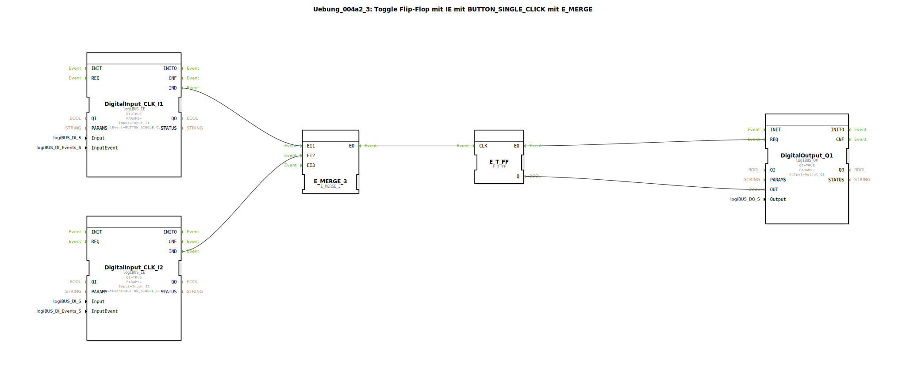

Hier ist die Dokumentation für die Übung `Uebung_004a2_3` basierend auf den bereitgestellten Daten.

# Uebung_004a2_3: Toggle Flip-Flop mit IE mit BUTTON_SINGLE_CLICK mit E_MERGE

* * * * * * * * * *

## Einleitung

Diese Übung implementiert eine **Stromstoßschaltung** (Toggle-Funktion), die von zwei verschiedenen Eingängen aus bedient werden kann. Das Ziel ist es, einen digitalen Ausgang (z.B. eine Lampe) durch Betätigen eines von zwei Tastern an- und wieder auszuschalten.

Hierbei kommt ein Toggle-Flip-Flop (`E_T_FF`) zum Einsatz, welches seinen Zustand bei jedem Eingangsimpuls wechselt. Die Besonderheit liegt in der Verwendung von Event-Eingangsbausteinen (`logiBUS_IE`), die spezifisch auf einen "Single Click" (`BUTTON_SINGLE_CLICK`) reagieren, sowie einem Merge-Baustein (`E_MERGE`), der die Signale der beiden Taster zusammenführt.

## Verwendete Funktionsbausteine (FBs)

In dieser Sub-Applikation werden verschiedene Bausteine aus der `logiBUS` und der `iec61499` Standardbibliothek verwendet, um die Logik zu realisieren.

### Sub-Bausteine: DigitalInput_CLK_I1 & DigitalInput_CLK_I2
Die Eingangsbausteine erfassen die Tasterbetätigung.

- **Typ**: `logiBUS::io::DI::logiBUS_IE`
- **Verwendete interne FBs**:
    - **DigitalInput_CLK_I1**:
        - Parameter: `Input` = `Input_I1`
        - Parameter: `InputEvent` = `BUTTON_SINGLE_CLICK`
        - Ereignisausgang: `IND` (Indication - Signalisiert den Klick)
    - **DigitalInput_CLK_I2**:
        - Parameter: `Input` = `Input_I2`
        - Parameter: `InputEvent` = `BUTTON_SINGLE_CLICK`
        - Ereignisausgang: `IND`
- **Funktionsweise**: Diese Bausteine überwachen die physischen Eingänge I1 und I2. Sie sind so konfiguriert, dass sie nur bei einem einfachen Klick (`BUTTON_SINGLE_CLICK`) ein Event am Ausgang `IND` erzeugen.

### Sub-Bausteine: E_MERGE_3
Dient der Zusammenführung von Event-Strömen.

- **Typ**: `iec61499::events::E_MERGE_3`
- **Verwendete interne FBs**:
    - **E_MERGE_3**:
        - Ereigniseingang: `EI1` (Verbunden mit I1)
        - Ereigniseingang: `EI2` (Verbunden mit I2)
        - Ereignisausgang: `EO`
- **Funktionsweise**: Der Merge-Baustein fungiert als ODER-Glied für Events. Egal ob das Signal von Taster I1 oder Taster I2 kommt, das Event wird an den Ausgang `EO` durchgereicht.

### Sub-Bausteine: E_T_FF
Das eigentliche Speicherelement der Schaltung.

- **Typ**: `iec61499::events::E_T_FF`
- **Verwendete interne FBs**:
    - **E_T_FF**:
        - Ereigniseingang: `CLK` (Clock)
        - Datenausgang: `Q` (Aktueller Status: TRUE/FALSE)
        - Ereignisausgang: `EO` (Event Output nach Zustandswechsel)
- **Funktionsweise**: Das Toggle-Flip-Flop wechselt bei jedem eingehenden Event am `CLK`-Eingang seinen internen Zustand `Q` (von 0 auf 1 oder von 1 auf 0).

### Sub-Bausteine: DigitalOutput_Q1
Stellt die Verbindung zur physischen Hardware her.

- **Typ**: `logiBUS::io::DQ::logiBUS_QX`
- **Verwendete interne FBs**:
    - **DigitalOutput_Q1**:
        - Parameter: `Output` = `Output_Q1`
        - Dateneingang: `OUT` (Verbunden mit T_FF.Q)
        - Ereigniseingang: `REQ` (Request)
- **Funktionsweise**: Dieser Baustein schreibt den logischen Zustand auf den physischen Ausgang Q1.

## Programmablauf und Verbindungen

Der Ablauf der Schaltung gestaltet sich wie folgt:

1.  **Eingabeerfassung**: Der Benutzer betätigt entweder Taster an Eingang `Input_I1` oder an Eingang `Input_I2`. Die Bausteine `DigitalInput_CLK_I1` bzw. `_I2` erkennen einen einzelnen Klick (`BUTTON_SINGLE_CLICK`).
2.  **Signalevent**: Ein Event (`IND`) wird vom betätigten Eingangsbaustein ausgesendet.
3.  **Zusammenführung (Merge)**: Die Events beider Eingänge sind mit dem `E_MERGE_3` Baustein verbunden (an `EI1` und `EI2`). Sobald eines der Events eintrifft, gibt der Merge-Baustein sofort ein Event am Ausgang `EO` aus.
4.  **Umschaltung (Toggle)**: Das zusammengeführte Event erreicht den `CLK`-Eingang des `E_T_FF`. Dies veranlasst das Flip-Flop, seinen Zustand `Q` zu invertieren (umzuschalten).
5.  **Ausgabe**:
    *   Das Daten-Signal `Q` (TRUE/FALSE) wird an den Dateneingang `OUT` des Ausgangsbausteins `DigitalOutput_Q1` gesendet.
    *   Gleichzeitig triggert der Event-Ausgang `EO` des Flip-Flops den `REQ`-Eingang des Ausgangsbausteins, um die Aktualisierung des physikalischen Ausgangs durchzuführen.

## Zusammenfassung

In der Übung `Uebung_004a2_3` wird eine klassische Tasterschaltung mit zwei Bedienstellen realisiert. Lernziele sind der Umgang mit dem `E_MERGE`-Baustein zur Bündelung von Eventsignalen und die Anwendung des `E_T_FF` (Toggle-Flip-Flop) zur Zustandsspeicherung. Zudem wird verdeutlicht, wie spezifische Taster-Events (hier: Single Click) in der LogiBUS-Bibliothek verarbeitet werden.