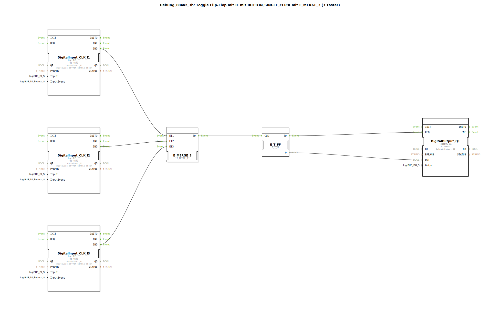

# Uebung_004a2_3b: Toggle Flip-Flop mit IE mit BUTTON_SINGLE_CLICK mit E_MERGE_3 (3 Taster)

* * * * * * * * * *

## Einleitung

Diese Übung realisiert ein **Toggle Flip-Flop** (auch als **T‑Flipflop** bekannt).  
Durch einen Tastendruck (Einzelfunktion – BUTTON_SINGLE_CLICK) an einem von drei Tastern (I1, I2 oder I3) wird der angeschlossene Ausgang Q1 jeweils umgeschaltet (ein‑/ausgeschaltet).  
Die drei Taster werden über einen **E_MERGE_3**‑Baustein zusammengeführt, sodass jeder beliebige Tastendruck das Flipflop triggert.

## Verwendete Funktionsbausteine (FBs)

Die Übung besteht ausschließlich aus primitiven (vordefinierten) Funktionsbausteinen. Es werden keine eigenen Unterbausteine (SubApps) verwendet.

### Primitive Funktionsbausteine

- **DigitalInput_CLK_I1** (Typ: `logiBUS::io::DI::logiBUS_IE`)  
  - Parametereinstellungen:  
    - `QI` = `TRUE`  
    - `Input` = `Input_I1`  
    - `InputEvent` = `BUTTON_SINGLE_CLICK`  
  - Ereignisausgang: `IND` (wird bei Tastendruck ausgelöst)  
  - Datenausgang: wird nicht verwendet (keine Datenverbindung)

- **DigitalInput_CLK_I2** (Typ: `logiBUS::io::DI::logiBUS_IE`)  
  - Parametereinstellungen:  
    - `QI` = `TRUE`  
    - `Input` = `Input_I2`  
    - `InputEvent` = `BUTTON_SINGLE_CLICK`  
  - Ereignisausgang: `IND`

- **DigitalInput_CLK_I3** (Typ: `logiBUS::io::DI::logiBUS_IE`)  
  - Parametereinstellungen:  
    - `QI` = `TRUE`  
    - `Input` = `Input_I3`  
    - `InputEvent` = `BUTTON_SINGLE_CLICK`  
  - Ereignisausgang: `IND`

- **E_MERGE_3** (Typ: `iec61499::events::E_MERGE_3`)  
  - Ereigniseingänge: `EI1`, `EI2`, `EI3`  
  - Ereignisausgang: `EO` (wird ausgelöst, sobald eines der Eingangsereignisse eintrifft)

- **E_T_FF** (Typ: `iec61499::events::E_T_FF`)  
  - Ereigniseingang: `CLK` (Takt – schaltet bei jedem eingehenden Ereignis um)  
  - Ereignisausgang: `EO` (wird bei jedem Toggeln ausgelöst)  
  - Datenausgang: `Q` (logischer Zustand, TRUE oder FALSE)

- **DigitalOutput_Q1** (Typ: `logiBUS::io::DQ::logiBUS_QX`)  
  - Parametereinstellungen:  
    - `QI` = `TRUE`  
    - `Output` = `Output_Q1`  
  - Ereigniseingang: `REQ` (Anforderung zum Setzen des Ausgangs)  
  - Dateneingang: `OUT` (Wert, der auf den reellen Ausgang geschrieben wird)

## Programmablauf und Verbindungen

1. **Ereignisverkettung**  
   - Die drei Tasterbausteine (`DigitalInput_CLK_I1`, `I2`, `I3`) erzeugen bei einem Tastendruck (BUTTON_SINGLE_CLICK) ein Ereignis an ihrem Ausgang `IND`.  
   - Diese drei Ereignisse sind mit den drei Eingängen des `E_MERGE_3` (EI1 … EI3) verbunden.  
   - Sobald einer der drei Taster gedrückt wird, erzeugt `E_MERGE_3` ein Ereignis an seinem Ausgang `EO`.  
   - Dieses Ereignis wird an den Takteingang `CLK` des `E_T_FF` weitergeleitet.  
   - Das `E_T_FF` toggelt bei jedem Ereignis: Sein Ausgang `Q` wechselt zwischen TRUE und FALSE. Gleichzeitig wird das Ereignis `EO` des Flipflops ausgelöst.  

2. **Datenverkettung**  
   - Der Zustand des Flipflops (Datenausgang `Q`) wird direkt an den Dateneingang `OUT` des Ausgangsbausteins `DigitalOutput_Q1` geführt.  
   - Das Ereignis `EO` des Flipflops löst den `REQ`‑Eingang des Ausgangsbausteins aus, sodass der aktuelle Wert auf den physikalischen Ausgang **Output_Q1** geschrieben wird.  

3. **Zusammenfassung des Ablaufs**  
   - Jeder einzelne Tastendruck (an I1, I2 oder I3) führt zu einer Umschaltung des Ausgangs.  
   - Dadurch kann der Ausgang mit drei verschiedenen Tastern gesteuert werden (Toggle‑Funktion).

## Zusammenfassung

Diese Übung veranschaulicht die **Kombination von Ereignis- und Datenflüssen** in IEC 61499:  
- Drei gleichberechtigte Taster werden über einen **E_MERGE_3** zu einem gemeinsamen Ereignis zusammengeführt.  
- Ein **E_T_FF** (Toggle‑Flipflop) realisiert die eigentliche Umschaltlogik.  
- Der Ausgangsbaustein setzt den physikalischen Ausgang entsprechend dem Flipflop‑Zustand.

**Lernziele:**  
- Verständnis des Zusammenspiels mehrerer ereignisgesteuerter Eingänge.  
- Anwendung eines T‑Flipflops als einfachen Zustandsspeicher.  
- Praxisnahe Nutzung von logiBUS‑Ein‑ und Ausgangsbausteinen mit BUTTON_SINGLE_CLICK‑Ereignissen.

**Schwierigkeitsgrad:** Einsteiger  
**Voraussetzungen:** Grundlegende Kenntnisse der IEC 61499‑Ereignissteuerung.