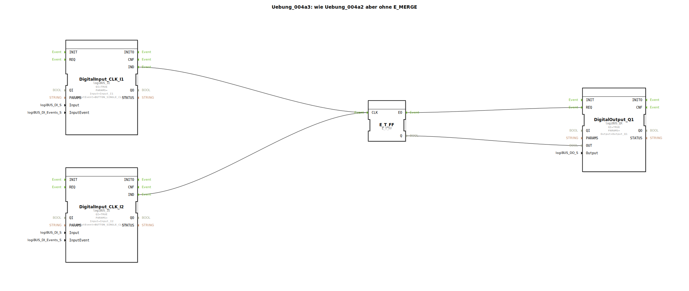

# Uebung_004a3: wie Uebung_004a2 aber ohne E_MERGE


[](https://notebooklm.google.com/notebook/a6872e59-1dfc-4132-a118-aff1bc7bc944)

Dieser Artikel beschreibt die logiBUS®-Übung `Uebung_004a3`. Diese Übung zeigt eine Vereinfachung gegenüber `Uebung_004a2`: In IEC 61499 können mehrere Ereignisquellen oft direkt auf denselben Ereigniseingang verbunden werden.

----


## Ziel der Übung

Das Ziel ist die Reduktion der visuellen Komplexität im Netzwerk-Diagramm. Es wird demonstriert, dass der explizite `E_MERGE` Baustein weggelassen werden kann, da die 4diac-Laufzeitumgebung eingehende Events an einem Port automatisch nacheinander verarbeitet ("Fan-In").

-----

## Beschreibung und Komponenten

[cite_start]Die Subapplikation `Uebung_004a3.SUB` verbindet zwei Event-Quellen direkt mit dem Takteingang des Flip-Flops[cite: 1].

### Funktionsbausteine (FBs)




  * **`DigitalInput_CLK_I1` & `I2`**: Die ereignisbasierten Eingänge.
  * **`E_T_FF`**: Das Toggle-Flip-Flop.
  * **`DigitalOutput_Q1`**: Der Ausgang.

Der Baustein `E_MERGE` aus der vorherigen Übung fehlt hier bewusst.

-----

## Funktionsweise

```xml
<EventConnections>
    <Connection Source="DigitalInput_CLK_I1.IND" Destination="E_T_FF.CLK"/>
    <Connection Source="DigitalInput_CLK_I2.IND" Destination="E_T_FF.CLK"/>
</EventConnections>
```

[cite_start][cite: 1]

Die Funktionsweise ist identisch zur Übung mit `E_MERGE`: Jedes eintreffende Event an `E_T_FF.CLK` – egal ob von `I1` oder `I2` kommend – triggert die Ausführung des Funktionsbausteins. 4diac unterstützt diese Mehrfachverbindung für Events nativ.

> **Wichtiger Hinweis:** Bei **Datenverbindungen** ist dies **nicht erlaubt**! Zwei Datenausgänge dürfen niemals direkt auf denselben Dateneingang schreiben, da dies zu Konflikten führen würde. Bei Events hingegen ist dies eine effiziente Methode für "ODER"-Verknüpfungen von Auslösern.

-----

## Anwendungsbeispiel

Gleiches Beispiel wie zuvor (Wechselschaltung), jedoch mit schlankerem Code (weniger Bausteine, höhere Übersichtlichkeit).