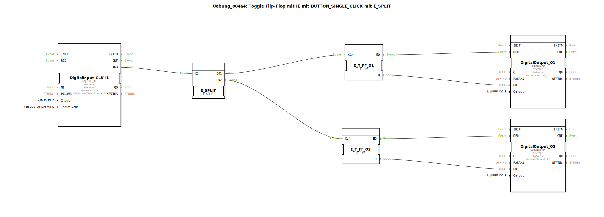

# Uebung_004a4: Toggle Flip-Flop mit IE mit BUTTON_SINGLE_CLICK mit E_SPLIT


[](https://notebooklm.google.com/notebook/a6872e59-1dfc-4132-a118-aff1bc7bc944)

Dieser Artikel beschreibt die logiBUS®-Übung `Uebung_004a4`. Hier wird gezeigt, wie ein einzelnes Ereignis genutzt werden kann, um mehrere unabhängige Prozesse sequenziell anzustoßen, indem man einen `E_SPLIT` Baustein verwendet.

----


## Ziel der Übung

Das Ziel ist das Verständnis der sequenziellen Ereignis-Verarbeitung. Der `E_SPLIT` Baustein nimmt ein einzelnes Eingangs-Event entgegen und feuert daraufhin seine Ausgänge nacheinander ab. Dies ermöglicht es, eine Aktion an mehrere Ziele zu verteilen und dabei die Reihenfolge der Abarbeitung festzulegen.

-----

## Beschreibung und Komponenten

[cite_start]Die Subapplikation `Uebung_004a4.SUB` verwendet einen Taster, um zwei separate Toggle-Flip-Flops gleichzeitig zu schalten[cite: 1].

### Funktionsbausteine (FBs)




  * **`DigitalInput_CLK_I1`**: Der Event-Generator (Klick-Taster).
  * **`E_SPLIT`**: Ein Ereignis-Verteiler. Er hat einen Eingang `EI` und zwei Ausgänge `EO1` und `EO2`.
  * **`E_T_FF_Q1` & `E_T_FF_Q2`**: Zwei unabhängige Flip-Flops.
  * **`DigitalOutput_Q1` & `DigitalOutput_Q2`**: Zwei physische Ausgänge.

-----

## Funktionsweise

```xml
<EventConnections>
    <Connection Source="DigitalInput_CLK_I1.IND" Destination="E_SPLIT.EI"/>
    <Connection Source="E_SPLIT.EO1" Destination="E_T_FF_Q1.CLK"/>
    <Connection Source="E_SPLIT.EO2" Destination="E_T_FF_Q2.CLK"/>
</EventConnections>
```

[cite_start][cite: 1]

1.  Ein Klick auf Taster 1 sendet ein Event an `E_SPLIT.EI`.
2.  `E_SPLIT` sendet daraufhin **zuerst** ein Event an `EO1` ➡️ `E_T_FF_Q1` schaltet um.
3.  Unmittelbar danach sendet `E_SPLIT` ein Event an `EO2` ➡️ `E_T_FF_Q2` schaltet um.

Beide Lampen wechseln synchron ihren Zustand, gesteuert durch einen einzigen Taster.

> **Hinweis:** Wie im Quellcode vermerkt, wäre es funktional effizienter, beide Ausgänge an ein einziges Flip-Flop zu hängen. Diese Übung dient jedoch rein zur Demonstration der Event-Verteilung mit `E_SPLIT`.

-----

## Anwendungsbeispiel

**Zentral-Aus Schaltung**: Ein Taster "Feierabend" löst über einen Splitter mehrere Aktionen nacheinander aus: Zuerst wird die Arbeitsbeleuchtung ausgeschaltet (`Q1`) und danach die Stromzufuhr für die Maschinen gekappt (`Q2`).