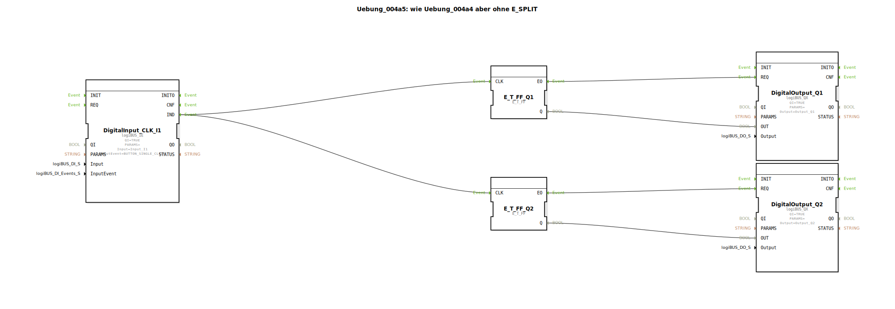

# Uebung_004a5: wie Uebung_004a4 aber ohne E_SPLIT


[](https://notebooklm.google.com/notebook/a6872e59-1dfc-4132-a118-aff1bc7bc944)

Dieser Artikel beschreibt die logiBUS®-Übung `Uebung_004a5`. Ähnlich wie bei der Zusammenführung von Events wird hier gezeigt, dass auch die Verteilung eines Events auf mehrere Ziele oft ohne expliziten Baustein möglich ist.

----


## Ziel der Übung

Demonstration der "Fan-Out"-Fähigkeit von Ereignisverbindungen in 4diac. Ein einzelner Ereignis-Ausgang kann mit mehreren Ereignis-Eingängen verbunden werden, um parallele Aktionen auszulösen.

-----

## Beschreibung und Komponenten

[cite_start]Die Subapplikation `Uebung_004a5.SUB` entfernt den `E_SPLIT` Baustein aus der vorherigen Übung und verbindet den Taster direkt mit beiden Flip-Flops[cite: 1].

### Funktionsbausteine (FBs)




  * **`DigitalInput_CLK_I1`**: Taster.
  * **`E_T_FF_Q1` & `Q2`**: Zwei unabhängige Flip-Flops.

-----

## Funktionsweise

```xml
<EventConnections>
    <Connection Source="DigitalInput_CLK_I1.IND" Destination="E_T_FF_Q1.CLK"/>
    <Connection Source="DigitalInput_CLK_I1.IND" Destination="E_T_FF_Q2.CLK"/>
</EventConnections>
```

[cite_start][cite: 1]

Wenn `I1` ein Ereignis feuert, wird dieses an alle verbundenen Ziele verteilt. Die Reihenfolge der Abarbeitung ist in der IEC 61499 Norm für diesen Fall nicht strikt definiert (meistens erfolgt sie in der Reihenfolge, in der die Verbindungen erstellt wurden).

**Wann nutzt man was?**
*   Nutzen Sie **direkte Verbindungen (Fan-Out)**, wenn die Reihenfolge der Abarbeitung keine Rolle spielt (wie hier beim gleichzeitigen Toggelt zweier Lampen).
*   Nutzen Sie einen **`E_SPLIT` Baustein**, wenn eine exakte Abfolge (zuerst A, dann B) technisch zwingend erforderlich ist.

-----

## Anwendungsbeispiel

Gleiches Beispiel wie zuvor (Zentral-Aus), jedoch platzsparender implementiert. Dies ist der Standardweg in 4diac, um Signale zu vervielfältigen.