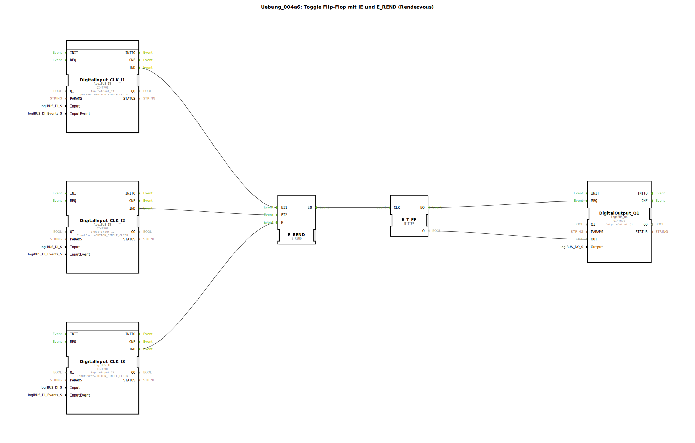

# Uebung_004a6: Toggle Flip-Flop mit IE und E_REND (Rendezvous)


[](https://notebooklm.google.com/notebook/a6872e59-1dfc-4132-a118-aff1bc7bc944)

Dieser Artikel beschreibt die logiBUS®-Übung `Uebung_004a6`. Hier wird ein fortgeschrittenes Ereignis-Muster vorgestellt: Das Rendezvous. Ein Ereignis wird erst dann weitergegeben, wenn mehrere unterschiedliche Bedingungen zeitunabhängig eingetroffen sind.

----


## Ziel der Übung




Erlernen des Umgangs mit dem `E_REND` Baustein. Dieser fungiert wie ein "Gedächtnis-UND" für Ereignisse. Er feuert erst am Ausgang, wenn an *allen* konfigurierten Eingängen mindestens einmal ein Ereignis registriert wurde. Dies dient der Synchronisation von asynchronen Prozessen.

-----

## Beschreibung und Komponenten

[cite_start]Die Subapplikation `Uebung_004a6.SUB` nutzt `E_REND`, um sicherzustellen, dass zwei Taster gedrückt wurden, bevor der Ausgang umschaltet[cite: 1].

### Funktionsbausteine (FBs)

  * **`DigitalInput_CLK_I1` & `I2`**: Die beiden Taster für die Synchronisation.
  * **`DigitalInput_CLK_I3`**: Ein Reset-Taster zum Löschen der Vorbedingungen.
  * **`E_REND`**: Der Rendezvous-Baustein mit Eingängen `EI1`, `EI2` und einem Reset-Eingang `R`.
  * **`E_T_FF`**: Das Flip-Flop zur Zustandsspeicherung.

-----

## Funktionsweise

Die Logik verlangt die Bestätigung beider Quellen:

```xml
<EventConnections>
    <Connection Source="DigitalInput_CLK_I1.IND" Destination="E_REND.EI1"/>
    <Connection Source="DigitalInput_CLK_I2.IND" Destination="E_REND.EI2"/>
    <Connection Source="E_REND.EO" Destination="E_T_FF.CLK"/>
    <Connection Source="DigitalInput_CLK_I3.IND" Destination="E_REND.R"/>
</EventConnections>
```

[cite_start][cite: 1]

Der funktionale Ablauf:
1.  Drückt man nur Taster 1 (`I1`), passiert am Ausgang nichts. `E_REND` speichert intern: "EI1 ist erledigt".
2.  Drückt man irgendwann später Taster 2 (`I2`), ist die Bedingung erfüllt (beide waren da). `E_REND` feuert nun das Event an `EO`.
3.  Das Flip-Flop toggelt den Ausgangszustand.
4.  Danach setzt sich `E_REND` automatisch zurück und wartet erneut auf beide Eingänge.

*   Der Reset-Taster (`I3`) kann jederzeit genutzt werden, um die internen Merker von `E_REND` zu löschen (Abbruch der Sequenz).

-----

## Anwendungsbeispiel

**Sequenzielle Freigabe**:
In einer Montagehalle muss ein Monteur den Zusammenbau bestätigen (`I1`) und ein Qualitätskontrolleur die Prüfung abnehmen (`I2`). Erst wenn beide (unabhängig voneinander und in beliebiger Reihenfolge) ihre Quittierung gegeben haben, darf das Förderband zum nächsten Schritt weiterschalten (`EO`).