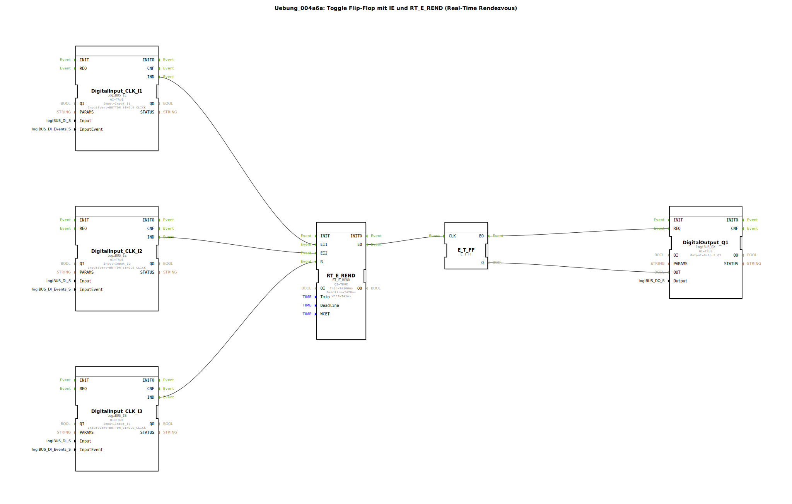

# Uebung_004a6a: Toggle Flip-Flop mit IE und RT_E_REND (Real-Time Rendezvous)

* * * * * * * * * *

## Einleitung

Diese Übung implementiert einen Toggle-Flip-Flop, der durch Echtzeit-Ereignisse gesteuert wird. Sie dient dem Kennenlernen des Zusammenwirkens von digitalen Eingängen (IE), einem Real-Time Rendezvous-Baustein (RT_E_REND) und einem Toggle-Flip-Flop (E_T_FF). Die Ausgabe erfolgt auf einen digitalen Ausgang (QX). Ziel ist es, das Verständnis für zeitgesteuerte Ereignisketten in 4diac zu vertiefen.

## Verwendete Funktionsbausteine (FBs)

### logiBUS_IE (DigitalInput_CLK_I1, DigitalInput_CLK_I2, DigitalInput_CLK_I3)
- **Typ**: logiBUS::io::DI::logiBUS_IE  
- **Parameter**:  
  - `QI` = `TRUE`  
  - `Input` = jeweiliger physischer Eingang (`Input_I1`, `Input_I2`, `Input_I3`)  
  - `InputEvent` = `BUTTON_SINGLE_CLICK`  
- **Funktionsweise**:  
  Erfasst einen Tastendruck (Single Click) an einem digitalen Eingang und erzeugt ein Ereignis am Ausgangsereignis `IND`. Dient als Startquelle für die Ereigniskette.

### RT_E_REND
- **Typ**: eclipse4diac::rtevents::RT_E_REND  
- **Parameter**:  
  - `QI` = `TRUE`  
  - `Tmin` = `T#100ms` (Minimale Zeit zwischen zwei Auslösungen)  
  - `Deadline` = `T#20ms` (Maximal zulässige Reaktionszeit)  
  - `WCET` = `T#1ms` (Worst-Case Execution Time)  
- **Ereigniseingänge**:  
  - `EI1` – Erster Starteingang (verbunden mit DigitalInput_CLK_I1.IND)  
  - `EI2` – Zweiter Starteingang (verbunden mit DigitalInput_CLK_I2.IND)  
  - `R` – Rücksetzeingang (verbunden mit DigitalInput_CLK_I3.IND)  
- **Ereignisausgang**:  
  - `EO` – Ausgangsereignis (verbunden mit E_T_FF.CLK)  
- **Funktionsweise**:  
  Realisiert ein Real-Time Rendezvous. Es wartet auf Ereignisse an `EI1` und `EI2`. Erst wenn beide innerhalb der Deadline (20 ms) eingetroffen sind, wird ein Ereignis am Ausgang `EO` erzeugt. Der Eingang `R` setzt den internen Zustand zurück. Damit wird sichergestellt, dass die nachfolgende Logik nur bei synchronen Ereignissen ausgelöst wird.

### E_T_FF
- **Typ**: iec61499::events::E_T_FF  
- **Keine Parameter**  
- **Ereigniseingang**:  
  - `CLK` – Takt-Eingang (verbunden mit RT_E_REND.EO)  
- **Datenausgang**:  
  - `Q` – Ausgangswert (Bool, verbunden mit DigitalOutput_Q1.OUT)  
- **Funktionsweise**:  
  Toggle-Flip-Flop. Bei jedem Ereignis am Takt-Eingang (`CLK`) wird der interne Zustand umgeschaltet. Der Ausgang `Q` gibt den aktuellen Zustand aus (TRUE/FALSE).

### logiBUS_QX (DigitalOutput_Q1)
- **Typ**: logiBUS::io::DQ::logiBUS_QX  
- **Parameter**:  
  - `QI` = `TRUE`  
  - `Output` = `Output_Q1` (physischer Ausgang)  
- **Ereigniseingang**:  
  - `REQ` – Anforderungsereignis (verbunden mit E_T_FF.EO)  
- **Dateneingang**:  
  - `OUT` – Ausgangswert (verbunden mit E_T_FF.Q)  
- **Funktionsweise**:  
  Setzt den physischen digitalen Ausgang `Output_Q1` auf den Wert, der am Dateneingang `OUT` anliegt, sobald ein Ereignis am `REQ`-Eingang eintrifft.

## Programmablauf und Verbindungen

Die Übung verwendet drei digitale Eingänge (`I1`, `I2`, `I3`) und einen digitalen Ausgang (`Q1`).

1. **Ereignisverkettung**:  
   - Wird an `I1` ein Tastendruck erkannt, sendet `DigitalInput_CLK_I1` ein Ereignis über `IND` an den Ereigniseingang `EI1` von `RT_E_REND`.  
   - Wird an `I2` ein Tastendruck erkannt, sendet `DigitalInput_CLK_I2` ein Ereignis über `IND` an den Ereigniseingang `EI2` von `RT_E_REND`.  
   - Der Rücksetzeingang `R` von `RT_E_REND` wird über `DigitalInput_CLK_I3` (Tastendruck an `I3`) aktiviert.  
   - Wenn beide Ereignisse an `EI1` und `EI2` innerhalb der Deadline (20 ms) eintreffen, erzeugt `RT_E_REND` ein Ereignis an seinem `EO`-Ausgang. Dieses Ereignis gelangt an den `CLK`-Eingang des Flip-Flops `E_T_FF`.

2. **Datenverkettung**:  
   - Der Ausgang `Q` des Flip-Flops `E_T_FF` wird über eine Datenverbindung an den Dateneingang `OUT` des Ausgangsbausteins `DigitalOutput_Q1` übergeben.

3. **Zustandsänderung**:  
   - Jedes erfolgreiche Rendezvous (gleichzeitiges Drücken von `I1` und `I2` innerhalb von 20 ms) toggelt den Ausgang `Q1`.  
   - Ein Tastendruck an `I3` setzt den Rendezvous-Zustand zurück (ohne den Ausgang direkt zu ändern).  
   - Der Ausgang `Q1` wechselt mit jedem Rendezvous-Ereignis seinen Wert.

**Lernziele**:  
- Verständnis für Real-Time Rendezvous-Mechanismen in 4diac.  
- Anwendung von Toggle-Flip-Flop und Ausgangsansteuerung.  
- Erstellen von Ereignis- und Datenverbindungen über SubApp-Netzwerke.

**Schwierigkeitsgrad**: Fortgeschritten  
**Vorkenntnisse**: Grundlagen der Ereignissteuerung in 4diac, Umgang mit digitalen Ein-/Ausgängen.

**Hinweise zur Ausführung**:  
Die Übung wird auf einer Zielplattform mit logiBUS-Hardware ausgeführt. Die drei Taster müssen angeschlossen sein (Input_I1, Input_I2, Input_I3). Der Ausgang Output_Q1 kann z. B. eine LED ansteuern. Nach dem Start der Applikation ist das Flip-Flop zurückgesetzt (Q = FALSE).

## Zusammenfassung

Die Übung zeigt, wie mit dem Baustein `RT_E_REND` ein echtzeitkritischer Rendezvous-Mechanismus realisiert wird. Durch die Kombination von digitalen Eingängen, einem Toggle-Flip-Flop und einem Ausgangsbaustein entsteht eine einfache aber praxisnahe Steuerung, bei der ein Ausgang nur dann umschaltet, wenn zwei Taster innerhalb einer kurzen Zeitspanne gleichzeitig gedrückt werden. Ein dritter Taster dient dem Zurücksetzen des Synchronisationszustands. Die Übung vertieft das Verständnis für zeitgesteuerte Ereignisverkettungen in IEC 61499.