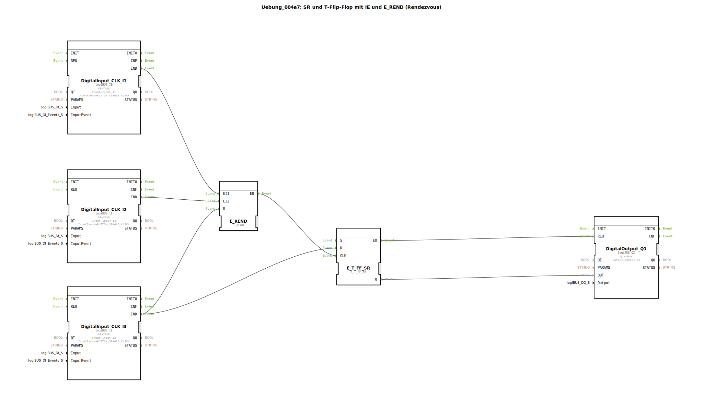

# Uebung_004a7: SR und T-Flip-Flop mit IE und E_REND (Rendezvous)


[](https://notebooklm.google.com/notebook/a6872e59-1dfc-4132-a118-aff1bc7bc944)

Dieser Artikel beschreibt die logiBUS®-Übung `Uebung_004a7`. Hier wird das Rendezvous-Muster mit einem erweiterten Flip-Flop-Typ kombiniert, der eine dedizierte Reset-Funktion besitzt.

----


## Ziel der Übung

Demonstration der Interaktion zwischen komplexer Ereignis-Logik (`E_REND`) und einem Flip-Flop mit Set/Reset-Priorität (`E_T_FF_SR`). Ziel ist eine Steuerung, die nur nach mehrfacher Bestätigung aktiv wird, aber jederzeit sicher abgeschaltet werden kann.

-----

## Beschreibung und Komponenten

[cite_start]Die Subapplikation `Uebung_004a7.SUB` nutzt drei Taster zur Steuerung eines Lampenzustands[cite: 1].

### Funktionsbausteine (FBs)




  * **`I1` & `I2`**: Eingänge für das Rendezvous (Scharfschalten).
  * **`I3`**: Zentraler Reset-Eingang.
  * **`E_REND`**: Synchronisiert die Ereignisse von `I1` und `I2`.
  * **`E_T_FF_SR`**: Ein Toggle-Flip-Flop, das zusätzlich einen `R` (Reset) Eingang besitzt, um den Zustand definiert auf `FALSE` zu setzen.

-----

## Funktionsweise

```xml
<EventConnections>
    <Connection Source="DigitalInput_CLK_I1.IND" Destination="E_REND.EI1"/>
    <Connection Source="DigitalInput_CLK_I2.IND" Destination="E_REND.EI2"/>
    <Connection Source="E_REND.EO" Destination="E_T_FF.CLK"/>
    <Connection Source="DigitalInput_CLK_I3.IND" Destination="E_REND.R"/>
    <Connection Source="DigitalInput_CLK_I3.IND" Destination="E_T_FF.R"/>
</EventConnections>
```

[cite_start][cite: 1]

1.  Um das Licht (`Q1`) umzuschalten, müssen beide Taster `I1` und `I2` betätigt worden sein. Das Rendezvous feuert dann den Takt (`CLK`) für das Flip-Flop.
2.  Der Taster `I3` fungiert als **Alles-Aus-Taste**:
    *   Er setzt das Flip-Flop `E_T_FF_SR` sofort zurück (Ausgang wird `FALSE`).
    *   Er löscht gleichzeitig das Gedächtnis von `E_REND`. Falls also nur ein Taster (`I1` oder `I2`) gedrückt war, wird diese Teil-Information gelöscht.

-----

## Anwendungsbeispiel

**Maschinenfreigabe mit Not-Stopp**:
Zwei Sicherheitsbereiche müssen als "geprüft" gemeldet werden (`I1` und `I2`), damit die Maschine in den nächsten Modus wechseln kann. Ein Not-Halt-Taster (`I3`) stoppt die Maschine jedoch sofort und macht alle bisherigen Sicherheits-Bestätigungen ungültig, sodass nach der Entriegelung beide Bereiche erneut geprüft werden müssen.