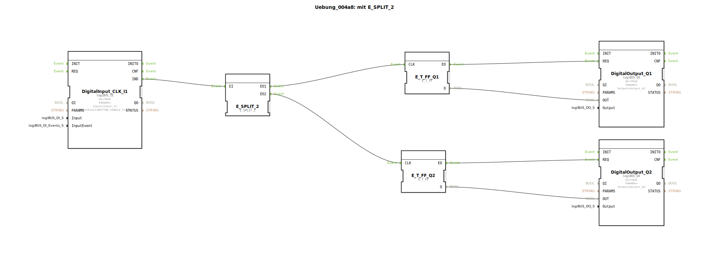

# Uebung_004a8: mit E_SPLIT_2

Dieser Artikel beschreibt die logiBUS®-Übung `Uebung_004a8`. Dies ist eine Variante der Übung 004a4, bei der ein spezifischer Baustein für zwei Ausgänge verwendet wird.

----

## Ziel der Übung

Kennenlernen von typspezifischen Splitter-Bausteinen. Während `E_SPLIT` oft generisch ist, definieren Bausteine wie `E_SPLIT_2` explizit die Anzahl der Ausgänge.

-----

## Beschreibung und Komponenten

[cite_start]Die Subapplikation `Uebung_004a8.SUB` nutzt einen `E_SPLIT_2` Baustein zur Ereignisverteilung[cite: 1].

### Funktionsbausteine (FBs)

  * **`DigitalInput_CLK_I1`**: Taster.
  * **`E_SPLIT_2`**: Verteilt den Eingang `EI` nacheinander auf `EO1` und `EO2`.
  * **`E_T_FF_Q1` & `Q2`**: Zwei Flip-Flops.

-----

## Funktionsweise

Funktional identisch zu Übung 004a4: Ein einzelner Tastendruck führt dazu, dass zwei unabhängige Flip-Flops nacheinander getriggert werden. Dies stellt sicher, dass beide Speicherzustände sicher aktualisiert werden.

-----

## Anwendungsbeispiel

Synchrones Schalten von redundanten Systemen, bei denen sichergestellt sein muss, dass beide Teilsysteme den gleichen Schaltbefehl in einer festen Abfolge erhalten.