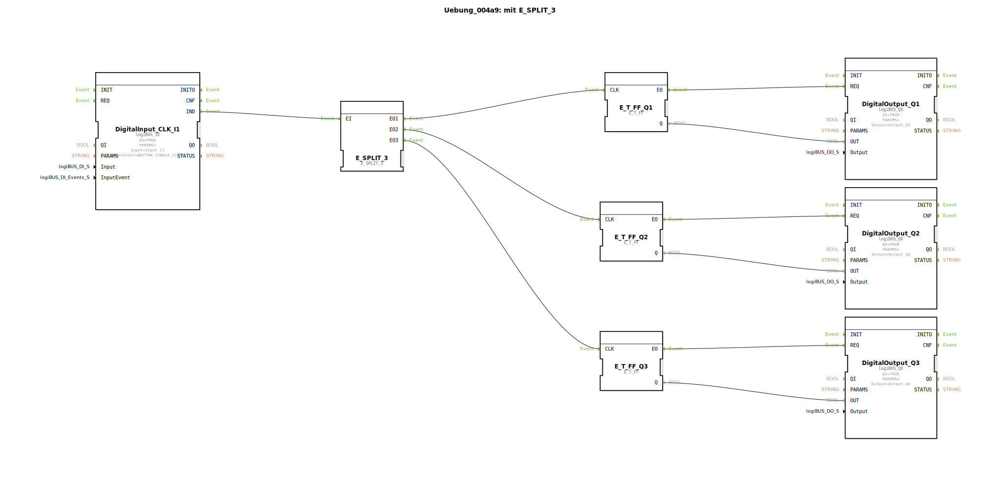

# Uebung_004a9: mit E_SPLIT_3

Dieser Artikel beschreibt die logiBUS®-Übung `Uebung_004a9`. Hier wird das Konzept des sequenziellen Event-Splittings auf drei Ziele erweitert.

----

## Ziel der Übung

Demonstration der Skalierbarkeit von Ereignis-Verteilern. Mit `E_SPLIT_3` können drei Prozesse mit einem einzigen Auslöser sequenziell angestoßen werden.

-----

## Beschreibung und Komponenten

[cite_start]Die Subapplikation `Uebung_004a9.SUB` verteilt das Signal eines Tasters auf drei separate Toggle-Flip-Flops und somit auf drei Ausgänge[cite: 1].

### Funktionsbausteine (FBs)

  * **`DigitalInput_CLK_I1`**: Der zentrale Auslöser (Taster).
  * **`E_SPLIT_3`**: Verteilt den Eingang `EI` nacheinander auf `EO1`, `EO2` und `EO3`.
  * **`E_T_FF_Q1`, `Q2`, `Q3`**: Drei unabhängige Flip-Flops.
  * **`DigitalOutput_Q1`, `Q2`, `Q3`**: Drei physische Lampen.

-----

## Funktionsweise

Ein einziger Klick auf den Taster löst eine definierte Ereigniskette aus:
1.  `EO1` feuert ➡️ `Q1` toggelt.
2.  `EO2` feuert ➡️ `Q2` toggelt.
3.  `EO3` feuert ➡️ `Q3` toggelt.

Die Abarbeitung erfolgt in der Steuerung so schnell, dass die Lampen für den Betrachter gleichzeitig umschalten, jedoch ist die interne Reihenfolge strikt vorgegeben.

-----

## Anwendungsbeispiel

**Szenen-Schaltung im Gebäude**:
Ein Taster an der Wohnungstür schaltet gleichzeitig die Beleuchtung im Flur (`Q1`), in der Küche (`Q2`) und im Außenbereich (`Q3`) um. Durch den Splitter wird sichergestellt, dass alle Funktionsblöcke den Trigger erhalten.