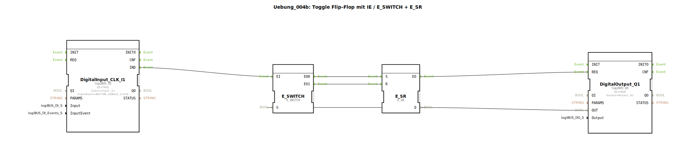

# Uebung_004b: Toggle Flip-Flop mit IE / E_SWITCH + E_SR


[](https://notebooklm.google.com/notebook/a6872e59-1dfc-4132-a118-aff1bc7bc944)

Dieser Artikel beschreibt die logiBUS®-Übung `Uebung_004b`. Hier wird gezeigt, wie die Funktion eines Toggle-Flip-Flops manuell aus Grundbausteinen (Weiche und Speicher) aufgebaut werden kann.

----


## Ziel der Übung

Verständnis der inneren Logik eines Speicherbausteins. Anstatt den fertigen `E_T_FF` Baustein zu nutzen, wird hier eine Rückkopplungsschleife konstruiert, die den aktuellen Zustand nutzt, um das nächste Ereignis an den richtigen Eingang (`Setzen` oder `Rücksetzen`) zu leiten.

-----

## Beschreibung und Komponenten

[cite_start]Die Subapplikation `Uebung_004b.SUB` realisiert die Toggle-Funktion durch die Kombination einer Ereignis-Weiche und eines SR-Speichers[cite: 1].

### Funktionsbausteine (FBs)




  * **`DigitalInput_CLK_I1`**: Liefert ein Ereignis bei jedem Tastendruck.
  * **`E_SWITCH`**: Eine Ereignis-Weiche. [cite_start]Je nach Zustand am Dateneingang `G` leitet sie das Ereignis `EI` entweder an `EO0` (wenn FALSE) oder an `EO1` (wenn TRUE) weiter[cite: 1].
  * **`E_SR`**: Ein ereignisbasierter SR-Speicher (Set/Reset).
  * **`DigitalOutput_Q1`**: Der Hardware-Ausgang.

-----

## Funktionsweise

Der Schlüssel liegt in der Rückführung des Ausgangszustands zum Eingang der Weiche:

```xml
<EventConnections>
    <Connection Source="DigitalInput_CLK_I1.IND" Destination="E_SWITCH.EI"/>
    <Connection Source="E_SWITCH.EO0" Destination="E_SR.S"/>
    <Connection Source="E_SWITCH.EO1" Destination="E_SR.R"/>
    <Connection Source="E_SR.EO" Destination="DigitalOutput_Q1.REQ"/>
</EventConnections>
<DataConnections>
    <Connection Source="E_SR.Q" Destination="DigitalOutput_Q1.OUT"/>
    <Connection Source="E_SR.Q" Destination="E_SWITCH.G"/>
</DataConnections>
```

[cite_start][cite: 1]

Der funktionale Ablauf:
1.  **Zustand AUS**: `E_SR.Q` ist FALSE, damit ist auch `E_SWITCH.G` auf FALSE.
2.  Ein Tastendruck feuert `EI`. Die Weiche leitet es an `EO0` ➡️ `E_SR.S`. Der Speicher wird gesetzt, die Lampe geht an.
3.  **Zustand AN**: Da die Lampe nun an ist, liegt an `E_SWITCH.G` eine TRUE an.
4.  Der nächste Tastendruck feuert wieder `EI`. Diesmal leitet die Weiche das Event an `EO1` ➡️ `E_SR.R`. Der Speicher wird zurückgesetzt, die Lampe geht aus.

-----

## Bewertung

Dieser Aufbau ist lehrreich, um die Konzepte von Ereignissteuerung und Datenrückkopplung zu verstehen. In realen Projekten sollte jedoch immer der spezialisierte Baustein `E_T_FF` bevorzugt werden, da dieser übersichtlicher ist und weniger Ressourcen verbraucht.